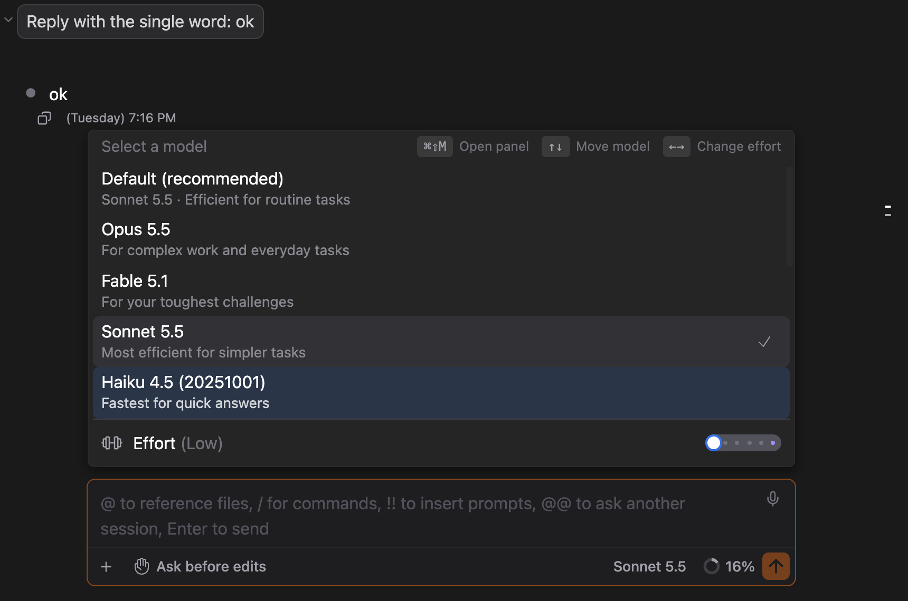

# Effort & Fast Mode

> Languages: **English** · [한국어](./ko.md)
>
> Related: [#121](https://github.com/Swttch/swttch/issues/121), [#152](https://github.com/Swttch/swttch/issues/152), [#474](https://github.com/Swttch/swttch/issues/474)

Two of the controls in the **Model** section let you trade speed for depth on a per-model basis: **Effort** and **Fast mode**. Both mirror what the Claude Code CLI already lets you set, surfaced as inline controls so you never have to leave the chat.

## Effort

**Effort** is how hard Claude works on a response — its reasoning budget. Higher effort means more thorough thinking (slower, more tokens); lower effort means quicker, cheaper replies. It's the same setting the CLI exposes per model.

### The slider

Effort is a **slider**, not a list. Each notch is one level the current model supports:

| Level | Label |
|-------|-------|
| `low` | Low |
| `medium` | Medium |
| `high` | High |
| `xhigh` | Extra high |
| `max` | Max |

- **Auto** is not a notch — it's the label shown while you haven't picked a level, meaning "use the CLI's default." As soon as you pick a level the slider stays within the real levels.
- **Click or drag** the slider to jump to a level. **Clicking the row** (or pressing Enter on it) cycles to the next level, wrapping back to the first.

### Ultracode (the top step)

When a model supports the `xhigh` level, the slider gains one extra step past Max, rendered in **purple**: **Ultracode**. Landing on it engages `xhigh` effort **plus** standing workflow orchestration — the maximum-capability setting. It's only offered when the model supports `xhigh` and Workflows aren't disabled.

### Where to find it

- **Model panel** — click the model name in the composer's bottom bar, or press **⌘⇧M** (**Ctrl + Shift + M** on Windows and Linux). The **Effort** row sits below the model list, under a divider.
- **Slash command panel** (type `/`) → **Model** section → the **Effort** row, with the current level shown next to the label (e.g. *Effort (Extra high)*).

Effort used to sit at the bottom of the Modes popup (**Shift + Tab**). It moved to the model panel, so the Modes popup now only picks the permission mode.

### Driving it from the keyboard

Opening the model panel moves keyboard focus into it, so everything works without the mouse. The panel's top-right corner lists the keys it answers to.

| Key | What it does |
|-----|--------------|
| **⌘⇧M** / **Ctrl + Shift + M** | Opens the panel |
| **↑** / **↓** | Moves the highlight through the models (it looks like hovering) |
| **Enter** | Picks the highlighted model, the same as clicking it |
| **←** / **→** | Lowers / raises Effort |
| **Esc** | Closes the panel |

- Picking a model **no longer closes the panel**, so you can choose a model and then set its Effort in one visit. Close the panel with **Esc** or by clicking anywhere outside it. Keyboard focus, and your cursor position in the message box, come back to where they were.
- The slider moves the moment you press **←** or **→**. The change itself is sent half a second after your last key press, so stepping through three levels sends one change, not three.

### What the next reply actually uses

- A change applies to the **running chat** — there is no restart, and it takes effect on the next reply.
- After each reply, the CLI records the effort it really used. The panel shows that **applied** value. If it ever differs from what you set, the panel shows the value that was actually used until you move the slider again.
- The slider is **one setting shared by every chat and model**. It is stored in your Claude user settings as `effortLevel`.

### Older Claude Code CLI versions

- **Older than 2.1.38**: the CLI does not know the effort option at all. The slider still moves, but it has no effect. Update the CLI to use it.
- **2.1.38 through 2.1.49**: the CLI cannot take a change in the middle of a chat, so the **next message restarts that chat's CLI process** with the new level. The conversation continues where it left off. These versions may also not report the applied effort, in which case the panel keeps showing what you chose.
- **2.1.50 and later**: changes apply to the running chat, as described above.

## Fast mode

**Fast mode** prioritizes faster output. It's available on **Opus** models only. You'll find it in the **Model** section as the **Toggle fast mode** switch.

## Model support at a glance

Which controls apply depends on the model you're using — the CLI reports each model's capabilities, and the GUI follows them exactly:

| Model | Effort | Levels | Ultracode | Fast mode |
|-------|:---:|---|:---:|:---:|
| **Opus** | ✅ | Low · Medium · High · Extra high · Max | ✅ | ✅ |
| **Sonnet** | ✅ | Low · Medium · High · Max *(no Extra high)* | ❌ | ❌ |
| **Haiku** | ❌ | — | ❌ | ❌ |

A couple of consequences worth knowing:

- **Sonnet has no Extra high**, so it also has **no Ultracode step** — that's a model capability, not a bug.
- **Fast mode is Opus-only**, so on Sonnet and Haiku the toggle is inactive.

## What happens on models that don't support a control

Rather than hiding a control on models that don't support it, the row stays visible but **disabled (greyed out)**, and hovering it shows a short tooltip explaining why — for example *"This model doesn't support effort levels"* or *"Fast mode is only available on Opus models"*. This keeps the Model section consistent no matter which model you're on, so a missing control never looks like something broke ([#152](https://github.com/Swttch/swttch/issues/152)).

## Notes

- These controls reflect the **currently running session model** — switch models and the available effort levels, Ultracode step, and Fast mode availability update to match.
- Everything here maps to what the CLI already supports; the GUI just makes it a click instead of a flag.
