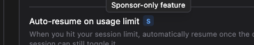
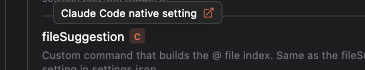

# Settings Badges

> Languages: **English** · [한국어](./ko.md)
>
> Related: this feature ships on the `feat/auto-resume-on-limit-reset` branch.

The Settings screen holds a mix of different kinds of options — some are real Claude Code CLI settings the GUI is editing on your behalf, others are extras that come with sponsoring the project. To make that distinction obvious at a glance, certain setting rows carry a small labelled **badge** right next to their title. Hover a badge and a tooltip tells you exactly what kind of setting it is.

*The Settings → General screen. Notice the small S and C chips sitting next to certain rows.*

## The two badges

There are two badge variants today, each a tiny letter chip:

| Badge | Glyph | Color | Meaning | Tooltip |
|-------|:-----:|-------|---------|---------|
| **Sponsor** | `S` | Blue | This row belongs to a **sponsor-only feature** | *Sponsor-only feature* |
| **Claude Code native** | `C` | Orange | This row edits a **real Claude Code CLI setting** | *Claude Code native setting* |

They're intentionally small and unobtrusive — a quiet signal, not a banner. You never have to interact with them; they're just there to answer the question "what am I actually looking at?" when you want it answered.

## Sponsor badge (S)

The **S** badge marks a setting that belongs to a **sponsor-only feature**. When you see it, you know that row is one of the extras unlocked by supporting the project.

*Hovering the blue **S** badge shows "Sponsor-only feature".*

Claude Code with GUI stays free to use, and sponsoring is what keeps this independent, JetBrains-first project moving forward. Supporting the project unlocks every sponsor-only feature — the ones wearing this badge — plus all future ones, automatically. So think of the **S** badge as a friendly bookmark: it points out the goodies that come with sponsoring, in case you'd like them. If you'd rather not, that's completely fine — the core experience is free and stays free.

For example, **Auto-resume on usage limit** in Settings → General carries the **S** badge.

## Claude Code native badge (C)

The **C** badge marks a setting that is a **real Claude Code CLI setting** — the GUI is simply giving you a nicer way to edit it. This is different from a GUI-only convenience setting that lives only in the app. When you change a **C**-badged option, you're changing something the `claude` command-line tool itself understands.

*Hovering the orange **C** badge shows "Claude Code native setting", with a link icon that opens the official docs for that setting.*

When the setting maps to an official Claude Code settings key, the tooltip includes a small external-link icon. Click it and the **official Claude Code documentation** for that exact key opens in a new browser tab — a one-click way to read the authoritative description straight from the source. Because the tooltip has a clickable link in this case, it's interactive: you can move your pointer off the badge and onto the link without the tooltip disappearing.

For example, **fileSuggestion** in Settings → General carries the **C** badge, and its tooltip links straight to that setting's page in the official docs.

## Where you'll see them

Badges show up wherever a setting row needs one of these signals — most visibly in **Settings → General**, and elsewhere in the settings screens next to native CLI options. You don't need to hunt for them; they simply appear on the rows they apply to.

## Notes

- Badges are **informational only**. They never change what a control does — they just label what kind of setting it is.
- A single row can only be one kind, so you'll see at most one badge per setting.
- The **C** badge's docs link always opens the official Claude Code documentation in a **new tab**, so you never lose your place in the app.
