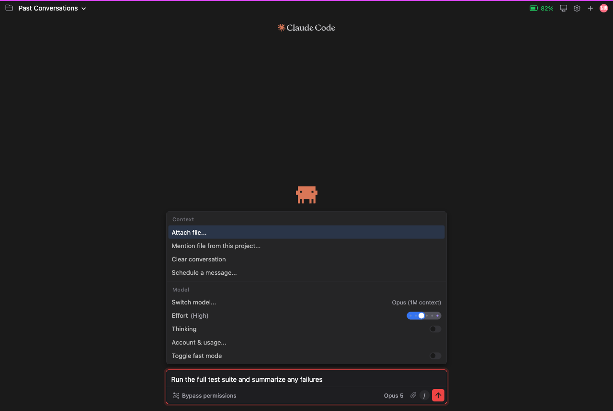
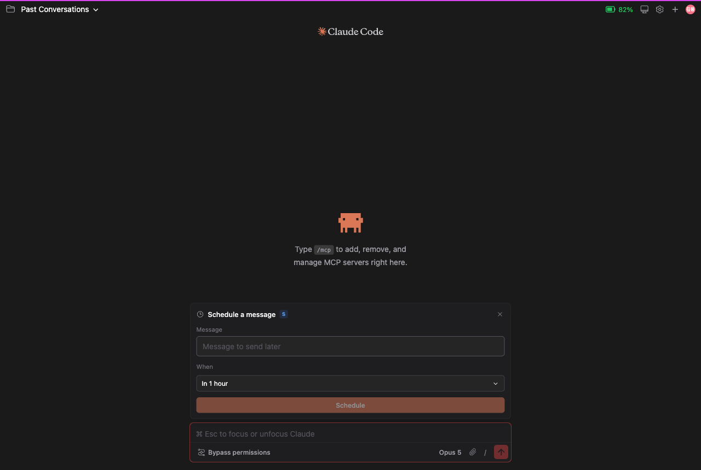
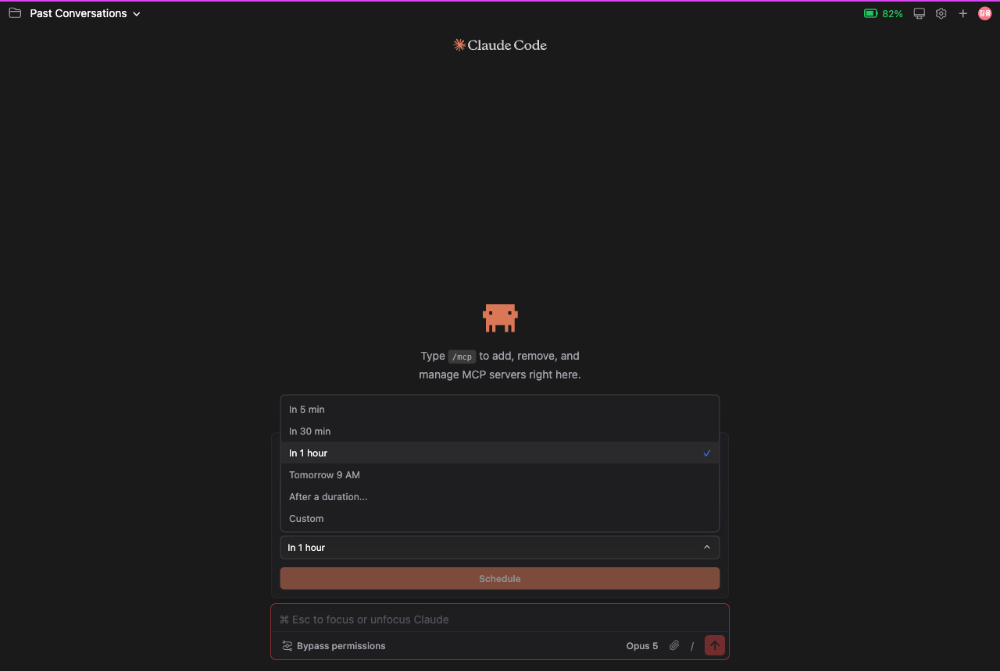
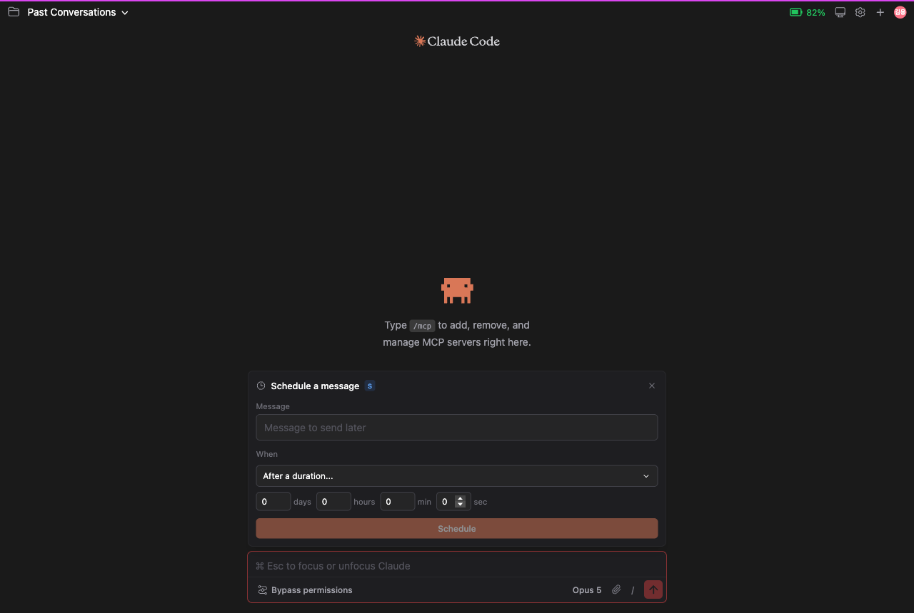
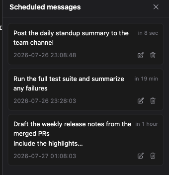
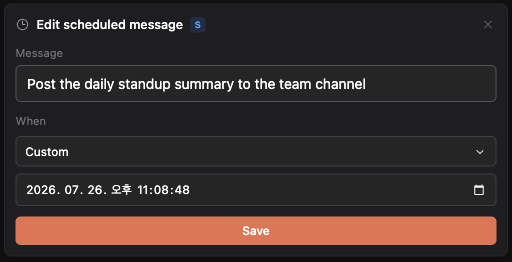

# Scheduled Messages

> 언어: [English](./en.md) · **한국어**
>
> 관련: `feat/auto-resume-on-limit-reset` 브랜치로 배포 예정 (아직 PR/이슈 번호 없음).

**Scheduled messages(예약 메시지)** 는 채팅용 Slack 스타일 "나중에 보내기"입니다. 지금 메시지를 써 두고 언제 보낼지 고르면, 그 시각에 GUI가 대신 보내줍니다 — 마치 직접 입력하고 전송 버튼을 누른 것과 똑같이요. 예약은 만든 세션에 묶이며, 언제든 목록을 보고 수정하고 취소할 수 있습니다.

> **예약은 후원자 기능입니다.** 컨트롤은 누구에게나 보이므로 전체 흐름을 직접 눌러볼 수 있지만, 실제 예약은 후원자에게만 이뤄집니다 — **Schedule**을 누르는 순간 확인이 실행됩니다. 프로젝트를 후원하시면 이 기능이 열립니다. 플러그인이 계속 발전하도록 돕는 작은 방법이자, 그 대가로 이 기능이 켜집니다.

## 예약 메시지 만들기

컴포저에서 **슬래시 커맨드 패널**(`/` 입력)을 연 뒤 **Context** 섹션으로 가서 **"Schedule a message…"** 를 고릅니다. 컴포저 바로 위에 팝오버가 열립니다.

*슬래시 패널의 Context 섹션, "Schedule a message…" 항목.*

팝오버는 두 부분 — **Message** 상자와 **When** 선택기 — 과 **Schedule** 버튼으로 이뤄집니다.

*생성 팝오버: Message, When, Schedule.*

자연스럽게 느껴지도록 만든 몇 가지 장치가 있습니다:

- **작성 중이던 초안이 그대로 넘어옵니다.** 메시지 상자는 **컴포저에 이미 입력해 두었던 내용으로 미리 채워집니다.** 그래서 쓰다 만 문장이 사라지지 않고, 여기서 이어서 마무리하면 됩니다.
- **컴포저와 같은 에디터입니다.** 메시지 상자는 매일 쓰는 바로 *그* 리치 에디터입니다. 내용에 맞춰 높이가 자동으로 늘어나고 IME에 안전해서(한국어·일본어·중국어 등 조합 입력이 올바르게 동작), 어느 것도 어설프게 느껴지지 않습니다.

### 보낼 시각 고르기

**When** 드롭다운은 빠른 프리셋과 두 개의 자유 지정 옵션을 제공합니다.

*열린 When 드롭다운, 프리셋 옵션 표시.*

| 옵션 | 의미 |
|------|------|
| **In 5 min** | 지금 + 5분 |
| **In 30 min** | 지금 + 30분 |
| **In 1 hour** | 지금 + 1시간 |
| **Tomorrow 9 AM** | 내일 로컬 시각 09:00 |
| **After a duration…** | 지금 + 직접 지정한 기간(일 / 시간 / 분 / 초) |
| **Custom** | 직접 고른 정확한 날짜와 시각 |

**After a duration…** 를 고르면 네 개의 작은 입력칸 — **days(일)**, **hours(시간)**, **minutes(분)**, **seconds(초)** — 이 나타나, "2시간 30분 뒤에 보내기"처럼 정확히 지정할 수 있습니다.

*"After a duration" 입력칸: 일, 시간, 분, 초.*

**Custom** 을 고르면 초 단위까지 지정하는 정확한 날짜·시각 입력칸이 나타납니다.

> **Custom 입력칸 참고.** 이 정확한 날짜·시각 선택기는 운영체제의 기본 위젯이라, 배치와 표기가 앱의 인터페이스 언어가 아니라 **운영체제 언어**를 따릅니다. 이는 정상 동작으로, 다른 앱들에서 쓰는 바로 그 선택기와 같습니다.

메시지와 시각이 마음에 들면 **Schedule** 을 누릅니다. (기존 예약을 수정 중이라면 버튼은 **Save**로 표시됩니다.) 확인 메시지가 뜨고 팝오버가 닫힙니다.

## 메시지가 보내질 때

지정한 시각이 되면 메시지는 **직접 입력하고 전송 버튼을 누른 것과 똑같이** 보내집니다 — 일반 메시지와 완전히 동일한 전송 경로를 탑니다. 실제로는 다음을 뜻합니다:

- 세션이 유휴 상태였다면, 손으로 보낼 때처럼 프로세스가 **되살아나** 메시지를 받습니다.
- 메시지는 대화에 **내가 보낸** 메시지로 나타납니다.
- 그 뒤의 모든 것 — 스트리밍, 권한, 도구 — 이 일반 전송과 동일하게 동작합니다.

발송은 그 세션의 **살아 있는 탭 하나**로 라우팅되며, 다음 순서로 선택됩니다:

1. **예약을 만든 탭**(아직 열려 있다면).
2. 그게 아니면, **그 세션을 현재 보여주고 있는 탭**.
3. 그것도 아니면, **가장 최근에 포커스된** 탭.

시각이 되었을 때 열린 탭이 하나도 없으면, 메시지는 그 세션에 **다음에 접속(attach)할 때** 전달됩니다 — 아무것도 유실되지 않습니다.

## 예약 메시지 관리하기

세션에 예약이 하나라도 생기면, 상단바에 **시계 버튼**이 나타나고 대기 중인 개수를 보여주는 **카운트 뱃지**가 붙습니다. 클릭하면 **Scheduled messages** 패널이 열립니다.

*Scheduled messages 패널: 각 행에 실시간 "in N …", 정확한 발송 시각, Edit / Cancel 표시.*

패널의 각 행은 다음을 보여줍니다:

| 요소 | 내용 |
|------|------|
| **메시지** | 3줄로 잘려 표시됩니다. **클릭하면 전체 텍스트로 펼쳐지고**(다시 클릭하면 접힘). |
| **실시간 카운트다운** (우측 상단) | "**in N min / sec / hours / days**" 형태의 상대 시각으로, 패널이 열려 있는 동안 **매초 갱신**됩니다. 시각이 되면 "**due now**"로 표시됩니다. |
| **정확한 발송 시각** | **초** 단위까지의 절대 시각을 24시간제로 표시(`YYYY-MM-DD HH:mm:ss`, 로컬 시각). |
| **Edit** | 이 예약의 메시지와 시각으로 **미리 채워진** 팝오버를 다시 엽니다 — 둘 중 무엇이든 바꾸면 수정으로 저장됩니다. |
| **Cancel** | 예약을 삭제합니다. |

목록은 **가까운 순**으로 정렬되어, 다음에 나갈 메시지가 항상 맨 위에 옵니다.

### 예약 수정하기

행에서 **Edit** 을 누르면 같은 팝오버가 화면 가운데 오버레이로 다시 열리며, 그 예약의 메시지와 정확한 발송 시각으로 미리 채워집니다(정확한 순간을 볼 수 있도록 **Custom** 날짜·시각으로 열립니다). 메시지·시각·둘 다를 조정한 뒤 **Save** 를 누릅니다.

*Edit 오버레이 — 예약 내용으로 미리 채워져 다시 열린 팝오버.*

## 키보드 단축키

생성/수정 팝오버는 키보드만으로 완전히 조작할 수 있습니다:

| 키 | 동작 |
|----|------|
| **Tab** / **Shift + Tab** | 메시지 상자, When 선택기, Schedule 버튼 사이를 이동(포커스는 팝오버 안에 머묾). |
| **Enter** / **Space** / **방향키** | When 드롭다운에서: 열고 옵션 사이를 이동. |
| **Cmd / Ctrl + Enter** | 팝오버 어디서든 제출(Schedule / Save). |
| **Esc** | 팝오버 닫기. |

메시지 상자 안에서 그냥 **Enter** 를 누르면 줄바꿈이 들어갑니다 — 메인 컴포저와 같은 동작이라, 여러 줄 메시지를 자유롭게 쓸 수 있습니다.

## 참고

- 예약은 **세션 단위**입니다 — 시계 버튼, 카운트 뱃지, 패널 모두 현재 들어와 있는 세션을 반영합니다.
- 상대 시각("in N …")은 항상 *지금* 기준으로 표시되고, 절대 시각은 메시지가 실제로 보내질 고정된 순간입니다.
