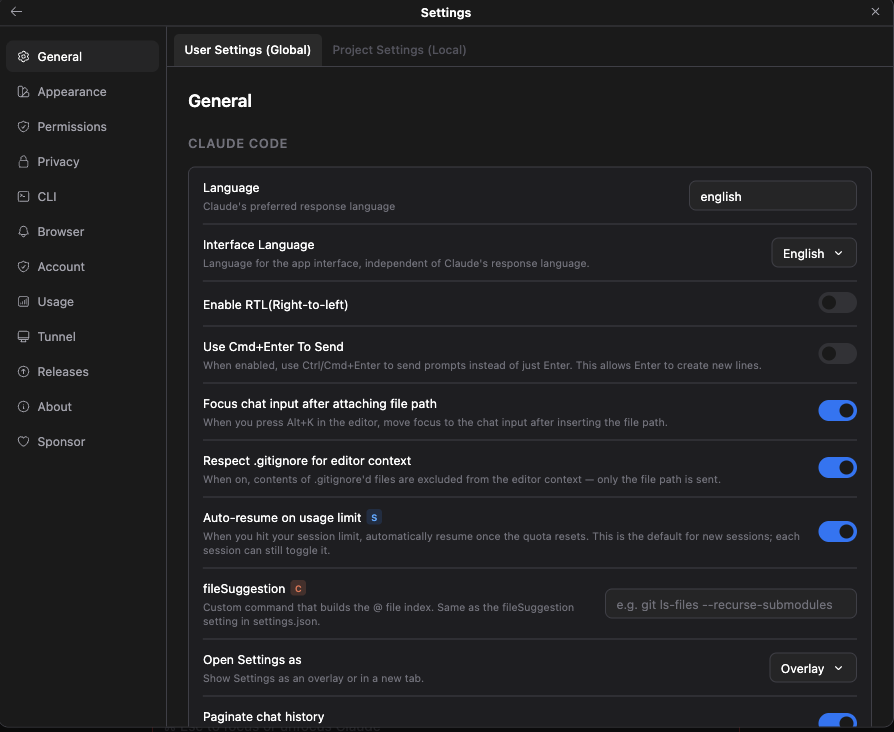

# Auto-resume on usage-limit reset

> Languages: **English** · [한국어](./ko.md)

When you hit your Claude usage or session limit, Claude Code posts a limit notice into the chat and the conversation stalls until your quota resets. **Auto-resume** lets the GUI pick the conversation back up for you the moment that reset lands — you don't have to sit and watch the clock, come back to a cold session, or remember to type "continue" hours later.

Under the hood it builds on the generic [Scheduled Messages](../018-scheduled_messages/en.md) engine: when a limit is detected, it schedules a "continue" message for the reset time, and a backend gate re-checks your usage right before sending so it only actually fires once your quota has genuinely recharged.

> **Auto-resume is a sponsor feature.** The controls are visible to everyone, so you can see exactly how it works, but the scheduling and immediate-resume actions run only for sponsors — the check happens the moment you use a control. Supporting the project unlocks this (and every other sponsor-only feature, plus future ones) automatically. Claude Code with GUI stays free; sponsoring is simply what keeps this independent, JetBrains-first project moving — and it flips this on for you.

## The limit banner

When a limit notice appears in the chat, the GUI recognizes it and renders the limit sentence inline with a small action right after it — no separate popup, it lives on the message itself.

*The limit banner: the CLI's own limit sentence, followed by the auto-resume state — here, "Auto-resume scheduled".*

What the banner shows depends on **when your quota resets**:

| Situation | What you see | What it does |
|-----------|--------------|--------------|
| Reset time is in the **future** | A **Schedule resume** action | Reserves a "continue" for the reset moment. |
| Reset is scheduled (auto-resume on) | An **Auto-resume scheduled** state (clock, orange) | Confirms it's queued; hover it to reveal **Cancel reservation**. |
| Reset time has **already passed** | A **Resume now** action | Sends "continue" immediately — the quota is already back. |

- The banner is derived from the conversation's own messages, so it **survives leaving and re-entering the session** — it's not a fleeting event that vanishes on reload.
- If auto-resume is turned **on** for the session, the schedule is placed for you automatically as soon as the limit appears, and the banner goes straight to the **Auto-resume scheduled** state. If it's off, the **Schedule resume** action is there for you to arm it by hand.

## The setting

The default lives in **Settings → General → "Auto-resume on usage limit"**. It's **off by default**.

*Settings → General. The row carries the blue **S** (Sponsor) badge, and its description reads: "When you hit your session limit, automatically resume once the quota resets. This is the default for new sessions; each session can still toggle it."*

This toggle sets the **default that every new session inherits**. It carries the **Sponsor (S)** badge (see [Settings Badges](../017-settings_badges/en.md)) because auto-resume is a sponsor feature.

Each session can still override the default on its own:

- Open the **slash-command panel** (type `/` in the composer) → **Model** section → **Toggle auto-resume**, sitting right **below "Toggle fast mode"**.
- Flipping it changes **only the current session** — it never touches the global default. This mirrors how per-model controls like fast mode work: a global default seeds each session, and any session can flip it on the fly.

## How resume works

Auto-resume is careful: your quota resetting is a wall-clock estimate, so instead of firing blindly at the reset time, it waits an additional **30 seconds** and then verifies your quota with your usage battery (`ccb`) before actually sending.

1. **The reset arrives.** A **30-second countdown** begins on the banner (`30s → 0s`).
2. **The backend gate re-checks your usage.** After the countdown, it polls your usage battery every **5 seconds**, for up to **10 minutes**, waiting for the five-hour quota to actually recharge. While it waits, the banner shows *"Waiting for quota reset…"*.
3. **Once recharged, it delivers "continue".** The message is sent **exactly the same way you'd send it yourself** — through the same [Scheduled Messages](../018-scheduled_messages/en.md) delivery path — so it appears as your own message and streaming, permissions, and tools all behave normally. The banner briefly reads *"Resuming…"*.

A few safeguards keep this trustworthy:

- **A usage-fetch error is not "not recharged."** If the check itself fails (for example, a network problem), it doesn't keep silently retrying against a dead connection — it **stops and shows a human-readable reason** on the banner (e.g. *"Network connection error"*).
- **Still not back after 10 minutes → it gives up** cleanly and tells you it timed out, rather than hanging forever.
- **You're always in control.** If you type into the chat again before the auto-resume fires, the pending reservation is **cancelled automatically** — you clearly wanted to drive the conversation yourself. You can also cancel a queued resume by hand: hover the **Auto-resume scheduled** state and press **Cancel reservation**.

## Reading the reset time — the CLI way

The reset time isn't fetched from any private or official API. It's parsed **straight out of the CLI's own limit-notice text** — the same sentence you'd read in the terminal (e.g. "…resets 2:40am"). This keeps the feature aligned with the project's core principle: **anything you can do from the `claude` CLI, you can do from the GUI**, without depending on undocumented or official-only interfaces. If the CLI can tell you when your limit resets, the GUI can act on it.

## Notes

- Auto-resume delivers a single **"continue"** — the same nudge you'd type by hand to pick a conversation back up.
- The banner and its actions are shown to everyone; the sponsor check happens **when you use a control** (schedule or resume-now), never as a wall in front of the information.
- Because the whole thing rides on [Scheduled Messages](../018-scheduled_messages/en.md), a queued auto-resume behaves like any other reservation: bound to its session, and delivered the next time that session is attached if no tab is open at the moment it fires.

## Using an account pool

[Account pools](../057-account_pool/en.md) first look for another account with
confirmed available usage. When all members are confirmed exhausted, the pool
selects the account with the earliest usable reset and returns to **this same
auto-resume mechanism**. A failed lookup keeps the current account as the fallback.

The selected account is saved with the reservation. Its five-hour, weekly, and
applicable model limits must permit use before a scheduled continuation is sent.
The reset time in the CLI notice is still used; if the account lookup reports a
later blocking reset, the reservation waits for the later time plus the existing
30-second margin. The Scheduled Messages panel shows the actual reservation.

Cancellation also stops a recharge check already in progress: a late successful
usage response cannot send a cancelled reservation. Reopening a chat preserves
an existing reservation, and temporary message loading does not cancel it.

Switching between conversations keeps each session's automatic actions and
cancellation separate. A reservation list still loading is not treated as a
cancellation, and an older response cannot replace a newer cancellation update.
During the current chat view's lifetime, returning to a session does not
automatically recreate a reservation you cancelled there.
