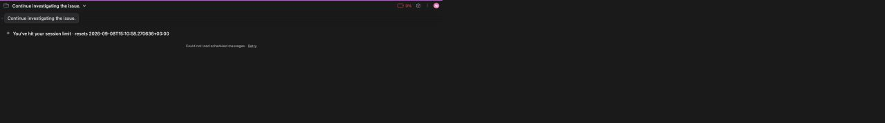

# Auto-resume on usage-limit reset

> 언어: [English](./en.md) · **한국어**

Claude 사용량 한도나 세션 한도에 도달하면 Claude Code가 채팅에 한도 안내를 띄우고, 사용량이 리셋될 때까지 대화가 멈춥니다. **Auto-resume**는 그 리셋이 오는 순간 GUI가 대화를 대신 이어가 줍니다 — 시계를 지켜보고 있을 필요도, 몇 시간 뒤에 식어버린 세션으로 돌아올 필요도, "continue"를 다시 입력해야 한다고 기억할 필요도 없습니다.

내부적으로는 범용 [Scheduled Messages](../018-scheduled_messages/ko.md) 엔진 위에 만들어졌습니다. 한도가 감지되면 리셋 시각에 보낼 "continue" 메시지를 예약하고, 백엔드 게이트가 전송 직전에 사용량을 다시 확인해 **사용량이 실제로 충전된 뒤에야** 실제로 발사되도록 합니다.

> **Auto-resume는 스폰서 기능입니다.** 컨트롤은 모두에게 보이므로 동작 방식을 그대로 확인할 수 있지만, 예약과 즉시 재개 동작은 스폰서에게만 실행됩니다 — 확인은 컨트롤을 사용하는 순간 이루어집니다. 프로젝트를 후원하면 이 기능(그리고 다른 모든 스폰서 전용 기능과 앞으로 추가될 기능까지)이 자동으로 열립니다. Claude Code with GUI는 계속 무료이며, 후원은 이 독립적인 JetBrains-우선 프로젝트를 계속 나아가게 하는 방법일 뿐입니다 — 그리고 여러분에게 이 기능을 켜 줍니다.

## 한도 배너

한도 안내가 채팅에 나타나면 GUI가 이를 인식해, 한도 문장 바로 뒤에 작은 액션을 인라인으로 붙여 렌더링합니다 — 별도 팝업이 아니라 메시지 자체에 함께 놓입니다.

*한도 배너: CLI 자체의 한도 문장 뒤에 auto-resume 상태가 이어집니다 — 여기서는 "Auto-resume scheduled".*

배너가 무엇을 보여주는지는 **사용량이 언제 리셋되는지**에 따라 달라집니다:

| 상황 | 표시되는 것 | 하는 일 |
|------|-------------|---------|
| 리셋 시각이 **미래** | **Schedule resume**(재개 예약) 액션 | 리셋 시점에 보낼 "continue"를 예약합니다. |
| 리셋이 예약됨(auto-resume 켜짐) | **Auto-resume scheduled**(예약됨) 상태(시계, 주황) | 예약되었음을 확인해 줍니다. 마우스를 올리면 **Cancel reservation**(예약 취소)이 드러납니다. |
| 리셋 시각이 **이미 지남** | **Resume now**(지금 재개) 액션 | "continue"를 즉시 보냅니다 — 사용량이 이미 돌아왔습니다. |

- 배너는 대화 자체의 메시지에서 파생되므로, **세션을 나갔다가 다시 들어와도 유지됩니다** — 새로고침하면 사라지는 일회성 이벤트가 아닙니다.
- 세션에 auto-resume가 **켜져** 있으면 한도가 나타나는 즉시 예약이 자동으로 걸리고, 배너는 바로 **Auto-resume scheduled** 상태로 갑니다. 꺼져 있으면 **Schedule resume** 액션이 있어 직접 예약을 걸 수 있습니다.

## 예약 목록을 불러오지 못한 경우

예약 조회에 실패하면 한도 안내 아래에 **예약된 메시지를 불러오지 못했습니다.**와
**다시 시도** 버튼이 나타납니다. 채팅을 나가지 않고 버튼을 눌러 다시 조회할 수 있습니다.
조회 중에는 버튼이 비활성화되며, 다시 실패해도 재시도할 수 있습니다.

조회 실패가 예약 취소를 뜻하지는 않습니다. 예약 목록을 확인할 때까지는 불완전한
정보로 동작하지 않도록 자동 계정 복구와 예약 생성을 잠시 멈춥니다. 조회에 성공하면
기존 예약이 다시 표시되고, 세션의 설정에 따라 원래 자동재개 절차가 이어집니다.

## 설정

기본값은 **설정 → General → "Auto-resume on usage limit"**에 있습니다. **기본값은 꺼짐**입니다.

*설정 → General. 이 행에는 파란 **S**(Sponsor) 뱃지가 붙어 있고, 설명은 이렇게 적혀 있습니다: "When you hit your session limit, automatically resume once the quota resets. This is the default for new sessions; each session can still toggle it."*

이 토글은 **새 세션마다 상속되는 기본값**을 정합니다. auto-resume가 스폰서 기능이기 때문에 **Sponsor(S)** 뱃지가 붙어 있습니다([Settings Badges](../017-settings_badges/ko.md) 참고).

각 세션은 이 기본값을 세션 단위로 재정의할 수 있습니다:

- **슬래시 커맨드 패널**(컴포저에서 `/` 입력) → **Model** 섹션 → **Toggle auto-resume**. **"Toggle fast mode" 바로 아래**에 있습니다.
- 이 토글을 켜고 끄면 **현재 세션에만** 적용되며, 전역 기본값은 절대 건드리지 않습니다. 이는 fast mode 같은 모델별 컨트롤이 동작하는 방식과 같습니다 — 전역 기본값이 각 세션의 시작값을 정하고, 어떤 세션이든 그때그때 뒤집을 수 있습니다.

## 재개는 어떻게 동작하나

Auto-resume는 신중하게 동작합니다. 사용량 리셋은 벽시계 기준의 추정이므로, 리셋 시각에 무작정 발사하는 대신 **30초를 추가로 기다린 다음** 사용량 배터리(`ccb`)로 사용량을 확인한 뒤에야 실제로 보냅니다.

1. **리셋이 도래합니다.** 배너에 **30초 카운트다운**이 시작됩니다(`30s → 0s`).
2. **백엔드 게이트가 사용량을 다시 확인합니다.** 카운트다운이 끝나면 사용량 배터리를 **5초마다**, 최대 **10분** 동안 폴링하며 다섯 시간 단위 사용량이 실제로 충전되기를 기다립니다. 기다리는 동안 배너에는 *"Waiting for quota reset…"*(사용량 리셋 대기 중)이 표시됩니다.
3. **충전이 확인되면 "continue"를 전달합니다.** 메시지는 **여러분이 직접 보내는 것과 완전히 동일한 방식**으로 — 같은 [Scheduled Messages](../018-scheduled_messages/ko.md) 전달 경로를 통해 — 보내지므로, 여러분 자신의 메시지로 나타나고 스트리밍·권한·도구가 모두 정상적으로 동작합니다. 배너에는 잠깐 *"Resuming…"*(재개하는 중)이 표시됩니다.

이 과정을 믿을 수 있게 해 주는 몇 가지 안전장치가 있습니다:

- **사용량 조회 오류는 "아직 충전 안 됨"이 아닙니다.** 확인 자체가 실패하면(예: 네트워크 문제) 죽은 연결에 대고 조용히 재시도를 반복하지 않고, **멈추고 사람이 읽을 수 있는 이유**를 배너에 보여줍니다(예: *"Network connection error"*(네트워크 연결 에러)).
- **10분이 지나도 돌아오지 않으면 깔끔하게 포기**하고 타임아웃되었음을 알려줍니다 — 영원히 매달려 있지 않습니다.
- **주도권은 언제나 여러분에게 있습니다.** auto-resume가 발사되기 전에 채팅에 다시 입력하면, 대기 중이던 예약이 **자동으로 취소됩니다** — 여러분이 직접 대화를 이끌겠다는 뜻이 분명하기 때문입니다. 예약된 재개를 직접 취소할 수도 있습니다: **Auto-resume scheduled** 상태에 마우스를 올려 **Cancel reservation**을 누르면 됩니다.

## 리셋 시각 읽기 — CLI 방식으로

리셋 시각은 그 어떤 비공개 API나 공식 API에서 가져오지 않습니다. **CLI 자체의 한도 안내 텍스트에서 직접** 파싱합니다 — 터미널에서 여러분이 읽게 되는 바로 그 문장입니다(예: "…resets 2:40am"). 이는 프로젝트의 핵심 원칙과 맞닿아 있습니다: **`claude` CLI에서 할 수 있는 것은 GUI에서도 할 수 있어야 하며**, 미문서화 인터페이스나 공식 전용 인터페이스에 의존하지 않습니다. CLI가 한도가 언제 리셋되는지 알려줄 수 있다면, GUI는 그것을 근거로 동작할 수 있습니다.

## 참고

- Auto-resume는 단 하나의 **"continue"**를 전달합니다 — 대화를 다시 이어가려고 여러분이 직접 입력하곤 하는 바로 그 한마디입니다.
- 배너와 그 액션들은 모두에게 보이며, 스폰서 확인은 **컨트롤을 사용할 때**(예약 또는 지금 재개) 이루어집니다. 정보 앞을 가로막는 벽으로 쓰이지 않습니다.
- 전체가 [Scheduled Messages](../018-scheduled_messages/ko.md) 위에서 돌아가기 때문에, 예약된 auto-resume는 다른 예약과 똑같이 동작합니다: 자기 세션에 묶여 있고, 발사되는 순간 열린 탭이 없으면 그 세션에 다음에 붙는 시점에 전달됩니다.

## 계정 풀과 함께 사용할 때

[계정 풀](../057-account_pool/ko.md)은 사용량이 남았다고 확인된 다른 계정을 먼저 찾습니다.
모든 계정의 소진이 확인되면 가장 빨리 다시 사용할 수 있는 계정을 선택한 뒤
**여기서 설명하는 기존 자동재개 매커니즘**으로 돌아옵니다. 조회 실패 시에는 현재 계정을
유지해 자동재개를 처리합니다.

선택한 계정을 예약에 저장합니다. 예약된 계속하기를 보내려면 그 계정의 5시간·주간·
해당 모델의 한도가 모두 사용을 허용해야 합니다. CLI 한도 안내의 리셋 시각을 계속
사용하되, 계정 조회에서 더 늦은 제한 리셋이 확인되면 늦은 시각에 기존의 30초 여유를
더해 예약합니다. 예약된 메시지 패널에서 실제 예약 시각을 확인할 수 있습니다.

예약 취소는 이미 진행 중인 충전 확인도 중단합니다. 늦게 도착한 사용량 조회가 성공해도
취소한 예약을 전송하지 않습니다. 채팅을 다시 열면 기존 예약을 유지하고, 메시지를
불러오는 동안 잠시 목록이 비어 있는 것만으로 예약을 취소하지 않습니다.

대화 사이를 이동해도 자동 동작과 취소 기록은 세션별로 구분합니다. 예약 목록을 아직
불러오는 중인 상태를 취소로 취급하지 않고, 늦게 도착한 과거 조회 응답이 더 최신인
취소 결과를 덮어쓰지 않습니다. 현재 채팅 화면이 유지되는 동안 세션을 떠났다 돌아와도
그 세션에서 취소한 예약을 자동으로 다시 만들지 않습니다.
