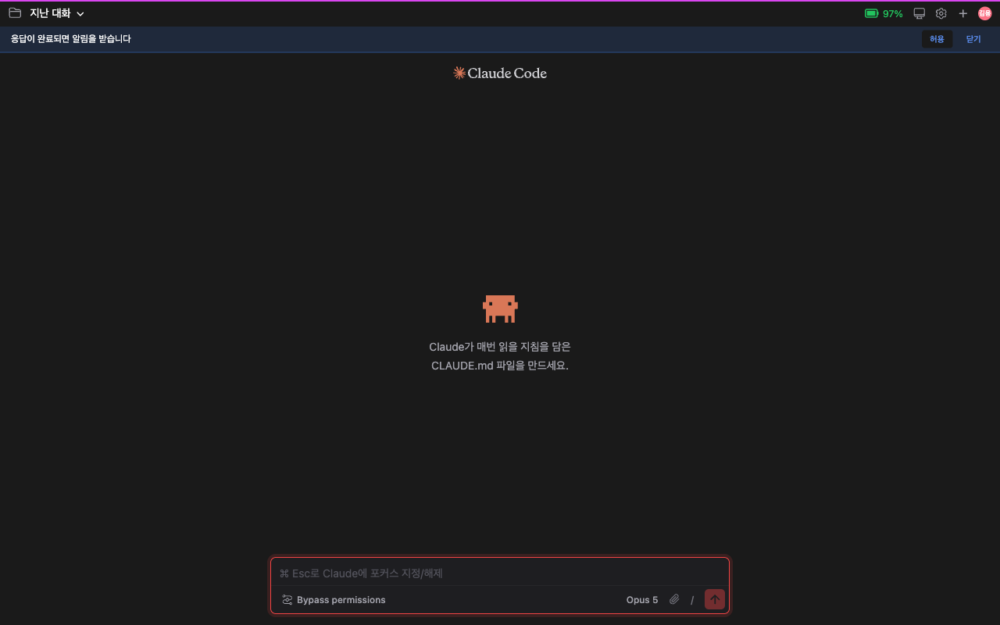
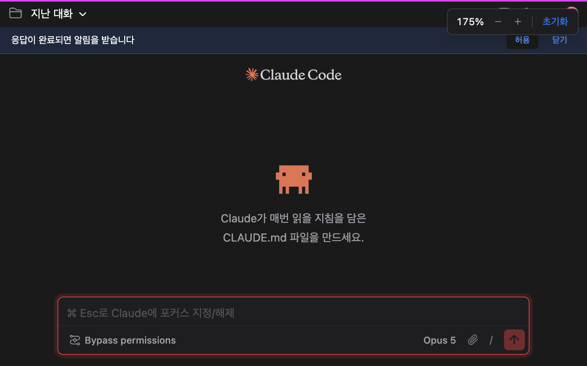
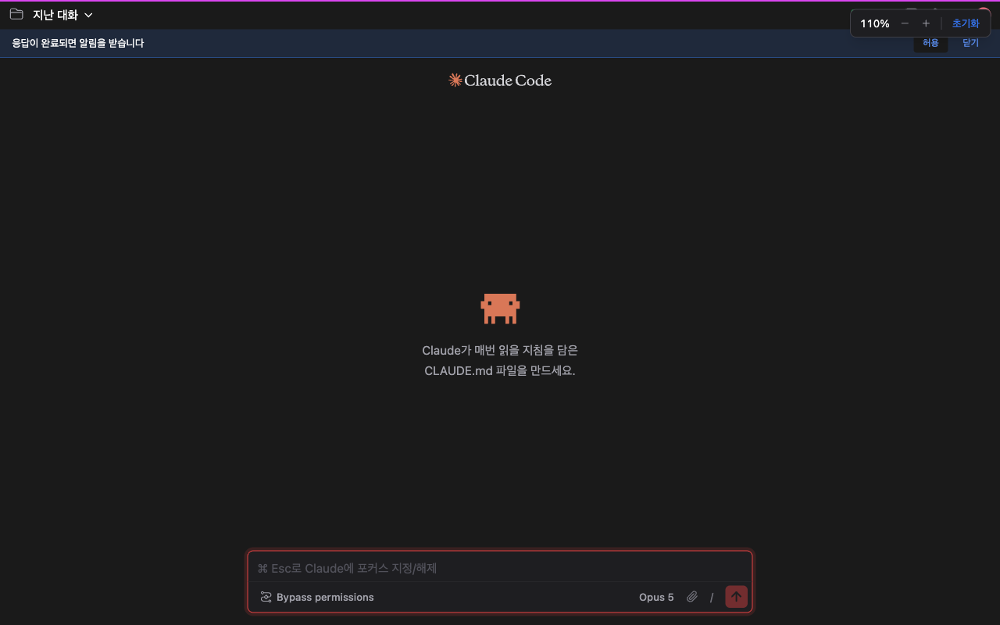

# UI Zoom

> Languages: **English** · [한국어](./ko.md)
>
> Related: [#169](https://github.com/Swttch/swttch/issues/169)

Some displays make the default interface feel a little small — a 4K monitor, an unusually high-DPI panel, or just a preference for larger text. There was previously no quick way to resize the whole GUI on the fly. Now you can zoom the interface in and out with the same gesture your browser and code editor already use.

*The chat screen at the default 100% zoom.*

## How to zoom

| Action | Shortcut |
|--------|----------|
| Zoom in | `Cmd` + `+` (macOS) / `Ctrl` + `+` (Windows/Linux), or scroll up while holding the modifier |
| Zoom out | `Cmd` + `-` (macOS) / `Ctrl` + `-` (Windows/Linux), or scroll down while holding the modifier |
| Reset to 100% | `Cmd` + `0` (macOS) / `Ctrl` + `0` (Windows/Linux) |

The modifier key follows your platform automatically — Command on macOS, Ctrl on Windows and Linux — exactly like the zoom shortcut in Chrome, VS Code, or IntelliJ itself.

Every adjustment steps through the same familiar ladder browsers use: 50%, 67%, 75%, 80%, 90%, 100%, 110%, 125%, 150%, 175%, 200%, 250%, 300%. Zooming out and back in always lands you exactly back on 100% — it never drifts to an odd in-between value.

## A Chrome-style indicator while you adjust

Whenever you zoom, a small panel appears in the top-right corner showing the current percentage, with its own `−` / `+` buttons and a **Reset** button — the same pattern Chrome uses for its own zoom control.

*Zoomed to 175%. The indicator in the top-right mirrors the keyboard/wheel gesture and offers the same controls as buttons.*

A few details worth knowing:

- **It stays out of your way.** The panel shows up, holds for a few seconds, then quietly disappears — it never piles up into a stack of popups even if you zoom several times in a row. Repeated adjustments just update the same panel's number.
- **It won't vanish while you're using it.** Move your mouse onto the panel and the auto-hide timer pauses, so reaching for the `−`, `+`, or **Reset** button never has the panel disappear out from under your click.
- **The buttons do exactly what the keyboard shortcuts do.** Click `+`/`−` to step through the same ladder, or click **Reset** to jump straight back to 100%.

*A closer look at the indicator — percentage, minus, plus, and Reset.*

## What actually gets bigger

Zoom scales the **entire interface** — text, icons, padding, borders, everything — the same way a browser's page zoom does, rather than just enlarging text. That means layouts stay intact at any zoom level instead of icons and spacing looking mismatched next to bigger text.

This is intentionally independent from the existing **Font size** setting in Settings → Appearance, which only enlarges text. The two combine: your effective text size is font size × zoom level. If zoom alone doesn't feel right for you, Font size is still there as a separate knob.

## It remembers your preference

Your zoom level is saved automatically and restored the next time you open the GUI — no need to re-apply it every session. Adjustments while you're mid-gesture (holding the wheel, or tapping `+` repeatedly) are batched into a single save rather than writing on every keystroke.

## Notes

- Reduced-motion note: since this uses the browser's native zoom mechanism, text stays crisp at every level instead of being scaled as a blurry bitmap.
- On mobile/narrow layouts, your zoom level combines with the app's own mobile scaling rather than overriding it.
