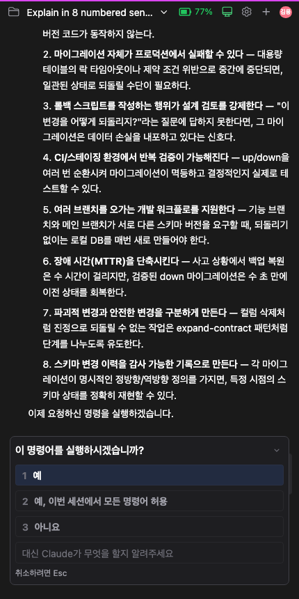
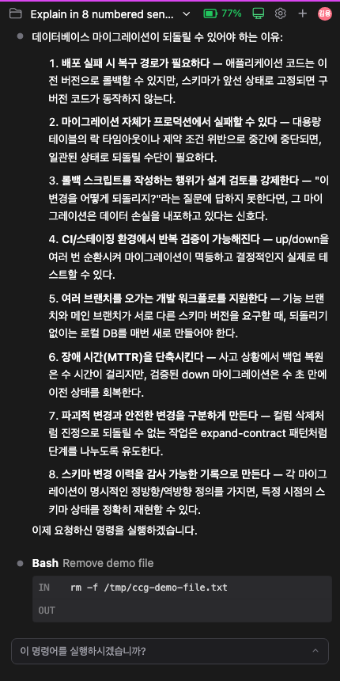

# 물어보는 패널을 잠시 접어두기, 그리고 "취소하려면 Esc"를 눌러서 취소하기

> 언어: **한국어** · [English](./en.md)
>
> 관련: [#248](https://github.com/Swttch/swttch/pull/248)

Claude가 작업을 하다 보면 사용자에게 되묻는 순간이 있습니다. "이 명령어를 실행할까요?", "이 계획대로 진행할까요?", "둘 중 어느 쪽을 원하세요?" 같은 것들입니다. 이때 채팅 입력창 위로 선택지 패널이 올라옵니다.

이번 업데이트는 그 패널들을 다루는 방식 두 가지를 손봤습니다. **잠시 접어둘 수 있게** 됐고, 패널 아래 적힌 **"취소하려면 Esc"를 직접 눌러서도** 취소할 수 있게 됐습니다.

## 무엇이 문제였나

패널이 뜨는 순간은 대개 **읽어봐야 결정할 수 있는** 순간입니다. Claude가 왜 그 명령을 실행하려는지, 앞서 뭘 확인했는지를 봐야 "예"인지 "아니요"인지 판단이 서니까요.

그런데 패널은 화면 아래쪽을 꽤 넓게 차지합니다. 데스크톱에서는 견딜 만하지만, **휴대폰처럼 좁은 화면에서는 정작 읽어야 할 내용이 패널 위 좁은 틈으로 밀려납니다.** 판단 근거를 보려고 스크롤을 위아래로 오가야 하고, 그러는 사이 무엇을 묻고 있었는지 놓치기 쉽습니다.

*8개 항목을 설명한 답변 위로 권한 확인 패널이 떠 있는 모습. 화면 아래 절반을 패널이 차지해서, 정작 읽어야 할 설명은 4번 항목 언저리에서 잘립니다.*

## 접어두기 — 창 최소화처럼

이제 패널 오른쪽 위에 **접기 버튼**(⌄)이 생겼습니다. 누르면 패널이 한 줄짜리 바로 줄어들어 화면을 비켜줍니다.

*같은 화면에서 패널만 접은 모습. 1번부터 8번까지 전부 보이고, 그 아래 도구 실행 카드까지 드러났습니다. 하단에는 "이 명령어를 실행하시겠습니까?" 한 줄만 남아 있습니다.*

윈도우의 창 최소화와 같은 감각으로 쓰시면 됩니다.

- **접어도 질문은 살아 있습니다.** 접기는 취소가 아닙니다. Claude는 여전히 답을 기다리는 중이고, 하던 작업도 그대로 멈춰 있습니다.
- **무엇을 묻고 있었는지 한 줄로 남습니다.** 접힌 바에는 패널 제목("이 명령어를 실행하시겠습니까?" 같은 것)이 그대로 남아 있어, 무엇이 대기 중인지 잊지 않습니다.
- **다시 펼치기도 한 번입니다.** 접힌 바 오른쪽의 펼치기 버튼(⌃)을 누르거나, **바의 아무 곳이나 눌러도** 원래대로 돌아옵니다. 고르던 선택지, 입력하던 텍스트 모두 그대로입니다.
- **접은 동안에는 숫자 키가 먹지 않습니다.** 펼쳐진 상태에서는 `1`, `2`, `3` 같은 숫자 키로 선택지를 바로 고를 수 있는데, 접어둔 동안에는 이 키들이 동작하지 않습니다. 뒤 내용을 읽는 중에 무심코 누른 숫자 하나가 승인으로 이어지면 안 되기 때문입니다. **`Esc`(취소)만은 접은 상태에서도 그대로 동작합니다.**
- **다음 질문은 항상 펼쳐진 채로 뜹니다.** 접기는 그 패널 하나에만 적용됩니다. 답을 하거나 취소해서 패널이 사라지면 접힘 상태도 함께 사라지고, 다음에 올라오는 질문은 언제나 펼쳐진 상태로 나타납니다. 접어둔 걸 잊고 있다가 새 질문을 놓치는 일은 없습니다.

## "취소하려면 Esc"를 눌러서 취소하기

패널 아래에는 예전부터 **"취소하려면 Esc"**라는 안내가 적혀 있었습니다. 지금까지 이건 말 그대로 안내문일 뿐이라, 실제로 취소하려면 키보드의 `Esc` 키를 눌러야 했습니다.

키보드가 없거나 쓰기 번거로운 상황 — 휴대폰이나 태블릿에서 원격으로 접속했을 때가 대표적입니다 — 에서는 이 안내가 알려주는 방법을 쓸 수가 없었습니다.

이제 **그 문구 자체를 누르면 `Esc`를 누른 것과 똑같이 취소**됩니다. 마우스를 올리면 글자에 밑줄이 생기고 커서가 손 모양으로 바뀌어, 누를 수 있다는 걸 알려줍니다.

버튼처럼 생긴 모양으로 바꾸지는 않았습니다. 선택지 버튼들 사이에서 눈에 띄는 또 하나의 버튼이 생기면 오히려 헷갈리기 때문에, 지금까지처럼 조용한 안내문으로 두되 누를 수 있게만 했습니다. 물론 키보드 `Esc`도 그대로 동작합니다.

## 어떤 패널에 적용되나

Claude가 되묻는 패널 세 가지 모두에 적용됩니다.

| 패널 | 언제 뜨나 |
|------|-----------|
| 도구 실행 권한 확인 | 명령 실행이나 파일 수정 전에 허락을 구할 때 |
| 계획 승인 | 플랜 모드에서 세운 계획대로 진행할지 물을 때 |
| 선택지 질문 | Claude가 사용자에게 직접 선택지를 물을 때 |

세 패널 모두 오른쪽 위에 같은 접기 버튼이 있고, 아래쪽 "취소하려면 Esc"가 눌러집니다. 선택지 질문 패널처럼 질문이 여러 개인 경우에는, 접힌 바에 지금 보고 있던 질문의 이름이 남습니다.

## 참고

- 접기 버튼은 마우스뿐 아니라 키보드 `Tab`으로도 접근할 수 있고, 화면 낭독기에는 "접어두기" / "펼치기"로 읽힙니다.
- 이 기능은 12개 인터페이스 언어에 모두 반영되어 있습니다.
