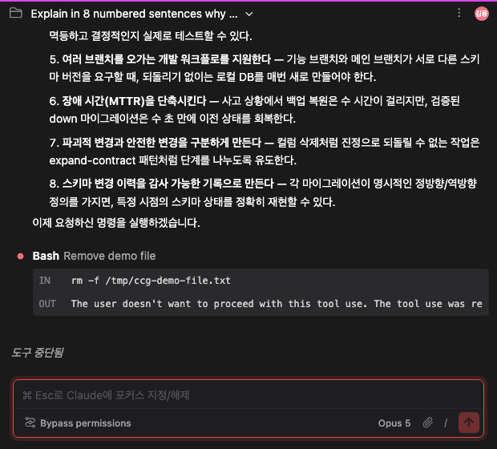
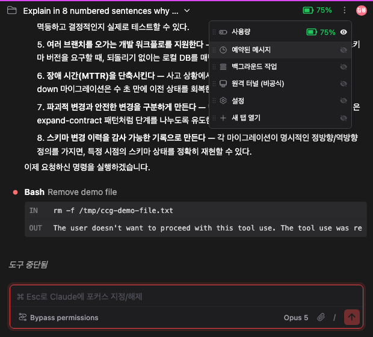

# 상단바에 어떤 아이콘을 남길지, 직접 고르기

> 언어: **한국어** · [English](./en.md)
>
> 관련: [#249](https://github.com/yhk1038/claude-code-gui-jetbrains/pull/249)

채팅 화면 위쪽, 세션 제목 오른편에는 그동안 아이콘이 하나둘 늘어났습니다. 사용량 배터리, 예약된 메시지, 백그라운드 작업, 원격 터널, 설정, 새 탭 열기 — 여섯 개입니다.

이번 업데이트는 그 여섯 개를 **더보기(⋮) 메뉴 하나로 정리**하고, 그중 자주 쓰는 것만 골라 다시 꺼내 둘 수 있게 했습니다.

## 무엇이 문제였나

기능이 하나 늘 때마다 아이콘이 하나 붙었습니다. 그 자체로도 복잡했지만, 진짜 문제는 다른 데 있었습니다.

**상단바는 왼쪽 세션 제목과 오른쪽 아이콘이 같은 가로 폭을 나눠 씁니다.** 그래서 아이콘이 늘어날수록 제목이 먼저 잘려나갔습니다. IDE 툴윈도우처럼 좁은 자리에 띄우면 제목이 몇 글자만 남습니다.

*좁은 폭에서 아이콘을 모두 켜둔 모습. 오른쪽에 여섯 개가 줄지어 있고, 왼쪽 세션 제목은 "Explain in 8 numbered sentences why …"에서 잘립니다.*

게다가 여섯 개 중 상당수는 **사람마다 쓰임새가 갈립니다.** 원격 터널을 매일 쓰는 사람이 있고 한 번도 안 쓰는 사람이 있는데, 아이콘은 모두에게 똑같이 자리를 차지했습니다.

## 기본은 ⋮ 하나

이제 아무 설정도 하지 않으면 오른쪽에는 **⋮ 하나만** 있습니다. 여섯 기능은 모두 그 안에 들어 있고, 메뉴에서 눌러 쓰면 이전과 똑같이 동작합니다.

*같은 폭, 같은 세션입니다. 아이콘이 빠진 만큼 제목이 더 보입니다.*

## 자주 쓰는 것만 꺼내 두기

물론 늘 보고 싶은 것도 있습니다. 사용량이 얼마나 남았는지, 백그라운드 작업이 몇 개 돌고 있는지 같은 것들은 메뉴를 열어봐야 안다면 의미가 없으니까요.

그래서 ⋮ 왼쪽을 **"도크"**로 두고, 원하는 것만 꺼내 둘 수 있게 했습니다.

*⋮ 를 누르면 여섯 항목이 하나의 목록으로 곧바로 보입니다. 별도의 "편집 모드"에 들어갈 필요가 없습니다. 여기서는 사용량만 눈이 켜져 있어서, 상단바에도 배터리가 나와 있습니다.*

각 항목은 세 가지로 다룹니다.

1. 오른쪽 끝의 **눈 아이콘**을 누르면 그 항목이 도크에 나타나거나 사라집니다
2. 왼쪽의 **끌기 손잡이**(점 여섯 개)를 잡고 위아래로 옮기면 **순서**가 바뀝니다 — 끌고 가는 동안 나머지 항목이 자리를 비켜주고, 도크에 올라간 아이콘도 이 순서를 그대로 따릅니다
3. 손잡이도 눈 아이콘도 아닌 **항목 자체를 누르면** 그 기능이 바로 실행됩니다

배치는 저장되어 다음에 열 때도 그대로입니다. 프로젝트를 옮겨도 같은 자리에 있습니다 — 도크는 손이 기억하는 도구 모음이라, 프로젝트마다 아이콘 위치가 달라지면 오히려 불편하기 때문입니다.

## 한 줄 안에 세 가지 동작이 있어도 헷갈리지 않게

한 행에 "끌기", "누르면 실행", "켜고 끄기"가 함께 있으면, 하나를 만지려다 다른 게 일어나기 쉽습니다.

그래서 셋은 **완전히 다른 자리**를 차지합니다. 왼쪽 손잡이를 잡아야만 드래그가 시작되고, 오른쪽 눈 아이콘을 눌러야만 도크 노출이 바뀌며, 그 사이를 누르면 바로 실행됩니다. 손잡이에 마우스를 올리면 배경이 살짝 밝아져서, 어디를 잡아야 하는지도 눈에 보입니다.

## 도크에 꺼내도 메뉴에서 사라지지 않는다

도크에 올린 기능도 ⋮ 메뉴에 **그대로 남습니다.** 한 번 메뉴에서 찾는 법을 익힌 기능이 배치를 바꿨다는 이유로 그 자리에서 없어지면 안 되기 때문입니다. 도크에 있든 없든, 어느 쪽에서 눌러도 하는 일은 같습니다.

## 메뉴에서도 실제 상태가 보인다

각 항목 오른쪽에는 그 항목이 도크에 있을 때 보여주는 것과 **똑같은 정보**가 뜹니다. 꺼내기 전에도 지금 상태를 미리 볼 수 있습니다.

- **사용량** — 배터리 아이콘과 남은 비율(%). 아직 사용량 추적을 설정하지 않았다면 "설정" 안내가 대신 뜹니다
- **예약된 메시지 / 백그라운드 작업** — 활성 상태일 때 아이콘 색이 바뀌고, 오른쪽에 개수 배지가 붙습니다. **0건일 때는 배지가 뜨지 않습니다** — 빈 배지는 아이콘만으로 알 수 있는 것 이상을 말해주지 않으니까요
- **원격 터널** — 켜져 있을 때만 아이콘이 초록으로 바뀌고, 오른쪽에 초록 글씨로 "활성"이 뜹니다
- **설정 / 새 탭 열기** — 한 번 실행하고 끝나는 동작이라 보여줄 상태가 없습니다

## 계정은 도크 대상이 아니다

계정 전환은 이 정리에서 뺐습니다. 실행하는 동작 하나가 아니라 저장된 계정 중 하나를 고르는 목록이라, 다른 여섯 기능과 성격이 다르기 때문입니다. 예전처럼 ⋮ 오른쪽에 **자기 아이콘을 그대로 유지**하고, 눌렀을 때 열리는 드롭다운도 그대로입니다.

## 앞으로 들어올 알림

알림 기능은 아직 없지만, 자리는 정해 두었습니다. 알림 벨은 **⋮ 왼쪽에 항상 표시**되며 도크 항목이 아닙니다. 도크는 "숨길 수 있게 하는" 장치인데, 사용자가 요청한 적 없는 알림은 숨겨지면 안 되기 때문입니다. 계정 아이콘과 같은 이유로 도크 바깥에 둡니다.

## 참고

- 끌기는 **손잡이를 잡았을 때만** 시작됩니다. 항목의 나머지 부분은 평소처럼 누르면 바로 실행됩니다.
- 마우스 없이도 순서를 바꿀 수 있습니다. 손잡이에 **키보드 초점**을 두고 `Space` 로 집은 뒤, `↑` `↓` 로 옮기고 다시 `Space` 로 놓으면 됩니다.
- 끌던 중 `Esc` 를 누르면 원래 자리에 둔 채 취소됩니다. 취소한 순서는 저장되지 않습니다.
- 나중에 새 기능이 추가되면 그 항목은 목록 맨 아래에 자동으로 추가되고, 도크에는 뜨지 않는 채로 시작합니다. 이전에 저장해 둔 배치가 새 기능을 가리는 일은 없습니다.
