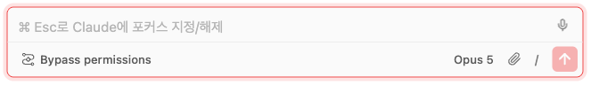
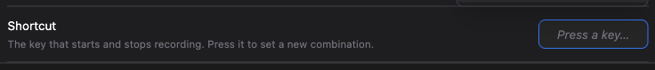
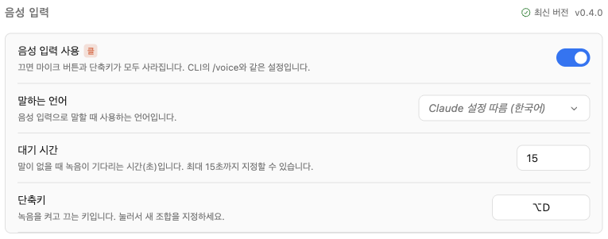
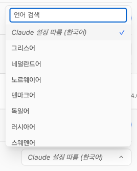
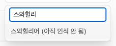

# Speak into the chat instead of typing it

> Language: **English** · [한국어](./ko.md)
>
> Related: [#235](https://github.com/Swttch/swttch/issues/235)

## The report

A user described the workaround they had settled into: for anything long, they dictated into the
Claude Desktop app, then copied the text and pasted it into the plugin. They asked whether the
recording could just happen here, and mentioned they speak German rather than English — accuracy
away from English is usually worse, but good enough, and still far faster than typing.

## Why this took a detour

The obvious route was the browser's built-in speech API. It is not available in the WebView that
JetBrains IDEs use, so that route was closed before it started.

The next question was how the other Claude Code clients do it, since they clearly manage it. Both
the desktop app and the VS Code extension call a private Anthropic endpoint — and calling it means
**sending the account's credentials.**

That is the wall. A JetBrains plugin is not permitted to handle credentials, so this could not be
built into the plugin, no matter how the UI was arranged.

## How it was solved

**By putting the part that touches credentials outside the plugin.**

The transcription code lives in [`@swttch/extend-kit`](https://www.npmjs.com/package/@swttch/extend-kit),
a package installed on your own machine — the same arrangement the usage panel already uses for
`ccb`. The plugin ships no credential-handling code; it asks the kit, and the kit uses the Claude
Code login already on your machine.

The practical consequences of that choice:

- **No separate API key, and no separate bill.** It authenticates as the account you are already
  signed into, so dictation costs you nothing beyond what Claude Code already does.
- **The same quality as the other clients**, because it is the same service, not a substitute.
- **One prerequisite**: the kit has to be installed. If it is missing, the plugin says so rather
  than failing quietly.

## Using it

A microphone button sits at the top right of the input box. From the keyboard it is `⌥D` (`Alt+D` on
Windows and Linux).

Alt rather than Cmd or Ctrl because those are already spoken for: `⌘D` bookmarks the page in every
browser, and `Ctrl+D` is end-of-input in a terminal.

The key is yours to change, under **Settings → General → Voice input → Shortcut**. Press the field,
then press the combination you want; Escape leaves it as it was.

It records the combination rather than asking you to spell it out, because a shortcut you press
cannot be mistyped.

One of Ctrl, Alt or Cmd has to be part of it. A shortcut that is just a letter would take that letter
away from the input box.

The shortcut remembers **the key's place on the keyboard**. Assign Ctrl+A with a Korean input method
active and it still stores `⌃A`, and it keeps working after you switch back to Latin input.

**Tap it** and recording starts and stays on; tap again to finish. Good for dictating something
long.

**Hold it** and recording lasts only as long as you hold; releasing ends it. Good for a sentence
or two.

You do not have to choose between them. The button tells them apart by how long it was held.

While you speak, the text appears **inside the input box**, italic and dimmed — that is the
recognizer still making up its mind, and it rewrites itself constantly. When a phrase settles it
turns into ordinary text in place.

Dictation **splices at the caret.** Put the caret mid-sentence and speak, and the words go there;
nothing already typed is lost. If you start typing while it is writing, dictation stops rather
than overwriting what you just typed.

While recording, three bars appear beside the microphone and rise with your voice. That is
deliberate: a muted microphone or the wrong input device looks exactly like a working one until no
text arrives, and the bars are the difference.

## Turning it off in the terminal turns it off here

`/voice off` in the CLI removes the microphone button and disables the shortcut here too — one
machine should not hold two answers to the same question. **Settings → General → Voice input** writes
the same value, so switching it off here switches it off in the CLI as well.

One thing deliberately differs from the CLI. Claude Code treats a missing value as **off**, because
dictation there has to be switched on with `/voice` first. We treat it as **on**: there is no such
command in the GUI and the microphone button is visible, so inheriting "absent means off" would hide
the feature behind a command that does not exist.

The mode (`/voice hold`, `/voice tap`) and auto-submit are left alone. Both describe holding a key in
a terminal, which means nothing where recording starts by pressing a button. Their values are
preserved rather than dropped, so the terminal's own configuration survives untouched.

## The language you speak

The recognizer has to be told which language it is listening for. Left unset it assumes English and
transcribes everything else phonetically through it — "안녕하세요" comes back as "ah ñomaseu".

Hence **Settings → General → Voice input language**. It defaults to **follow**, which is right for
most people without touching anything.

Following reads Claude's **response language** first, and the interface language when that is empty:
someone reading the UI in Korean is likely to speak Korean.

It exists separately because the two genuinely come apart — telling Claude to answer in Korean while
speaking English, say. That is the case this setting is for.

### Where this differs from the official behaviour

Claude Code takes the dictation language **from the response-language setting**. It has no dedicated
one.

This plugin uses **the spoken language you pick here first**. The order is inverted because the
documented one makes the setting you just changed do nothing: as long as a response language is set
— which is the normal case — switching the spoken language to English keeps producing Korean
transcripts, with nothing on screen to say why.

**Left on follow, it behaves exactly as the official does.** The two orders diverge only for someone
who explicitly picked a spoken language, and that person wanted to be transcribed in it.

The CLI has no spoken-language setting at all, so this difference blocks nothing that works there:
clearing the control reproduces the official resolution precisely.

The same explanation is on the ⓘ next to the setting.

The list holds **every language that has a code**. Unlike the interface translations this is only a
value we pass along, so there was no reason to narrow it to the handful we happened to pick. The
twenty the service actually transcribes sort first; the rest say what they are.

They are not hidden, because a language missing from the list gives no way to find out why. Nor are
they left looking ordinary, which would mean discovering it by speaking and getting English back.

**When it stops hearing anything, recording ends by itself.** The default wait is 15 seconds, and
**Settings → General → Voice input → Wait time** makes it shorter.

What it measures is the silence, not the total length: keep talking and it keeps going, and each
pause starts the clock over. A single recording runs up to two minutes.

Longer than 15 seconds is not offered, because the transcription service stops listening after that
much silence on its own — a longer wait would be a deadline that never arrives. For the same reason
there is no "never stop" option.

When it does end, it does not just stop: whatever audio has not been sent yet goes out, comes back
as text, and lands in the input box before recording closes, so the last thing you said is not lost.

This exists for the microphone left on after you walk away, or simply forget. Without it the
recording indicator stays lit and a connection stays open with nothing to transcribe.

## Opening the microphone inside the IDE

The WebView the IDE uses (JCEF) denies a microphone request outright when nothing answers it, and
unlike a browser there is no prompt to fall back on. Do nothing and **the microphone quietly never
opens** — no error, just no text.

So the plugin answers that request itself, and grants **the microphone only**. The request arrives as
a bitmask that can also ask for the camera and for screen capture; the reply is masked down to the
audio bit and the rest is dropped. A request for anything else is denied.

There is no confirmation dialog of our own because the page being loaded is not arbitrary web
content — it is the chat UI we serve ourselves. The real decision belongs to the OS: the first time
you record, macOS asks whether the IDE may use the microphone, and refusing there keeps the
microphone shut no matter what the plugin answers.

## When it cannot start

When something fails, a banner appears just above the input — not a tooltip, because an instruction you have to act on should not need to be hovered over to be found.

Three failures, three messages, because they need three different fixes. The missing kit is the one we can fix for you, so that banner carries an **Install** button; pressing it installs the kit and clears the banner.

### "Which package manager" is really three questions

It sounds like one question and it is three, on independent axes:

| Axis | What it manages | Examples |
| --- | --- | --- |
| **Runtime manager** | Node **versions** | volta, nvm, fnm, asdf, mise, nodenv, brew's node |
| **Library manager** | global npm **packages** | npm, pnpm, yarn, bun, volta's own store |
| **App channel** | the `claude` **app** itself | the official installer, a Homebrew cask, WinGet |

volta appears in **two** of them, because it genuinely does both jobs: it switches Node versions and
it keeps its own package store.

Collapsing the three into one value makes ordinary setups inexpressible. "Node from brew, packages
from npm" is completely normal, and a single word cannot say whether that is brew or npm.

More importantly, **volta's own store and the npm globals of the Node volta manages are different
places.** Both sit under `~/.volta/`, so they look like one thing — but a package removed from one
stays in the other.

### The install goes through whichever manager runs this machine

All three install affordances — this banner's button, and the Install and Update buttons in
settings — take the same path, and **which package manager they use is decided by the `claude` you
run in a terminal.**

If your terminal's `claude` is managed by volta, the kit is installed with volta. pnpm means pnpm,
yarn means yarn. The tool you already chose in the terminal is the answer — this is the project's
"whatever works in the CLI works in the GUI" rule applied to installing.

Only when no `claude` can be found do we fall back to the Node running the backend. That Node is
the one that will later load the kit, so when there is only one thing to ask, it is the right one.

When `claude` came from something that **cannot install an npm package** — Homebrew, the official
install script, WinGet — the install falls back to npm. The npm it uses is not whatever PATH
happens to surface, but **the npm sitting next to the backend's own Node**. Without that
distinction the install lands in a different Node's global folder, succeeds, reports success, and
leaves voice input unable to find the kit ([#298](https://github.com/Swttch/swttch/issues/298)).

If you would rather **install it yourself in a terminal, the command shown to you is built the same
way** — what the screen tells you to run and what the button would have run must never be two
different commands.

### A kit you installed can be removed from the same line

Once it is installed, a **trash button** sits to the right of the version. It belongs on the line
that reports the version, because that is the version it removes.

At rest it is the same size as the version text and very nearly the same colour, so it does not
compete with Install and Update for your attention; on hover it turns red, because by the time you
are about to press it the consequence should be obvious.

**It asks first.** Removing turns voice input off on this machine until you install it again, and
reinstalling is a download rather than an undo. The usage panel reads the same package, so the
confirmation says that too.

**Removing does not look in one place the way installing does**, because a machine can hold the same
package more than once.

That is not hypothetical: volta's own store held 0.4.0 while the npm globals of the Node volta
manages held 0.3.0. Removing only with the manager that would install today clears one of them, and
the version line then honestly reports the survivor — which reads, correctly, as **"I pressed delete
and it is still there"**.

So removal sweeps **every store it knows about**. Most of them hold nothing and fail; that is
expected and is not reported.

**Success is judged by the disk, not by exit codes.** Five different tools' exit codes are not
comparable, and one of them will happily report success while doing nothing (below). After the
sweep the kit is looked up again; if a copy survived, that is a failure.

When it finishes, a toast confirms it and the version line refreshes.

### npm can say "success" and do nothing

npm reads its global folder from configuration, and the `npm_config_prefix` environment variable
overrides all of it — regardless of which npm binary you ran.

If an IDE, a shell profile or another project's tooling leaves that variable set, the backend
inherits it. `npm uninstall -g` then runs against a different folder entirely, prints `up to date`,
exits 0, and removes nothing.

So every npm command pins the target with `--prefix`. Measured: with that variable set the package
survived a successful-looking uninstall, and adding `--prefix` removed it.

This is **the same shape of defect** as the install bug this feature started with — a command that
succeeds against the wrong place.

### One copy that would not delete was a source file, not a package

Pressing remove kept showing the same version afterwards. The cause was a **copy of the kit
committed to the repository**.

While voice input was first being built, something ran `npm i -g --prefix backend`, which installed
the package into `backend/lib/node_modules/`. `.gitignore` only excluded `backend/node_modules/`, so
74 files were committed along with the feature.

After that, on any machine where `npm_config_prefix` pointed at that folder, the backend found the
kit there and reported it as installed. **No remove button could ever clear it** — it was not in any
package manager's store, it was a tracked source file.

The committed copy is gone, and `.gitignore` now excludes `node_modules/` wherever it appears.

### Click the version to check again

The kit also changes outside this screen: you can install, update or remove it in a terminal. So
**the version text itself is the re-check button**. The version is the thing that would be wrong,
which makes it the place to press to ask again.

Working out where the kit is installed means actually running package managers, so the answer is
cached — checking on every render would be far too slow. **Pressing this is the one case that
ignores that cache** and resolves from scratch. Honouring it here would mean the button does nothing
at the exact moment it is pressed, which is the only reason it exists.

| What you see | What happened |
| --- | --- |
| Microphone blocked | Something is blocking the microphone (where to unblock it is below) |
| No microphone was found | No input device is connected |
| Voice input needs @swttch/extend-kit | The kit is not installed on this machine |

**Where a blocked microphone is unblocked depends on where you are using it**, so the message says
which one applies.

In a browser it is the **lock icon in the address bar**, then a reload — not system settings. A
browser remembers a site it was refused for and will not show the permission prompt again, and there
is no way for a site to ask for it a second time. That is the web platform's decision, not ours.

Inside the IDE the plugin answers the microphone request itself, so nothing is refused at that step.
A block there came from the OS, and system settings is where the IDE gets microphone access back.

- **macOS**: System Settings → Privacy & Security → Microphone
- **Windows**: Settings → Privacy & security → Microphone (desktop apps need microphone access on too)

If Claude Code is not logged in on this machine, dictation is unavailable for the same reason the
usage panel is — there is no account to authenticate as.

## A note on stability

This uses an endpoint Anthropic has not documented, the same one the other clients use. It could
change without warning. The client ignores anything it does not recognise rather than breaking, but
a larger change on their side could still stop dictation working until we catch up.
