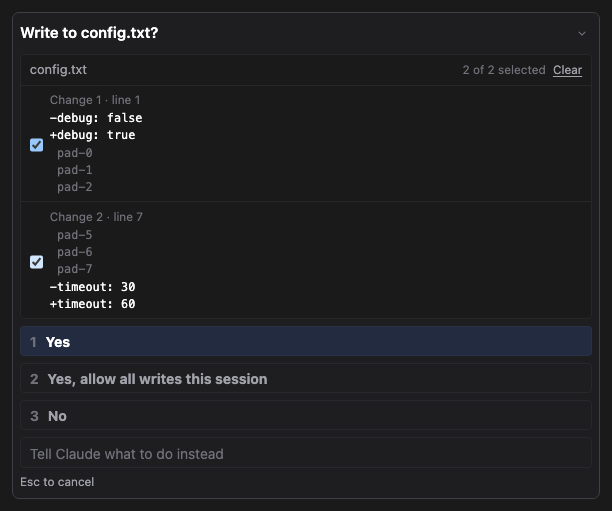
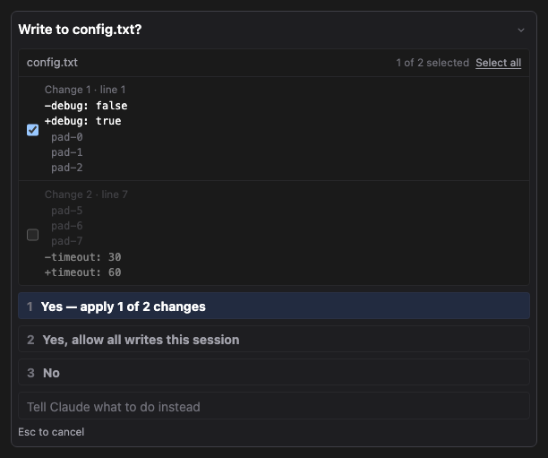
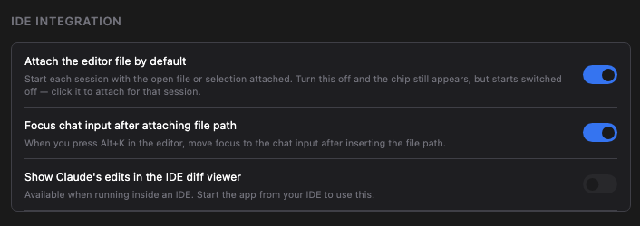

# 무엇을 고치는지 보고, 원하는 것만 받기

지금까지 파일 편집을 승인하려면 이 한 줄을 보고 짐작해야 했습니다.

> **config.txt에 이 편집을 적용하시겠습니까?**
> 1. 예 2. 예, 이번 세션에서 모든 편집 허용 3. 아니요

파일 이름은 알려주지만, 그 안에서 무엇이 바뀌는지는 알려주지 않았습니다. 그리고 Claude가 열 군데를 고쳤는데 여덟 군데만 맞다면 선택지는 전부 아니면 전무뿐이었습니다 — 다 받고 나중에 손으로 되돌리거나, 다 버리고 다시 시키거나.

이번 릴리즈에서 두 가지를 모두 바꿨습니다.

## 승인 화면에 변경 내용이 나옵니다

Claude가 파일 편집을 요청하면, 승인 화면이 변경 그 자체를 보여줍니다. 지워지는 줄은 빨강, 추가되는 줄은 초록으로, 앞뒤 몇 줄을 함께 붙여 파일의 어디쯤인지 알 수 있게 합니다.

*전부 체크된 상태 — 이대로 승인하면 예전과 똑같이 편집 전체가 적용됩니다.*

승인 화면의 나머지는 그대로입니다. 버튼 위치도, 단축키도 같고, 파일 편집이 아닌 요청(셸 명령 등)은 예전과 똑같이 보입니다.

## 일부만 받을 수 있습니다

변경이 파일의 여러 곳에 걸쳐 있으면, 각 곳마다 체크박스가 붙습니다.

처음엔 전부 체크된 상태라, 아무 생각 없이 승인해도 예전과 똑같이 동작합니다 — 편집 전체가 적용됩니다. 체크를 푸는 것이 범위를 좁히는 방법입니다. 하나라도 풀면 승인 버튼이 실제로 할 일을 말해줍니다 — **예 — 2개 중 1개만 적용** — 무엇에 동의하는지 헷갈릴 여지가 없습니다.

*두 번째 변경의 체크를 푼 상태 — 흐려지고, 버튼이 실제로 할 일을 말해줍니다.*

전부 풀면 버튼은 거절이 됩니다. 아무것도 안 바뀐 파일을 쓰면 일어나지도 않은 편집이 성공했다고 보고되기 때문입니다.

한 곳만 고치는 변경은 고를 것이 없으므로 예전 그대로 예/아니요입니다.

### 실제로 파일에 쓰이는 것

체크한 부분만 쓰입니다. 체크를 푼 부분은 디스크에 있는 그대로 남습니다 — 나중에 되돌리는 것이 아니라, 애초에 쓰이지 않습니다.

Claude에게는 무엇이 적용됐는지 전달되므로, 자기가 제안한 내용이 아니라 실제 파일 상태를 기준으로 이어갑니다.

## IDE의 diff 뷰어로도 보기

JetBrains IDE 안에서 실행 중이라면, 같은 변경이 IDE의 diff 뷰어에도 열립니다 — 버전 관리에서 쓰던 그 좌우 비교 창입니다. 승인하거나 거절하면 그 탭은 스스로 닫힙니다.

승인 버튼은 채팅 패널에 그대로 둡니다. 의도적입니다 — diff 창에도 버튼을 두면 질문 하나에 답하려고 두 곳을 오가야 합니다.

**설정 → IDE → Claude의 편집을 IDE diff 뷰어에 표시**에서 끌 수 있습니다. 끄면 아무것도 열리지 않고, 이번 릴리즈 이전과 완전히 동일하게 동작합니다. IDE 밖에서 실행 중이면 이 항목은 보이되 비활성입니다 — 열 IDE 창이 없기 때문입니다.

## 설정에 IDE 섹션이 생겼습니다

IDE 안에서만 의미가 있는 두 설정 — **에디터 파일을 기본으로 첨부**, **파일 경로 첨부 후 채팅 입력창에 포커스** — 이 '일반'에 있어서, 브라우저로 쓰는 사람에게도 쓸 수 없는 항목이 보였습니다. 새 **IDE** 섹션으로 옮겼고, 설정값은 그대로 유지됩니다.

*IDE 밖에서 실행 중일 때 — 옮겨온 두 설정은 그대로 쓸 수 있고, 새 diff 항목만 비활성이며 그 이유가 적혀 있습니다.*

관련: [#109](https://github.com/Swttch/swttch/issues/109), [#41](https://github.com/Swttch/swttch/issues/41)
