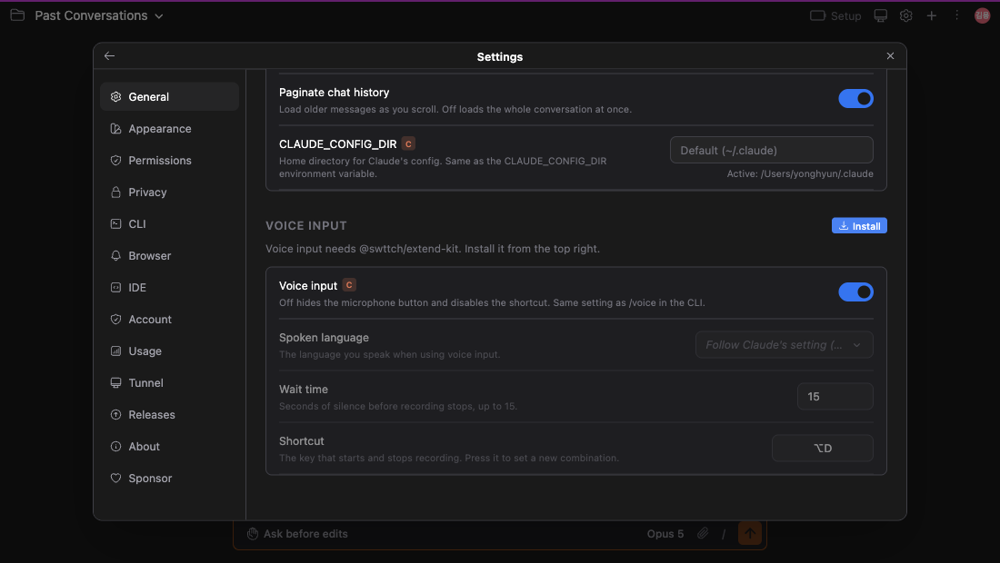
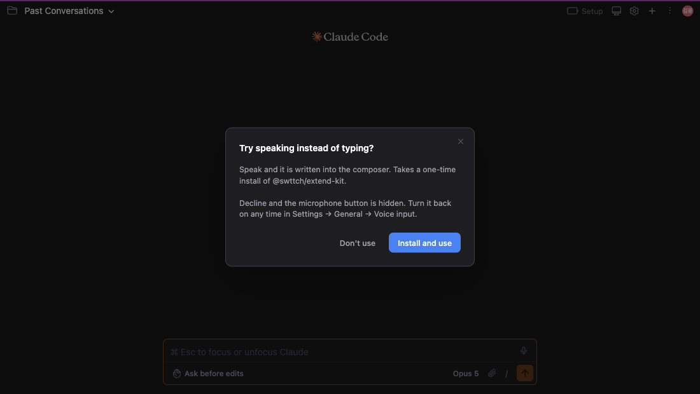
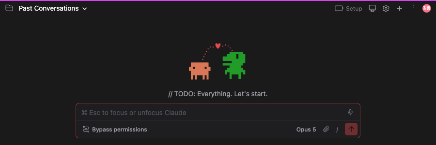
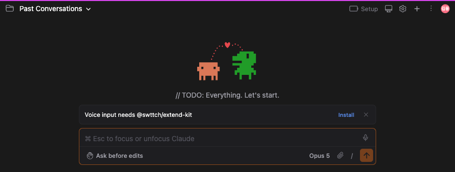

# Voice input you will not use can now be switched off

Related issue: [#299](https://github.com/Swttch/swttch/issues/299)

Voice input starts out on. Using it, though, takes installing a tool (`@swttch/extend-kit`) — and where that is not allowed, **a microphone button you could never use stayed on screen for good.**

Two things have changed.

## You can switch it off without installing the tool

Turn off the "Voice input" toggle in **Settings → General → Voice input**.

That toggle was always there. The catch was that a missing tool locked the whole section, so it **could not be pressed** — leaving the people who cannot install the tool as the only ones unable to turn it off.

Now it works whether the tool is installed or not. The three rows below stay locked, since they mean nothing without it.

## And you can decide right where the microphone is, without opening Settings

The microphone button is visible from the start. You cannot discover a feature that is hidden.

**The first time you press it**, a question appears before any recording starts.

Choosing **Don't use** does exactly what the toggle above does. No trip to Settings — it is settled where you are.

The question is asked **once**. After you answer, it does not come back.

## The microphone button disappears

Before and after.

The shortcut (`⌥D` by default) stops working too. Nothing is installed.

## If you choose "Install and use"

The tool is installed, using whichever package manager runs that machine (volta, pnpm, yarn, npm, …). The full rule is in the [voice input document](../029-voice_to_text/en.md).

**Recording does not start once it finishes.** A confirmation appears; press the microphone again to speak. From then on it records straight away, with no question.

A failed install does not bring the question back either — your "yes" still stands.

## Not ready to decide? Close it

A **close button** sits at the top right, and clicking **outside** the dialog or pressing `Esc` works too.

But **closing is not the same as "Don't use".** Nothing is decided, and the question **comes back** the next time you press the microphone.

"Don't use" here does not merely dismiss a dialog — it switches the feature off. A stray `Esc` should not be able to do that.

## If you already have the tool, you are not asked

Asking someone who has the tool whether to install it means nothing, so the microphone records straight away.

The same applies if you installed it yourself from a terminal.

## If you remove the tool

Remove it after answering — from a terminal, or with the trash button in Settings — and the question does not return. You already answered it.

Pressing the microphone then raises a banner above the composer, and its **Install** button is the way back.

## Note

The on/off setting for voice input is not ours — it is **Claude Code's own**, the same value `/voice` toggles in the terminal.

So switching it off here **also switches off dictation in the terminal**. One machine, one answer.
