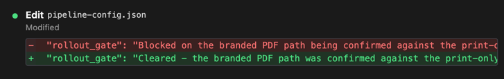
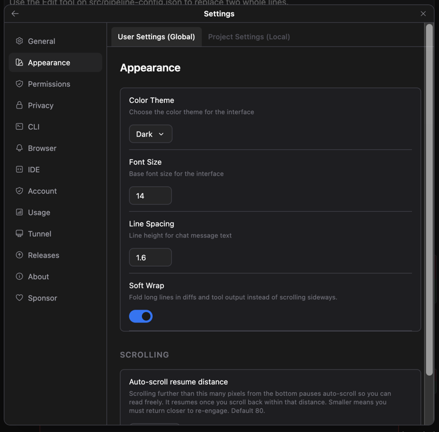
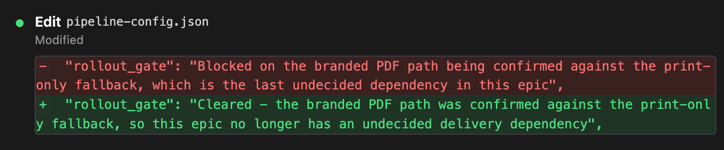

# 긴 줄을 접어서 한눈에 읽습니다

> 언어: [English](./en.md) · **한국어**
>
> 관련: [#179](https://github.com/Swttch/swttch/issues/179)

대화에는 고정폭 글꼴로 그려지는 블록들이 있습니다. 파일을 고쳤을 때 뜨는 diff 카드,
도구를 실행했을 때의 `IN`/`OUT` 줄, 질문과 답이 기록으로 남는 카드 같은 것들입니다.

지금까지 이 블록들은 줄을 접지 않았습니다. 한 줄이 길면 카드 폭에서 잘렸고, 뒷부분을
보려면 가로로 밀어야 했습니다. JSON 한 줄이나 긴 경로처럼 원래 길게 나오는 내용이면
보이는 건 앞머리뿐이었습니다.

diff에서는 이게 특히 곤란합니다. 지운 줄과 넣은 줄이 위아래로 붙어 있는데 **정작 달라진
부분이 잘린 뒤쪽에 있으면**, 무엇이 어떻게 바뀐 건지 알 수가 없습니다.

*자동 줄바꿈이 꺼진 기본 상태. 긴 줄은 카드 폭에서 잘리고, 가로로 밀어야 뒷부분이 보입니다.*

## 자동 줄바꿈 켜기

`설정 > 모양`에 **자동 줄바꿈** 스위치가 생겼습니다.

켜면 긴 줄이 블록 폭에 맞춰 접힙니다. 가로로 밀 필요 없이 줄 전체가 한 화면에 들어옵니다.
diff든 도구 출력이든 질문 기록이든 똑같이 적용됩니다.

*`설정 > 모양`의 자동 줄바꿈 스위치. 켜는 즉시 반영되며 따로 저장할 필요가 없습니다.*

*자동 줄바꿈을 켠 화면. 긴 줄이 여러 줄로 접혀 내용 전체가 보입니다.*

기본값은 꺼짐입니다. 지금까지의 가로 스크롤이 이 화면의 원래 모습이었으니, 바꾸고 싶은
분이 켜는 쪽이 맞다고 봤습니다.

경로나 JSON처럼 **띄어쓰기가 한참 없는 내용**은 단어 경계에서만 접으면 결국 밖으로
비어져 나갑니다. 그래서 필요하면 글자 단위로도 끊습니다.

## 배경색이 글자 끝까지 갑니다

diff에서 지운 줄은 붉게, 넣은 줄은 푸르게 칠해집니다. 그런데 옆으로 밀어보면 이 색이
글자를 따라오지 않고 중간에 끊겼습니다. 글자는 계속 있는데 배경만 사라져서, 이 줄이
지운 줄인지 넣은 줄인지 알 수 없게 됐습니다.

이제 어디까지 밀든 색이 글자를 끝까지 따라갑니다.

이 부분은 **자동 줄바꿈과 무관하게** 항상 적용됩니다. 줄바꿈을 켜면 애초에 밀 곳이 없어
문제가 생기지 않지만, 기본값이 꺼짐인 이상 끈 상태에서도 색은 제대로 나와야 하기
때문입니다.

## 모양 화면이 조금 단정해졌습니다

`모양` 화면 첫 상자에는 "테마"라는 제목이 붙어 있었습니다.

화면 이름이 이미 "모양"인데 그 바로 아래 "테마"가 또 있으면, 한 줄을 더 쓰면서 구분해주는
건 없습니다. 색 테마·글꼴 크기·줄 간격이 한 상자에 모여 있다는 건 상자 자체로 이미
보입니다. 그래서 제목을 뺐습니다.
