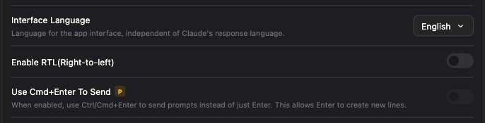

# Changing a global setting did nothing, and looked like it worked

For a setting that the project has overridden on top of the global one:
1. Changing it globally applied the global value optimistically, even though the project had a value for it.
2. On reload the project value took priority again and came back.
3. Rather than suspecting the project override, you were far more likely to read this as a bug where the global setting is not being kept.

Fixed.

## What it looks like now

A setting the project has already decided appears like this on the global tab.

*`Use Cmd+Enter To Send`, overridden by the project — badged, with the toggle dimmed*

- A `P` badge sits next to the label.
- The control on the right is dimmed and cannot be touched.
- Hovering the badge tells you the project is overriding it.
- The value is not hidden. You can still see what is stored globally.
- The project tab is unchanged. What you see there is the value that actually applies.

## Also fixed

Picking `Not set (use global setting)` on the project tab did not bring the
global value back. That is fixed too.

## Notes

- Issue: [#344](https://github.com/Swttch/swttch/issues/344)
