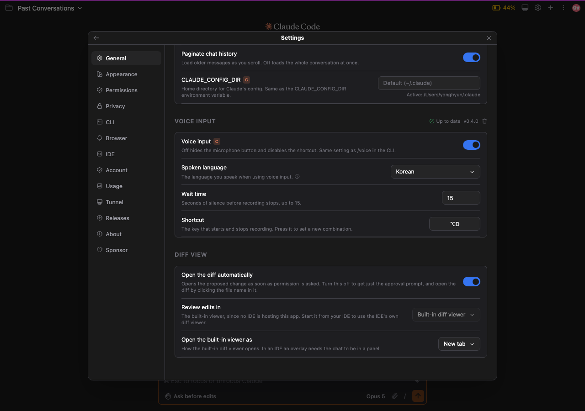
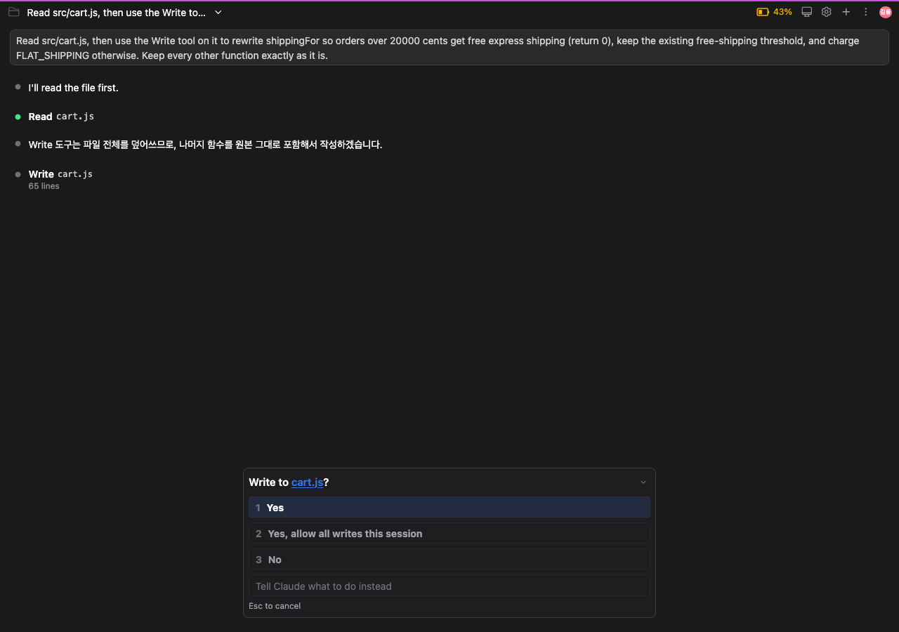

# Keeping the diff from opening on its own

Every time Claude asked to edit a file, a diff window opened along with it. There was no way to turn that off.

There were diff settings, but all of them were about **where** it opens. The IDE's diff viewer or our own diff page, a new tab or an overlay. Whichever value you picked, a window still appeared.

That is convenient if you decide by reading the diff. If you decide by reading the approval prompt, it was just one more window to close every time.

From this release you can **choose whether it opens by itself.**

## Where to turn it off

**Settings → General → Diff View → Open the diff automatically.**

It sits at the top of the Diff View section. The two rows below it say where the diff opens, so this one — whether it opens at all — comes first.

## What happens when it is off

The approval prompt goes up and stops there. No diff window opens.

*The file name `cart.js` is still a link. Click it and the diff opens then.*

**You do not lose sight of the change.** The file name in the approval prompt stays a link, and clicking it opens the diff. It just does not come to you — you go to it when you want it.

The proposed change is stored either way. So you can leave the prompt sitting for a while and the click still opens the same diff.

## It is on by default

The behaviour you have been using is the default. Updating will not suddenly stop your diffs from appearing.

## When this setting applies

When Claude **asks permission to edit a file.**

If you work in `Auto edit` or `Bypass permissions` rather than `Ask before edits`, Claude never asks, so no diff was opening in the first place and this setting has nothing to do with it.

The same goes for work that does not edit files — running a command, reading a file. There is no change to show, so then as now you only get the prompt.

Related: [#349](https://github.com/Swttch/swttch/issues/349)
