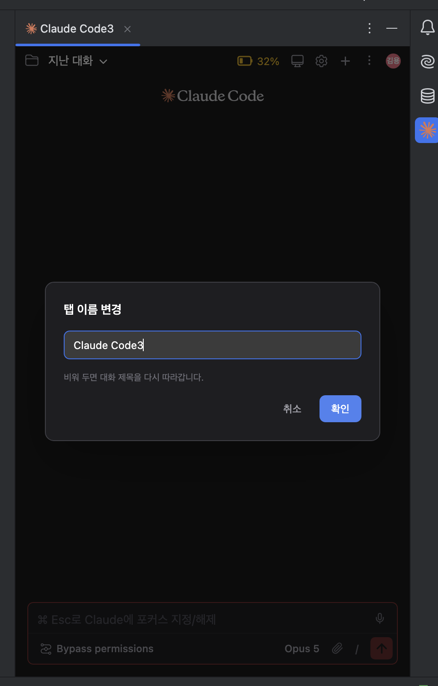

# 탭 이름 직접 정하기

여러 세션을 동시에 켜두고 쓰면, 탭 이름만 봐서는 어느 탭이 무슨 작업인지 알기 어려웠습니다.

탭 이름은 대화 제목을 자동으로 따라갑니다. 그런데 그 제목은 첫 메시지에서 만들어지는 것이라, 서로 다른 작업을 하는 탭 두 개가 비슷한 이름을 갖는 일이 흔했습니다. 내가 정할 방법도 없었습니다.

이번 릴리즈부터 **탭 이름을 직접 정할 수 있습니다.**

## 어떻게 바꾸나

탭을 우클릭하고 **Rename Session...** 을 고릅니다.

에디터 탭이든 툴윈도우 탭이든 똑같이 있습니다.

이름을 넣고 확인을 누르면 탭 이름이 바뀝니다.

## 원래대로 되돌리기

같은 창에서 **입력란을 비우고 확인** 을 누르면 됩니다.

그러면 다시 대화 제목을 따라갑니다. 직접 지은 이름이 지금 하는 작업과 안 맞게 되었을 때 쓰면 됩니다.

## 이름은 대화에 붙습니다

여기가 조금 특이한 부분입니다. **이름은 탭이 아니라 그 탭이 보고 있는 대화에 붙습니다.**

그래서 이렇게 동작합니다.

| 하는 일 | 탭 이름 |
|---------|---------|
| 대화 A를 보다가 이름을 지정 | 지정한 이름 |
| 같은 탭에서 대화 B로 이동 | B의 이름 (A에 지은 이름이 따라오지 않음) |
| 다시 대화 A로 돌아옴 | A에 지었던 이름이 그대로 |
| 다른 탭에서 대화 A를 열기 | 거기서도 A에 지었던 이름 |

탭에 이름이 붙는 방식이었다면, 그 탭에서 여는 모든 대화가 같은 이름을 뒤집어쓰게 됩니다. 이름을 지은 이유가 작업을 구분하기 위해서인데 그러면 반대가 됩니다.

## 새 대화를 시작하기 전에 이름을 지으면

아직 대화가 시작되지 않은 탭(`Claude Code` 라고 떠 있는 상태)에서도 이름을 지을 수 있습니다.

그 상태로 첫 메시지를 보내 대화가 시작되면, **지어둔 이름을 그 대화가 물려받습니다.**

무슨 작업을 할지 미리 정하고 이름부터 붙여두는 경우를 위한 것입니다. 반대로 대화를 시작하지 않고 새 세션으로 초기화하면, 그 이름은 따라가지 않습니다.

## IDE를 껐다 켜도 유지됩니다

지어둔 이름은 저장되므로, IDE를 재시작해도 탭에 그대로 남아 있습니다.

관련: [#301](https://github.com/Swttch/swttch/issues/301) · [#362](https://github.com/Swttch/swttch/pull/362)
