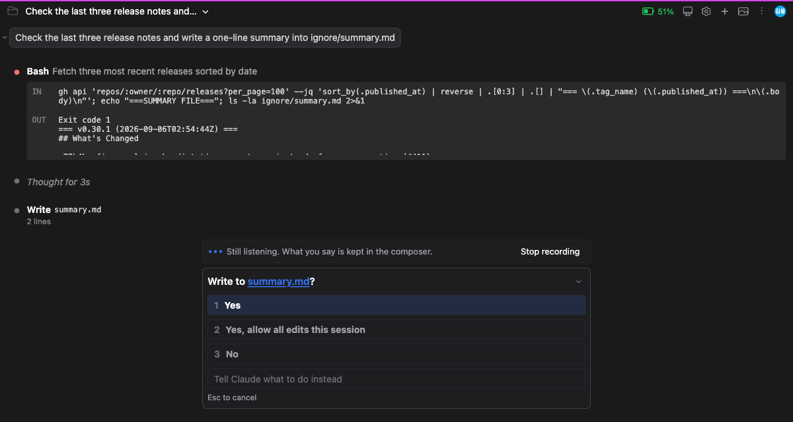

# 승인 창이 떠도 받아쓰기가 멈추지 않습니다

> 언어: [English](./en.md) · **한국어**
>
> 관련: [#409](https://github.com/Swttch/swttch/issues/409)

## 제보

WebStorm에서 플러그인을 쓰던 사용자가 이런 상황을 적어 보냈습니다. Claude가 작업하는 동안 다음에 보낼 말을 미리 받아쓰기로 부르고 있는데, 도구 실행 권한을 묻는 창이나 파일 편집을 승인해 달라는 창이 뜨면 **그 순간 녹음이 끊긴다**는 것이었습니다.

문제는 끊긴다는 사실 자체보다 그 뒤에 있었습니다. 사용자는 말하다가 녹음이 멈춘 것을 스스로 알아채야 하고, 마이크를 다시 켠 다음, 방금 한 말을 처음부터 다시 해야 했습니다. 긴 문장을 부르는 중이었다면 손해가 그만큼 큽니다.

## 왜 멈췄나

받아쓰기 세션이 **입력창 안에** 살고 있었기 때문입니다.

채팅 화면 아래쪽의 그 자리는 입력창만 쓰는 자리가 아닙니다. 승인이 필요한 상황이 생기면 입력창이 물러나고 그 자리를 승인 창이 대신 차지합니다. 즉 승인 창이 뜨는 순간 **입력창은 화면에서 사라집니다.**

입력창이 사라질 때는 뒷정리가 따라 돕니다. 그 뒷정리 중에 마이크를 놓아주는 코드가 있었습니다. 화면 조각 하나가 사라지는 일이 마이크를 끄는 일까지 겸하고 있었던 것입니다.

이것은 승인과 받아쓰기가 서로 부딪히는 문제가 아니었습니다. **녹음이 화면 조각의 수명에 묶여 있던 것**이 문제였습니다. 녹음은 "이 조각이 화면에 있는 동안"이 아니라 "사용자가 말하기를 멈출 때까지" 살아야 합니다.

## 무엇이 달라졌나

받아쓰기 세션의 주인을 입력창에서 **채팅 화면 전체**로 옮겼습니다.

이제 승인 창이 입력창 자리를 차지해도 마이크는 그대로 열려 있습니다. 승인을 처리하고 입력창이 돌아오면, 녹음은 끊긴 적 없이 이어지고 있습니다.

## 입력창이 없는 동안에는 알림줄이 대신 알려줍니다

녹음이 살아 있어도 그것을 보여주던 것들은 전부 입력창에 있었습니다. 마이크 버튼도, 목소리 크기를 보여주는 막대도, 받아쓴 글자가 나타나는 자리도 그렇습니다. 입력창이 물러나면 그 표시가 전부 함께 사라집니다.

녹음이 계속되는데 화면에 아무 표시가 없는 상태는, 차라리 녹음이 멈추는 것보다 나쁩니다. 사용자가 지금 말하는 내용이 저장되고 있는지 아닌지를 알 방법이 없기 때문입니다.

그래서 입력창이 물러나 있는 동안에는 **승인 창 바로 위에 알림줄**이 뜹니다.

알림줄은 세 가지를 담고 있습니다.

- **목소리 크기 막대** — 마이크 버튼 옆에 있던 것과 같은 막대입니다. 마이크가 음소거되어 있거나 입력 장치가 잘못 잡혀 있으면 여기서 바로 드러납니다.
- **지금 상태와 말한 내용의 행선지** — 녹음 중이라는 사실과 함께, 말한 내용이 입력창에 담기고 있다는 것을 알려줍니다.
- **녹음 중지 버튼** — 마이크 버튼이 화면에 없으므로 멈추는 방법도 여기 있어야 합니다.

**입력창이 돌아오면 알림줄은 사라집니다.** 마이크 버튼이 다시 보이므로 같은 정보를 두 곳에서 말할 이유가 없기 때문입니다.

## 승인 창이 떠 있을 때도 받아쓰기를 시작할 수 있습니다

이 변경으로 함께 풀린 것이 하나 더 있습니다.

받아쓰기 단축키(기본값 `⌥D`, Windows·Linux는 `Alt+D`)는 원래 **화면 어디에 있든 동작하도록** 만든 것입니다. 단축키를 만든 이유 자체가 마우스로 마이크 버튼을 찾아가지 않으려는 것이고, 그런 순간은 대개 입력창에 포커스가 없는 순간이기 때문입니다.

그런데 그 단축키를 듣고 있던 코드도 입력창 안에 있었습니다. 그래서 **승인 창이 떠 있는 동안에는 단축키를 눌러도 아무 일도 일어나지 않았습니다.** 시작할 방법이 화면에서 통째로 사라져 있었던 것입니다.

이제는 승인 창이 떠 있어도 단축키로 받아쓰기를 시작할 수 있습니다. 승인 창을 읽다가 "이건 승인하고 다음엔 이걸 시키자"는 생각이 들면, 승인을 처리하기 전에 바로 말하기 시작하시면 됩니다.

단축키를 바꾸는 곳은 **설정 → 일반 → 음성 입력 → 단축키**입니다. 자세한 것은 [타이핑 대신 말로 입력하기](../029-voice_to_text/ko.md) 문서에 있습니다.

## 말한 내용은 어디에 쌓이나

**입력창의 초안에 쌓입니다.** 입력창이 화면에 보이지 않는 동안에도 그렇습니다.

받아쓴 글이 들어갈 자리는 원래부터 입력창 바깥에서 관리되고 있었습니다. 화면에서 물러난 것은 그 글을 **보여주는 부분**이지 글 자체가 아닙니다. 그래서 승인 창이 떠 있는 동안 말한 내용도 그대로 초안에 들어가고, 승인을 처리해 입력창이 돌아오면 말한 것이 전부 거기 들어 있습니다.

한 가지 달라지는 점은 **글이 들어가는 위치**입니다.

입력창이 보일 때 받아쓰기는 **커서 자리에 끼워 넣습니다.** 문장 중간에 커서를 두고 말하면 거기에 들어갑니다. 그런데 입력창이 화면에 없으면 커서라는 것도 없습니다. 이때는 **초안의 맨 끝에 이어 붙입니다.**

끝에 붙이는 쪽을 고른 이유는 그것이 글자를 잃지 않는 유일한 방법이기 때문입니다. 위치를 짐작해서 중간에 끼워 넣으면 이미 적어둔 내용을 밀어내거나 덮어쓸 수 있습니다.

## 조용하면 녹음이 스스로 끝납니다

받아쓰기에는 원래부터 **말이 없으면 녹음을 끝내는 장치**가 있습니다. 기본값은 15초이고, 재는 것은 녹음한 총 시간이 아니라 조용했던 시간입니다. 말을 계속하는 동안에는 끊기지 않고, 잠시 멈출 때마다 시계가 처음으로 돌아갑니다.

이 장치는 승인 창이 떠 있는 동안에도 똑같이 돕니다. 그래서 **무엇을 승인할지 읽느라 오래 말을 멈추면 녹음이 끝날 수 있습니다.**

전에는 이럴 때 아무 말 없이 조용히 꺼졌습니다. 입력창이 화면에 없으니 마이크 버튼이 꺼지는 것도 안 보이고, 사용자는 계속 말하다가 나중에야 아무것도 안 들어온 것을 알게 됩니다.

이제는 **왜 멈췄는지 알려줍니다.**

**다시 녹음**을 누르면 그 자리에서 다시 시작합니다. 마이크 버튼을 찾으러 승인을 먼저 처리할 필요가 없습니다. 오른쪽 **X**를 누르면 알림만 닫힙니다.

### 이 시간을 늘릴 수는 없습니다

**설정 → 일반 → 음성 입력 → 대기 시간**에서 이 값을 바꿀 수 있지만, **더 짧게만 됩니다.** 15초가 기본값이자 최댓값입니다.

우리가 인색해서가 아니라 **지킬 수 없는 약속이기 때문입니다.** 음성을 글로 바꿔주는 서비스 자체가 15초 침묵이면 스스로 듣기를 멈춥니다. 우리 쪽 시계를 20초로 늘려도 그 전에 저쪽이 끊어버리므로, 화면에는 녹음 중이라고 표시되는데 실제로는 아무것도 받지 못하는 상태가 됩니다. 그것은 지금보다 나쁩니다.

같은 이유로 "자동으로 끄지 않음" 같은 선택지도 없습니다.

그래서 이 제한에 대해 우리가 할 수 있는 최선이 **멈춘 사실과 이유를 알리는 것**이었습니다. 없앨 수 없는 제한이라면 최소한 보이게는 만들어야 하기 때문입니다.

## 자주 묻는 질문

**승인 창이 뜨면 왜 입력창이 사라지나요?**

승인 창에는 자기 입력칸이 있습니다. "대신 Claude가 무엇을 할지 알려주세요"라고 적힌 칸이 그것이며, 거부하면서 이유를 함께 적을 수 있습니다. 입력창을 그대로 둔 채 승인 창을 띄우면 화면에 글자를 넣는 칸이 두 개가 되어, 지금 쓰는 글이 다음 메시지인지 거부 사유인지 알 수 없게 됩니다. 그래서 한 번에 하나만 둡니다.

**녹음 중에 숫자 키로 승인해도 되나요?**

됩니다. 승인 창의 `1`·`2`·`3`은 그대로 동작하고, 받아쓰기가 켜져 있다고 달라지지 않습니다. 다만 글자를 입력하는 칸에 포커스가 가 있으면 숫자 키는 글자로 들어갑니다. 이건 원래 그런 동작입니다.

**말하는 도중에 승인을 처리하면 하던 말이 잘리나요?**

아니요. 승인은 녹음에 영향을 주지 않습니다. 승인을 누르면 입력창이 돌아오고, 그때까지 말한 내용은 초안에 들어 있으며, 녹음은 계속됩니다.

**승인하지 않고 오래 두면 마이크가 계속 켜져 있나요?**

아니요. 위에서 설명한 침묵 감지가 계속 돌기 때문에, 말을 하지 않으면 15초 뒤에 녹음이 끝납니다. 승인 창을 열어둔 채 자리를 비워도 마이크가 무한정 열려 있지는 않습니다.

**채팅 화면을 벗어나면 어떻게 되나요?**

녹음이 끝나고 마이크가 닫힙니다. 받아쓰기는 채팅 입력창에 글을 넣는 기능이라, 입력창이 없는 화면에서 계속 녹음하면 말한 내용이 아무도 볼 수 없는 곳에 쌓이게 됩니다.

**녹음이 계속되고 있는지 어떻게 확인하나요?**

입력창이 보일 때는 마이크 버튼이 켜진 색으로 바뀌고 옆에 목소리 크기 막대가 나타납니다. 입력창이 물러나 있을 때는 승인 창 위 알림줄이 같은 역할을 합니다. 두 경우 모두 **막대가 목소리에 따라 움직이는지** 보시면 됩니다. 막대가 움직이지 않으면 마이크가 음소거되었거나 다른 입력 장치가 잡혀 있는 것입니다.

**받아쓰기가 아예 켜지지 않습니다.**

이 문서가 다루는 문제와는 다른 원인입니다. 마이크 권한, `@swttch/extend-kit` 설치 여부, 이 기기의 Claude 로그인 상태를 확인하셔야 합니다. [타이핑 대신 말로 입력하기](../029-voice_to_text/ko.md)의 "시작하지 못할 때" 절과 [받아쓰기에는 Claude 로그인이 필요합니다](../058-dictation_needs_a_claude_login/ko.md) 문서에 각각의 해결 방법이 있습니다.

## 이 변경이 다루지 않는 것

**직접 타이핑하면 받아쓰기는 여전히 멈춥니다.** 이것은 고쳐야 할 문제가 아니라 의도한 동작입니다. 사용자가 손으로 친 글자를 받아쓰기가 덮어쓰지 않기 위한 것입니다.

**말한 내용이 자동으로 전송되지는 않습니다.** 받아쓰기는 초안에 글을 넣을 뿐이고, 보내는 것은 사용자가 결정합니다.

**승인 창이 떠 있는 동안 받아쓴 글을 눈으로 확인할 수는 없습니다.** 글이 들어가는 곳은 입력창의 초안인데 그 입력창이 화면에 없기 때문입니다. 알림줄이 "담기고 있다"는 사실까지는 알려주지만 내용을 보여주지는 않습니다. 승인을 처리하면 전부 보입니다.

## 관련 문서

- [타이핑 대신 말로 입력하기](../029-voice_to_text/ko.md) — 받아쓰기 기능 전반, 단축키·언어·대기 시간 설정
- [음성 입력 첫 사용 안내](../031-voice_first_use_prompt/ko.md) — 처음 마이크를 누를 때 나오는 질문
- [받아쓰기에는 Claude 로그인이 필요합니다](../058-dictation_needs_a_claude_login/ko.md) — 로그인이 없을 때의 안내
