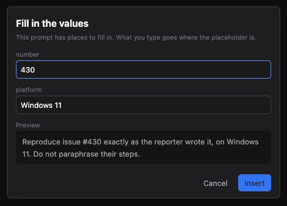
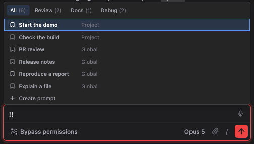
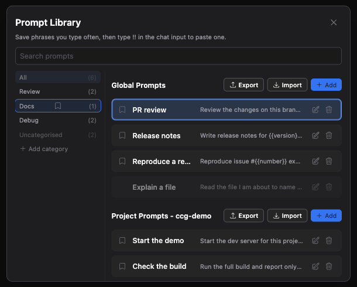
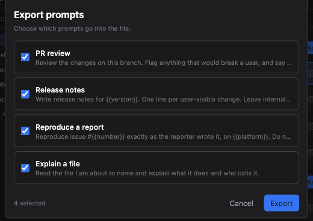

# 프롬프트 라이브러리

> 언어: [English](./en.md) · **한국어**

## 매번 다시 치는 그 문장

Claude Code를 매일 쓰다 보면 몇 번이고 다시 치게 되는 문장이 생깁니다. "이 브랜치의 변경사항을 검토하고, 네가 실제로 확인한 것만 말해." "제보자가 쓴 그대로 재현해." "릴리스 노트 써줘, 사용자에게 보이는 변경 하나에 한 줄로."

지금까지는 이 문장들을 둘 곳이 없었습니다. 매번 다시 치거나, 메모장에 적어두고 복사해 붙이거나 둘 중 하나였습니다.

프롬프트 라이브러리가 그 둘 곳입니다. 문장을 한 번 저장해두면, 그다음부터는 채팅 입력창에 `!!`를 치고 고르면 됩니다.

[#430](https://github.com/Swttch/swttch/issues/430)에서 요청받았습니다.

## `!!`를 치면 라이브러리가 열립니다

채팅 입력창 어디서든 `!!`를 치면 그 위에 라이브러리가 열립니다.

`!!` 뒤에 계속 타이핑하면 목록이 좁혀집니다. 입력한 글자는 세 가지와 동시에 대조됩니다.

| 대조 대상 | 그래서 |
|-----------|--------|
| 프롬프트 이름 | `!!rev`로 "PR review"를 찾습니다 |
| 프롬프트 내용 | 이름은 잊었지만 문장 일부가 기억날 때 그걸로 찾습니다 |
| 카테고리 이름 | `!!debug`로 Debug에 묶인 것을 모두 찾습니다 |

마우스로 고르거나, 방향키로 목록을 훑고 `Enter`를 누르면 됩니다. `Escape`는 패널만 닫고 입력한 글자는 그대로 둡니다.

**프롬프트를 고르면 붙여넣기만 하고 전송하지는 않습니다.** 이것이 핵심입니다. 다시 치지 않으려고 저장해둔 문장이지만, 한 번 읽어보고 오늘의 세부사항을 덧붙인 다음 보내고 싶기 때문입니다. 붙여넣어진 문장은 평범한 텍스트로 입력창에 들어가며, `Ctrl/Cmd+Z`로 다른 편집과 똑같이 되돌릴 수 있습니다.

### 전역 프롬프트와 프로젝트 프롬프트

모든 프롬프트는 둘 중 한 곳에 저장됩니다.

| 스코프 | 저장 위치 | 보이는 곳 |
|--------|-----------|-----------|
| **전역** | `~/.claude-code-gui/entities/prompt/` 아래 파일들 | 모든 프로젝트 |
| **프로젝트** | 같은 파일들 안에서 프로젝트 폴더 경로가 붙은 줄 | 그 프로젝트에서만 |

프로젝트 프롬프트가 먼저 나옵니다. 둘 다 입력한 글자에 걸릴 때는 프로젝트에 특화된 문장이 더 구체적인 답이기 때문입니다.

각 줄의 오른쪽에 그 프롬프트가 어느 스코프에서 왔는지 적혀 있습니다.

프로젝트를 열지 않았다면 프로젝트 쪽은 아예 나타나지 않습니다. 전역 프롬프트는 그대로 동작합니다.

## 라이브러리 화면

패널은 고르는 곳이고, 라이브러리 화면은 관리하는 곳입니다.

`/` 메뉴 → **Context** → **Prompt Library**로 열거나, `!!` 패널 맨 아래의 **프롬프트 만들기** 줄에서 열 수 있습니다.

스코프마다 자기 머리글과 자기 버튼 세 개를 갖습니다. 지금 누르는 버튼이 라이브러리의 어느 쪽에 작용하는지 헷갈릴 일이 없습니다.

각 줄에는 프롬프트 이름, 본문 앞 80자, 그리고 연필과 휴지통이 있습니다. 미리보기에 마우스를 올리면 줄바꿈까지 포함한 전체 문장이 뜹니다. 잘린 한 줄만으로는 지금 무엇을 붙여넣는지 알 수 없기 때문입니다.

두 목록은 각자 스크롤됩니다. 전역 프롬프트가 백 개가 되어도 프로젝트 프롬프트가 화면 아래로 밀려나지 않습니다.

### 순서 바꾸기

프롬프트 줄은 끌어서 순서를 바꿉니다. 손잡이가 따로 없고 **줄 전체가 손잡이**입니다. 줄을 누르면 지금까지처럼 입력창에 붙여넣고, 마우스를 몇 픽셀 끌면 그때부터 끌기가 시작됩니다. 줄 안의 연필과 휴지통은 끌기를 시작하지 않는 평범한 버튼입니다.

끄는 동안 이웃 줄이 비켜나면서 놓일 자리가 비워집니다. `Esc`를 누르면 원래 순서로 돌아갑니다. 전역 목록과 프로젝트 목록은 각자 안에서만 움직이며, 한 목록의 줄을 다른 목록으로 옮길 수는 없습니다.

바꾼 순서는 곧바로 저장됩니다. 라이브러리 화면을 닫았다가 다시 열어도, IDE를 껐다 켜도 그대로입니다. `!!` 패널의 목록도 같은 순서입니다.

#### 어느 순서가 바뀌는가

| 지금 보고 있는 것 | 끌면 바뀌는 것 |
|-------------------|----------------|
| **All** | 라이브러리 전체의 순서 |
| **카테고리 하나** | 그 카테고리 안의 순서만. 전체 순서와 다른 카테고리는 그대로 |
| **Uncategorised** | 아무것도 바뀌지 않습니다. 분류되지 않은 줄에는 자기만의 순서가 없습니다. 줄을 카테고리로 끌어 분류하는 것은 됩니다 |

같은 프롬프트가 카테고리마다 다른 자리에 있어도 됩니다. 카테고리를 고르면 목록 위에 "This order applies inside this category only."라는 안내 한 줄이 나타나서, 지금 끄는 것이 전체 순서가 아님을 알려줍니다.

검색어를 입력한 상태에서도 끌 수 있습니다. 걸러져서 보이는 줄들만 끌려오고, 숨겨진 줄들의 서로 간 순서는 그대로 유지됩니다. 놓은 자리는 바로 옆에 보이는 줄 옆으로 잡힙니다.

#### 카테고리 순서

카테고리 열의 줄도 줄 전체가 손잡이입니다. **All**도 카테고리와 함께 줄을 세웁니다. 처음에는 맨 위에 있지만 카테고리 사이 어디로든, 맨 아래로도 끌어다 놓을 수 있고, 놓은 자리는 저장됩니다. **Uncategorised**만 항상 맨 아래에 고정되어 있어서 끌 수 없고, 그 아래로 놓을 수도 없습니다. 이름을 고치는 중인 줄은 끌리지 않습니다. 나중에 새로 만든 카테고리는 어디에 두었든 **All** 아래, 카테고리 줄의 맨 끝에 붙습니다.

카테고리 줄은 프롬프트를 받는 자리이기도 합니다. 프롬프트를 끌어다 놓으면 분류되고, 카테고리를 끌어다 놓으면 순서가 바뀝니다. 둘은 서로 헷갈리지 않습니다.

#### 키보드로 옮기기

마우스 없이도 순서를 바꿀 수 있습니다. 고른 줄에서 **`Alt+↑`** 와 **`Alt+↓`** 를 누르면 한 칸씩 움직이고 선택도 줄을 따라갑니다. 카테고리 열에 초점이 있을 때는 같은 키가 카테고리를 옮깁니다. `!!` 패널에서도 똑같습니다. 맨 위나 맨 아래에서는 아무 일도 일어나지 않습니다.

IDE가 `Alt+↑↓`를 자기 단축키로 먼저 가져가는 환경에서는 이 키가 줄까지 오지 않을 수 있습니다. 그럴 때는 마우스로 끌어주세요.

### 키보드로 고치고 지우기

줄을 고르고 있는 동안에는 마우스 없이도 고치고 지울 수 있습니다. 라이브러리 화면과 `!!` 패널에서 똑같이 동작합니다.

| 고른 것 | 누르는 키 | 일어나는 일 |
|---------|-----------|-------------|
| 프롬프트 | **`e`** 또는 **`→`** | 연필 버튼을 누른 것과 같습니다. 그 프롬프트의 수정 화면이 열립니다 |
| 프롬프트 | **`Backspace`** | 지워도 되는지 먼저 묻습니다. 묻는 창에서 `Esc`를 누르면 취소입니다 |
| 카테고리 | **`e`** | 카테고리 이름이 그 자리에서 입력칸으로 바뀝니다. `Enter`는 저장, `Esc`는 고치기 전 이름으로 되돌립니다 |
| 카테고리 | **`Backspace`** | 지워도 되는지 먼저 묻습니다. 카테고리만 지워지고 프롬프트는 남습니다 |

- `e`는 글자가 아니라 **키의 자리**로 알아봅니다. 한글 자판에서 `ㄷ`이 찍히는 그 키도 똑같이 `e`로 동작합니다. 수정 화면이나 이름 입력칸은 키를 **누를 때가 아니라 뗄 때** 열립니다. 누르는 순간에 열면 그 키의 글자(`ㄷ`)가 열린 칸에 같이 입력되기 때문입니다.
- 카테고리 이름을 고치는 중에는 `Enter`가 저장, `Esc`가 취소(고치기 전 이름으로 복원)입니다. 커서가 칸 안에 있지 않아도 `Esc`는 동작합니다.
- **카테고리는 `→`로 고치지 않습니다.** 카테고리 열에서 `→`는 그 카테고리의 프롬프트 목록으로 건너가는 키이고, 건너간 뒤에는 `→`가 고른 프롬프트의 수정 화면을 엽니다.
- **All**과 **Uncategorised**는 카테고리가 아니라서 고치거나 지울 수 없습니다.
- `!!` 패널에서 수정 화면을 열었다면, 수정 화면을 닫을 때(저장, 취소, `Esc`) 원래 있던 `!!` 패널로 돌아옵니다. 라이브러리 화면에서 연 수정 화면은 라이브러리 화면의 목록으로 돌아옵니다.
- 라이브러리 화면과 `!!` 패널은 **맨 위에 있는 카테고리**에서 시작하고, 그 카테고리 안에서 맨 위에 있는 프롬프트가 고른 줄입니다. **All**을 아래로 옮겨 두었다면 첫 카테고리에서 열립니다.
- 지우고 나서도 라이브러리 화면이나 `!!` 패널은 닫히지 않고, 지운 줄만 사라집니다.
- 라이브러리 화면의 검색창에 커서가 있을 때 누르는 `e`와 `Backspace`는 글자입니다. 위아래 화살표를 누르면 커서가 검색창을 떠나 목록으로 가고, 그때부터 명령이 됩니다.
- `!!` 패널은 입력창에 쓰던 글자와 같은 자리를 쓰므로, **위아래 화살표로 줄을 한 번 옮긴 뒤부터** `e`와 `Backspace`가 명령이 됩니다. 그 뒤에 글자를 다시 치면 다시 검색어를 쓰는 글자로 돌아갑니다.

### `Esc`는 지금 하던 일만 취소합니다

`Esc`는 맨 위에 떠 있는 것 하나만 닫습니다. 지우기를 묻는 창이 떠 있으면 그 창만, 카테고리 이름을 고치는 중이면 그 고치기만, 수정 화면이면 목록으로, 목록이면 라이브러리 화면을 닫습니다. `!!` 패널과 `{{...}}` 값을 묻는 창도 같습니다.

**답이 오는 중에도 마찬가지입니다.** 예전에는 Claude가 답하는 도중에 이런 창을 `Esc`로 닫으면 같은 키가 입력창에도 닿아 도구가 멈추고 답이 중단되는 일이 있었습니다. 이제 창이나 패널을 닫는 `Esc`는 거기서 끝나고 답을 멈추지 않습니다. 답을 멈추고 싶을 때는 창과 패널이 모두 닫힌 상태에서 `Esc`를 누르면 됩니다.

### 프롬프트 작성

| 항목 | 한도 |
|------|------|
| 이름 | 60자 |
| 내용 | 100,000자 |
| 프롬프트당 카테고리 | 20개 |

이름은 목록에서 프롬프트를 구별하기 위한 것입니다. Claude에게 전송되지 않으며, 단정하게 지을 필요도 없습니다.

카테고리 상자는 원하는 만큼 담습니다. 입력하면 목록이 좁혀지고, 입력한 이름이 아직 없는 것이면 메뉴가 만들기를 제안합니다.

- **Enter**는 방금 친 글자 뒤에 커서가 있는 채로 그 이름을 만듭니다.
- **Tab**은 아래 방향키처럼 메뉴를 내려가고, **Shift+Tab**은 올라갑니다. 양 끝을 지나면 Tab은 다시 필드를 떠나는 키가 됩니다.
- **백스페이스**는 빈 상자에서 마지막 칩을 뗍니다. 글자가 남아 있으면 글자를 지웁니다.

이미 가지고 있는 이름은 대소문자가 어떻든 만들기로 제안되지 않습니다. "Review"가 있으면 "review"로 한 번 더 만들어지지 않고 원래 것을 찾습니다.

## 채워넣을 자리

프롬프트에 `{{무언가}}`가 들어 있으면, 삽입할 때 그 값을 물어봅니다.

- 서로 다른 `{{이름}}` 하나마다 필드 하나가 생기며, 처음 나온 순서를 따릅니다.
- 타이핑하는 대로 미리보기가 갱신되므로, 완성된 문장을 보낸 뒤가 아니라 보내기 전에 확인합니다.
- `Enter`는 아직 값이 비어 있는 다음 필드로 넘어가고, 전부 채워졌다면 **삽입**으로 갑니다. 삽입에서 `Shift+Tab`을 누르면 취소로 갑니다.
- 필드를 비워둬도 됩니다. 그 자리는 아무것도 없이 대체됩니다.
- **취소해도 입력해둔 `!!`는 그대로**이므로 다른 프롬프트를 다시 고를 수 있습니다.

`{{...}}`가 없는 프롬프트에는 이 다이얼로그가 뜨지 않습니다. 이 기능이 생기기 전과 똑같이 곧바로 붙여넣습니다.

### 무엇이 채워넣을 자리인가

`{{이름}}`이며, 이름에 중괄호가 없고 비어 있지 않아야 합니다. 그 밖의 것은 전부 평범한 텍스트입니다.

- 닫는 중괄호가 없는 `{{`는 쓴 그대로 남습니다.
- 중괄호 하나짜리 `{brace}`는 건드리지 않습니다. 프롬프트 안의 JSON이나 템플릿 코드가 멀쩡히 살아남습니다.
- `{{   }}`처럼 공백만 든 것은 채워넣을 자리가 아닙니다.

이름은 앞뒤 공백이 잘리므로 `{{ focus }}`와 `{{focus}}`는 같은 것이고 한 번만 물어봅니다. 같은 이름을 두 번 쓰면 필드는 하나이고 두 자리 모두에 그 값이 들어갑니다.

값 자체에 `{{...}}`가 들어 있다면 평범한 글자로 삽입됩니다. 두 번 채워지지 않습니다.

## 카테고리

카테고리는 폴더가 아니라 태그입니다. 프롬프트 하나가 여러 개를 가질 수 있고, 열에서 카테고리를 고르면 두 스코프가 동시에 좁혀집니다.

- **All**이 화면이 열리는 자리이자, 되돌아오는 자리입니다.
- **Uncategorised**는 맨 아래에 있으며, 실제로 아무 데도 묶이지 않은 것이 있을 때만 나타납니다.
- 이름 옆 숫자는 검색으로 남은 것이 아니라 라이브러리 전체를 셉니다. 타이핑하는 동안 숫자가 움직이지 않습니다.

카테고리 이름은 마우스를 올리고 연필을 누르면 그 자리에서 고칠 수 있습니다. 세션 이름을 고치는 것과 같습니다. **이름 변경은 한 번의 쓰기입니다.** 프롬프트는 카테고리 이름이 아니라 id를 들고 있기 때문에, 그 카테고리에 묶인 프롬프트가 전부 따라옵니다.

카테고리를 삭제하면 카테고리만 사라집니다. 거기 묶여 있던 프롬프트는 그대로 남아 미분류가 됩니다. **분류를 정리하다가 프롬프트를 잃는 일은 없습니다.**

방향키는 두 열을 넘나듭니다. `←`와 `→`가 열 사이를 건너고, `↑`와 `↓`는 건너간 쪽을 훑습니다. 지금 훑고 있는 열은 선택된 줄에 테두리가 둘러진 쪽입니다.

### 창이 좁을 때

창이 두 열을 놓기에 좁으면, 카테고리 열은 목록 위의 칩 줄이 됩니다. 감춰지는 것은 없고, 같은 목록이 가로로 놓일 뿐입니다.

같은 너비에서 워크플로우 에이전트 목록이 하는 것과 같은 방식입니다.

### 끌어다 놓아 분류하기

분류 하나 바꾸자고 프롬프트 폼을 여는 것은 단계가 많습니다. 그래서 줄을 그대로 카테고리로 끌어다 놓으면 그 카테고리로 분류됩니다.

`!!` 패널에서도 똑같이 동작합니다. 패널의 프롬프트 줄과 카테고리 칩도 끌어서 순서를 바꾸고, 그 순서는 라이브러리 화면과 같은 것입니다. 끄는 동안 입력창의 글자와 `!!`는 그대로입니다.

끄는 동안, 떨어뜨렸을 때 실제로 뭔가 바뀌는 카테고리만 밝아집니다. 바뀌지 않는 것은 흐린 채로 남습니다. 드롭을 받아놓고 아무것도 안 하는 대신 미리 알려주는 것입니다.

| 떨어뜨린 곳 | 무슨 일이 일어나나 |
|-------------|-------------------|
| 카테고리 | 원래 가지고 있던 분류는 두고 그 카테고리가 **추가**됩니다 |
| **미분류** | 모든 카테고리가 떨어집니다 |
| **전체** | 아무 일도 없습니다. 전체는 분류해 넣는 곳이 아닙니다 |

대체가 아니라 추가인 것은 의도입니다. 프롬프트는 카테고리를 여러 개 가질 수 있으므로 끌어다 놓는 것은 "이것만"이 아니라 "이것도"입니다. 미분류에 떨어뜨리는 것이 폼을 열지 않고 전부 떼는 방법입니다.

## 내보내기와 불러오기

스코프마다 자기 **내보내기**와 **불러오기**가 있습니다.

내보내기는 JSON 파일 하나를 씁니다. 처음에는 전부 선택되어 있으니, 넘기고 싶지 않은 것만 체크를 해제하면 됩니다. 목록은 라이브러리의 순서 그대로입니다. 파일 이름은 쓴 시각을 따라 `prompts-20260913010203.json` 형태가 되며, 고른 프롬프트가 실제로 쓰는 카테고리와 **카테고리 안의 순서**가 함께 따라갑니다.

JetBrains IDE에서는 IDE의 저장 대화상자가, 그 밖에서는 운영체제의 저장 대화상자가 뜹니다. 사용자 입장에서는 어느 쪽이든 평소 쓰던 그 대화상자입니다.

### 불러오기

불러오기는 파일을 물어보고, 그 안에 무엇이 있는지 알려준 다음, 그때서야 씁니다.

들어올 프롬프트마다 **새로 추가**인지 **이미 있음**인지 보이고, 원하지 않는 것은 체크를 해제할 수 있습니다. 그런 다음 이미 가지고 있는 것을 어떻게 할지 고릅니다.

| 선택 | 무슨 일이 일어나나 |
|------|-------------------|
| **내 것 유지** | 가지고 있던 것이 그대로 남고, 들어온 것은 건너뜁니다 |
| **덮어쓰기** | 들어온 것이 가지고 있던 것을 대체합니다 |
| **둘 다 보관** | 둘 다 남고, 들어온 것에 새 id가 붙습니다 |

새 프롬프트는 어느 선택에서든 추가됩니다. 이 셋은 충돌이 났을 때만 갈립니다.

들어온 프롬프트는 라이브러리 **맨 위**에 파일에 적힌 순서 그대로 붙습니다. 가지고 있던 프롬프트의 자리는 움직이지 않습니다. 카테고리 안에서도 마찬가지로, 들어온 것이 그 카테고리의 맨 위에 파일이 담은 카테고리 안 순서대로 붙습니다. **덮어쓰기**는 이름, 내용, 카테고리를 바꾸고 그 프롬프트가 이 컴퓨터에서 있던 자리는 그대로 둡니다.

"이미 있음"은 프롬프트의 id가 같은지로 가립니다. 업데이트 전에 내보낸 파일도 id가 그대로 이어져 있으므로 똑같이 판정됩니다.

파일에 카테고리가 들어 있으면 **이름으로** 내 것과 맞춥니다. "Review"로 들어온 프롬프트는 이미 있는 "Review"에 합류하지 두 번째 "Review"를 만들지 않으며, 처음 보는 카테고리는 새로 만들어집니다.

### 다른 곳에서 쓰던 프롬프트 가져오기

불러오기는 프롬프트 파일의 생김새에 대해 일부러 너그럽습니다. 옮겨오려는 그 파일은 애초에 우리가 쓴 파일이 아닐 가능성이 높기 때문입니다.

아래를 모두 받아들입니다.

- 우리 내보내기 파일. 형식 표시가 붙어 있는 것. 예전 버전이 내보낸 파일도, 카테고리 안 순서가 없을 뿐 그대로 읽힙니다
- 우리가 디스크에 쓰는 저장 파일. 형식 표시가 없는 것
- 프롬프트를 배열로 나열하지 않고 객체에 id를 키로 얹은 파일
- 프롬프트만 담긴 맨 JSON 배열

프롬프트에는 이름과 내용이 있어야 합니다. 나머지는 우리가 알아냅니다.

시각 정보가 없으면 채워 넣습니다. 우리가 쓰지 않을 형태의 id는 우리가 쓸 id로 바꾸되 프롬프트 자체는 살립니다. **못 읽는 줄 하나 때문에 멀쩡한 줄까지 잃지 않습니다.** 읽을 수 있는 프롬프트는 들어오고 나머지는 버려집니다.

파일이 아예 JSON이 아니거나, JSON이지만 프롬프트 파일이 아니거나, 읽을 수 있는 것이 하나도 없었다면, 셋 중 무엇이었는지 알려줍니다. 조용히 실패하지 않습니다.

## 이 기능이 하지 않는 것

- **스코프를 옮기는 방법은 없습니다.** 전역 프롬프트를 프로젝트 프롬프트로 만들려면 다시 쓰는 수밖에 없습니다. 필요하시면 이슈로 말씀해주세요.
- **프롬프트는 기기 사이에서 동기화되지 않습니다.** 디스크의 파일이며, 내보내기와 불러오기가 프롬프트가 이동하는 방법입니다.
- **프로젝트 폴더를 옮기거나 이름을 바꾸면 그 프로젝트의 프롬프트가 새 경로에 이어지지 않습니다.** 프로젝트 프롬프트는 프로젝트 폴더의 경로에 붙어 저장되기 때문입니다. 새 경로에서는 빈 프로젝트처럼 시작하며, 옛 경로로 되돌리면 다시 나타납니다. 필요하면 옛 경로에서 내보내고 새 경로에서 불러오세요.
- **다른 컴퓨터의 순서는 따라오지 않습니다.** 내보내기 파일이 순서를 담고 있으므로, 불러올 때 파일의 순서가 맨 위에 붙을 뿐입니다.
- **카테고리는 전역입니다.** 카테고리 이름은 한 벌이고 전역과 프로젝트가 함께 씁니다. 의도한 것입니다. 화면 한쪽에서만 쓸 수 있는 카테고리는 카테고리가 없느니만 못합니다.
- **카테고리 삭제는 되돌릴 수 없습니다.** 다만 프롬프트는 절대 지우지 않습니다.
- **`{{...}}`는 우리 것이지 Claude의 것이 아닙니다.** 입력창에 닿기 전에 채워지므로, Claude는 `{{`를 볼 일이 없습니다.

## 예전 버전에서 올라올 때

예전 버전은 프롬프트를 `~/.claude-code-gui/prompts.json`(전역)과 `<프로젝트>/.claude-code-gui/prompts.json`(프로젝트)에 저장했습니다. 이 버전은 업데이트 뒤 플러그인이 처음 시작될 때 그 파일들을 새 저장소로 **한 번** 옮깁니다. 따로 하실 일은 없습니다.

- 옮기기는 전역 프롬프트와 카테고리가 먼저이고, 프로젝트는 그다음입니다.
- 이름, 내용, 만든 시각, 고친 시각은 한 글자도 바뀌지 않습니다. 화면의 순서도 옮기기 직전과 같습니다. 예전 화면이 새것을 위에 놓았으므로 옮긴 직후에도 새것이 위입니다.
- 파일을 찾아보는 프로젝트는 플러그인이 아는 프로젝트입니다. Claude Code를 써 본 모든 폴더와, 플러그인이 한 번이라도 다룬 모든 폴더입니다. 홈 폴더 전체를 훑지 않으므로 macOS가 `Desktop`, `Documents`, `Downloads`의 접근 허용을 갑자기 묻지 않습니다.
- 옮기는 동안 라이브러리는 옮기기가 끝나기를 기다립니다. 1초가 넘게 걸리면 데이터를 업데이트하는 중이라는 배너가 뜨고, 그보다 빨리 끝나면 아무것도 보이지 않습니다.
- **예전 파일은 지우지도 고치지도 않습니다.** 그대로 남아서 백업이 됩니다.
- 옮기기에 실패하면 라이브러리와 프로젝트 목록이 빈 목록 대신 오류를 보여주고, 배너가 실패한 단계의 이름을 알려줍니다. 다음 시작 때 그 단계부터 다시 시도합니다.
- 읽을 수 없는 예전 파일(접근 권한이 없거나 파일이 망가진 경우)이 있으면 나머지는 옮기고, 배너가 그 폴더들을 알려줍니다. 그 프롬프트들은 예전 파일에 남아 있으며 불러오기로 가져올 수 있습니다.
- 한 번 옮긴 뒤에는 다시 옮기지 않으므로, 프롬프트를 전부 지워도 되살아나지 않습니다.
- Claude Code 대화가 한 번도 없었고 플러그인도 한 번도 열지 않은 폴더의 프롬프트는 찾지 못합니다. 그 폴더를 아는 곳이 없기 때문입니다. 그 프롬프트들은 예전 파일에 남아 있고, 불러오기로 가져올 수 있습니다.

예전 버전으로 돌아가면 예전 파일이 멀쩡히 읽힙니다. 다만 돌아가 있는 동안 고친 내용은 새 저장소로 따라오지 않습니다. 그 내용이 필요하면 예전 파일을 불러오기로 골라서 합치면 됩니다. 불러오기가 예전 저장 파일의 모양을 그대로 읽습니다.

## 파일 위치

| 무엇 | 어디 |
|------|------|
| 프롬프트(전역과 모든 프로젝트) | `~/.claude-code-gui/entities/prompt/prompt_items.entity.jsonl` |
| 카테고리 | `~/.claude-code-gui/entities/prompt/prompt_categories.entity.jsonl` |
| 프롬프트가 어느 카테고리의 몇 번째에 있는가 | `~/.claude-code-gui/entities/prompt/prompt_category_item_links.entity.jsonl` |
| 플러그인이 아는 프로젝트 폴더 | `~/.claude-code-gui/entities/project/projects.entity.jsonl` |
| 번호표와 옮김 기록 | `~/.claude-code-gui/entities/system/` |

모두 한 줄에 JSON 하나씩 적힌 평범한 글 파일이고 읽어봐도 괜찮습니다. 프로젝트 프롬프트는 `projectId`에 `projects.entity.jsonl`에 있는 프로젝트의 번호가 적힌 줄이고, 그 파일에 프로젝트 폴더의 경로가 있습니다. `CCG_HOME`을 설정해두셨다면 경로는 그쪽을 따릅니다.
