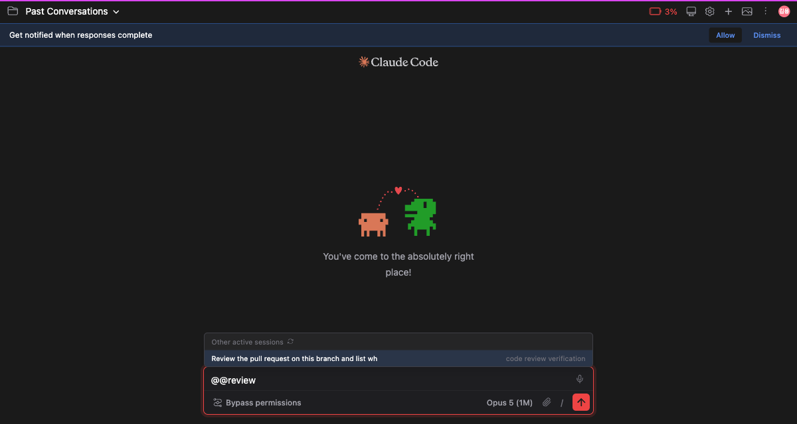
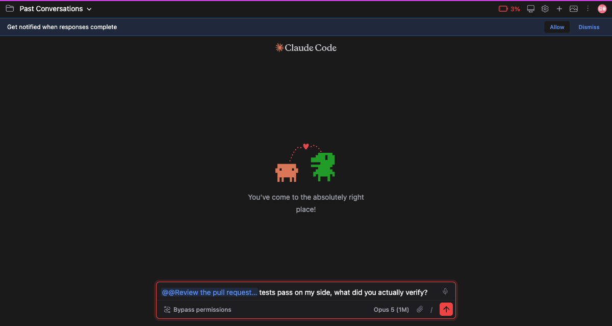

# Ask another session

> Language: **English** · [한국어](./ko.md)

## Three tabs open, and you were the one carrying things between them

A day with Claude Code ends with several tabs open. One is fixing an issue, one is researching a reference, one is writing the release notes.

None of them knows about the others. Handing a finding from the research tab to the fixing tab meant copying it across by hand. Finding which tab was doing what meant opening them one at a time.

Now you type `@@` in the composer.

## `@@` lists the sessions that are running

Every Claude session running on this machine, **most recently active first**. The tab you are typing in is left out of its own list.

**Each row is a title on the left and a name on the right.** The title is the same text the session dropdown shows it by. The name is the address the message actually goes to.

A long title is cut short on the left, and **the name is never cut**, because a name you cannot read in full is not an address.

Sessions from other projects are listed too. Reaching a tab in another project from this one is exactly what this is for.

### Keep typing to narrow it

What you type after `@@` is matched against **both the title and the name**. Use the title when you remember what a session started out doing; use the name when you remember the suffix that tells two tabs of one project apart.

Arrow keys walk the list, `Enter` picks, `Escape` closes the panel and leaves your text alone.

### The list is read again every time it opens

Sessions come and go. Measured in one sitting, the list went from three to four in well under an hour.

So the panel re-reads it on every open. A list read earlier is shown immediately and refreshed **quietly behind it** — the icon beside the header spins while that happens, and you can click it to read the list again yourself.

## Picking one leaves a chip

The session you picked stands in the composer as a **chip**, the way a mention reads when you @ someone in Slack.

The chip is not words. It is one address, so it behaves like one character.

| Key | What happens |
|-----|--------------|
| ← → | Crosses the whole chip **in one press**. The caret never rests inside it |
| Click on the chip | The caret is pushed to the nearer edge |
| `Backspace` (just after it) | Removes **all** of it |
| `Delete` (just before it) | The same |

Deleting it one letter at a time would leave `@@Review the pull reques`, which is neither an address nor a word.

Removing the chip removes the recipient with it. The next `Enter` goes to this session again.

## Sent, it stays as something you said

What you sent stays as **your own bubble**, chip and all. The chip is the record of how you addressed the message, so it belongs in what you said.

**The chip is cut off what actually travels.** To the session receiving it the chip is not words, and left at the front it would read as the opening line of your message.

The chip in the bubble can be clicked. **That session opens in a new tab**, and the conversation you were reading stays where it is. Clicking a mention is how you check what was referenced, not how you leave.

It finds its way even when the session belongs to another project: the chip carries the session id and its working directory.

## What you had is still there

Press `↑` to recall an earlier message and **the chip comes back alive** with it. Press `Enter` and it goes to the session it went to before.

The same holds if you leave a chip attached and visit another session: the text and its chip are both waiting when you come back.

## How it works

**The list is the official command.** It is whatever `claude agents --json` prints. Run that in your terminal and you get the same list.

**Delivery takes the route a CLI user takes.** Sending a message between sessions is the model's tool, and a terminal user cannot call it directly either — they say so out loud and let the model do it. This does the same. What the GUI adds is the **address**.

**Titles go through the same function the session dropdown uses**, because a session that reads one way in one place and another way somewhere else cannot be picked with confidence.

## Worth knowing

**A session name is a handle on a process.** When a CLI process restarts, a new name is issued: one conversation was observed as `…-36` and later as `…-57`. That is why the chip carries the **session id** alongside the name.

**Attachments do not travel with the message.** The delivery is a single string, so a file has nowhere to go. Attached files are left in place rather than dropped, and go with the next message you send to this session.

**The session you wrote to may not answer at once.** It picks the message up at its next turn, after it finishes what it was doing.
