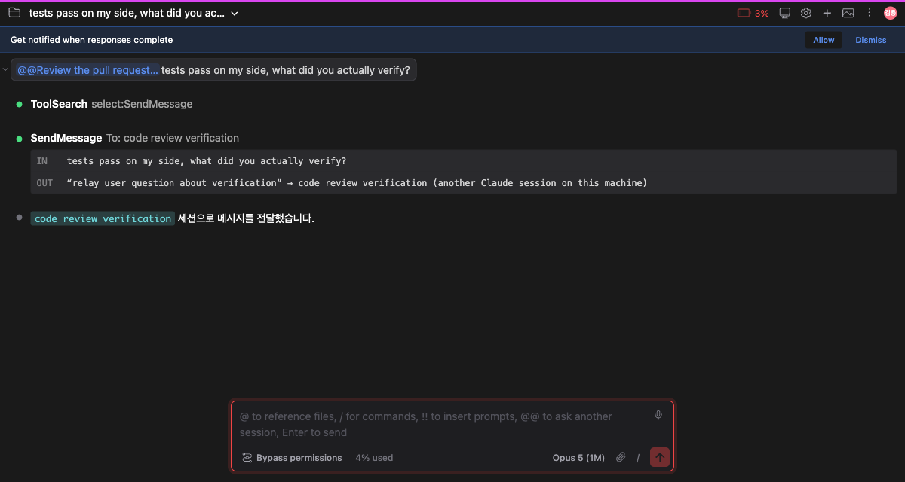

# 다른 세션에 말 걸기

> 언어: **한국어** · [English](./en.md)

## 탭 셋을 열어놓고, 그 사이를 사람이 오갔습니다

Claude Code를 하루 쓰다 보면 탭이 여러 개 열립니다. 하나는 이슈를 고치고, 하나는 레퍼런스를 조사하고, 하나는 릴리스 노트를 씁니다.

그런데 그 탭들은 서로를 모릅니다. 조사하던 탭이 알아낸 것을 고치던 탭에 넘기려면 사람이 복사해서 옮겨야 했습니다. 어느 탭이 뭘 하고 있었는지 찾으려면 하나씩 열어봐야 했습니다.

이제 채팅 입력창에 `@@`를 치면 됩니다.

## `@@`를 치면 살아있는 세션이 뜹니다

지금 이 컴퓨터에서 돌고 있는 세션이 **최근 활동순으로** 나옵니다. 지금 보고 있는 탭은 목록에서 빠집니다.

**줄마다 왼쪽은 세션 제목이고 오른쪽은 세션 이름입니다.** 제목은 세션 드롭다운에 뜨는 바로 그 글자입니다. 이름은 메시지가 실제로 가는 주소입니다.

제목이 길면 왼쪽이 말줄임되고, **이름은 잘리지 않습니다.** 이름이 잘리면 주소를 읽을 수 없기 때문입니다.

다른 프로젝트의 세션도 같이 나옵니다. 지금 이 프로젝트에서 저쪽 프로젝트의 탭에 말을 거는 것이 이 기능이 하려는 일이기 때문입니다.

### 계속 타이핑하면 좁혀집니다

`@@` 뒤에 친 글자는 **제목과 이름 둘 다**에 대조됩니다. 세션이 무슨 얘기로 시작했는지 기억나면 그걸로 찾고, 같은 프로젝트 탭 둘을 구별하는 접미어가 기억나면 그걸로 찾습니다.

방향키로 오르내리고 `Enter`로 고릅니다. `Escape`는 패널만 닫습니다.

### 목록은 열 때마다 다시 읽습니다

세션은 계속 생기고 사라집니다. 실제로 한 시간도 안 되는 사이에 세 개에서 네 개가 됐습니다.

그래서 패널은 열릴 때마다 목록을 다시 읽습니다. 이미 읽어둔 것이 있으면 그것을 즉시 보여주고 **뒤에서 조용히** 갱신합니다. 제목 옆 아이콘이 그동안 돌고, 눌러서 직접 다시 읽을 수도 있습니다.

## 고르면 칩이 됩니다

고른 세션은 입력창 안에 **칩**으로 들어갑니다. 슬랙에서 누군가를 멘션할 때와 같은 모양입니다.

칩은 글자가 아니라 **주소 하나**입니다. 그래서 한 글자처럼 움직입니다.

| 입력 | 동작 |
|------|------|
| 방향키 ← → | 칩을 **한 번에** 건너뜁니다. 가운데에 커서가 서지 않습니다 |
| 칩을 클릭 | 커서가 가까운 쪽 끝으로 밀려납니다 |
| `Backspace` (칩 뒤) | 칩이 **통째로** 지워집니다 |
| `Delete` (칩 앞) | 위와 같습니다 |

한 글자씩 지워지면 `@@Review the pull reques`가 남는데, 그것은 주소도 아니고 말도 아닙니다.

칩을 지우면 수신자도 같이 풀립니다. 그다음 `Enter`는 지금 이 세션으로 갑니다.

## 보내면 내가 한 말로 남습니다

보낸 메시지는 **내 말풍선으로 남습니다.** 칩도 그 안에 같이 남습니다. 칩은 그 메시지를 어떻게 부쳤는지의 기록이라, 내가 한 말의 일부이기 때문입니다.

**실제로 저쪽에 가는 본문에서는 칩이 빠집니다.** 받는 세션에게 칩은 말이 아니라서, 앞머리에 남으면 메시지의 첫 마디로 읽히기 때문입니다.

말풍선의 칩은 눌러볼 수 있습니다. **그 세션이 새 탭에서 열립니다.** 보고 있던 대화는 그대로 있습니다. 멘션을 누르는 것은 "저게 무슨 세션이었지"를 확인하려는 동작이지 여기를 떠나려는 것이 아니기 때문입니다.

다른 프로젝트의 세션이어도 제자리를 찾아갑니다. 칩이 세션 id와 작업 디렉토리를 같이 들고 있습니다.

## 쓰던 것을 그대로 다시 부를 수 있습니다

`↑`로 이전 메시지를 불러오면 **칩도 같이 살아서** 돌아옵니다. 그대로 `Enter`를 치면 원래 보냈던 그 세션으로 갑니다.

칩을 붙여둔 채 다른 세션에 다녀와도 마찬가지입니다. 입력창 내용과 함께 칩이 그대로 있습니다.

## 어떻게 동작하나

**목록은 공식 명령입니다.** `claude agents --json`이 주는 것을 그대로 읽습니다. 터미널에서 같은 명령을 치면 같은 목록이 나옵니다.

**전달은 CLI 사용자와 같은 경로입니다.** 세션 사이에 메시지를 보내는 것은 모델의 도구이고, 터미널 사용자도 그것을 직접 부를 수는 없습니다. 말로 시키는 수밖에 없고, 이 기능도 같은 방법을 씁니다. GUI가 더한 것은 **주소**입니다.

**제목은 세션 드롭다운과 같은 함수를 지납니다.** 같은 세션이 화면마다 다른 이름으로 보이면 고를 수가 없기 때문입니다.

## 알아둘 것

**세션 이름은 프로세스에 붙은 핸들입니다.** CLI 프로세스가 재시작되면 이름이 새로 발급됩니다. 실제로 같은 대화가 `…-36`이었다가 `…-57`이 된 것을 확인했습니다. 그래서 칩은 이름과 함께 **세션 id**를 들고 다닙니다.

**메시지에 첨부 파일은 실리지 않습니다.** 전달이 글자 하나로 이뤄지기 때문입니다. 첨부한 파일은 지워지지 않고 남아 있다가, 다음에 이 세션으로 보내는 메시지에 따라갑니다.

**받는 세션이 바로 답하지 않을 수 있습니다.** 그쪽이 하던 일을 마치고 다음 차례에 메시지를 꺼내 봅니다.
