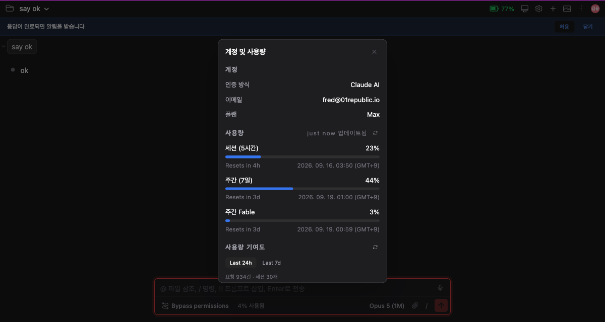
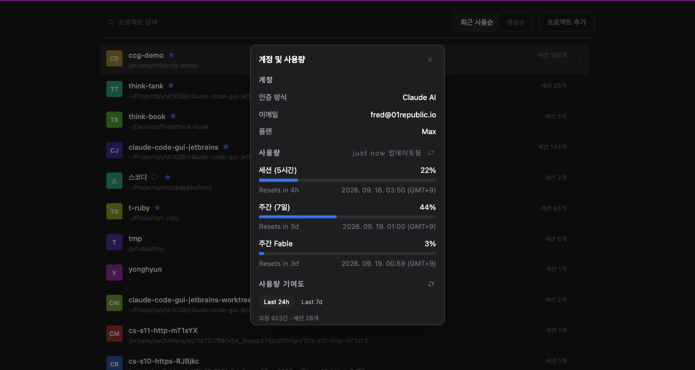
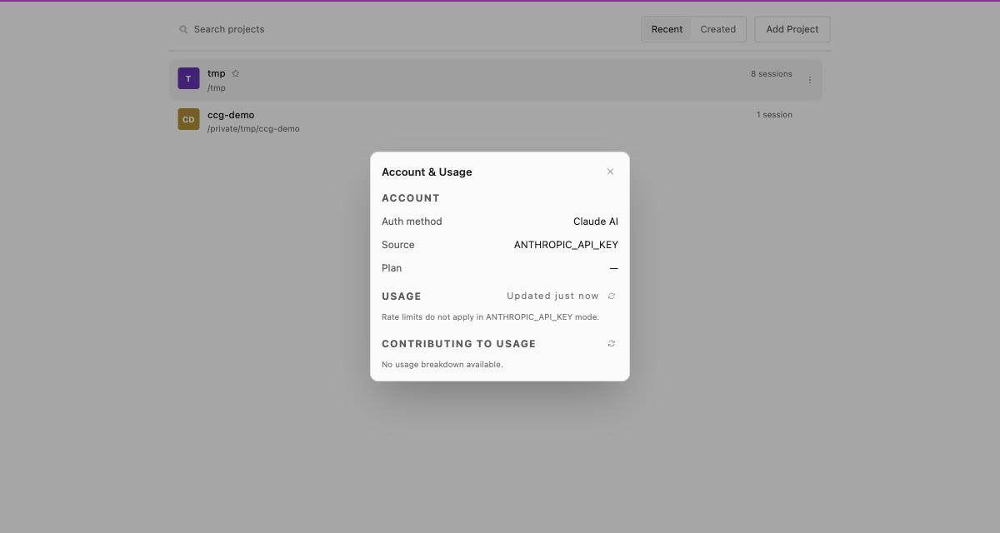

# A usage panel that knows when to ask

> Language: **English** · [한국어](./ko.md)

## What was wrong

The usage panel asked the same question over and over, and answered a few of
them wrongly.

It ran a `ccb` process every time it needed a number, including right after
being told it was asking too often. It drew whichever windows it had been
taught the names of, so a per-model limit the API had been reporting for weeks
never appeared. And on an account signed in with an API key it showed three
blank rows and an empty chart, which reads less like "that does not apply here"
and more like "this product does not support my plan".

## Updated from the conversation itself

`claude` reports your remaining session and weekly allowance as a turn runs. It
always did; nothing was listening.

Now the panel takes it. Chat for a while and the bars move on their own, with
no request spent on asking — and a request that is never made is a request that
cannot be rate limited.

An event of this kind is an update rather than a full statement of everything
known, so a window it does not mention keeps the value it already had.

## Being rate limited means stop asking

If the API answers "too many requests", asking again inside the window renews
the penalty rather than resolving it. The panel now waits out the interval the
API asked for, and shows the last numbers it had while it waits, rather than
going blank.

The wait applies to **one account**. Several accounts refresh together here,
and one of them being throttled must not silence the others.

Refreshing by hand skips the stored copy and asks fresh — but it cannot skip
this wait, which is the exact hammering the wait exists to prevent. The panel
says how long is left instead of failing silently.

## Numbers that have gone stale are not shown as current

A stored reading is reused for a few minutes so that a second window, or a
restart, does not spend another request drawing the same thing.

It is dropped early when a window rolls over. A five-hour allowance that reset
two minutes ago is not "almost spent" any more, and showing the old figure for
the rest of the interval looks exactly like a number that is stuck.

## Per-model limits appear

Some weekly allowances are reported per model, and they arrive in a part of the
response that has no fixed field names. The panel read only the named fields,
so those allowances were invisible even while the API reported them.

They are drawn now, under whatever name the API gives them. A model introduced
next month needs no release here to show up.

An entry that repeats a window already shown is left out rather than drawn
twice.

## Accounts that use an API key

An API key is billed per request, so there is no subscription allowance to
report — the API says as much when asked. Claude Code also reports the same
authentication method for an API key as for a subscription login, and leaves
the email, organisation and plan empty.

The panel now names the credential instead of leaving the row blank, and says
plainly that allowances do not apply, in the same muted tone an empty list
uses rather than as an error.

`Plan` is left as it is. It may become answerable later, and an empty row is
honest in the meantime.

## What you need

The rate-limit handling and the per-model windows work with any recent `ccb`.
The proxy correction described in
[Usage stats work behind a proxy](../063-usage_behind_a_proxy/en.md) needs
`ccb` 0.6.1 or newer, which the backend installs on its own.
