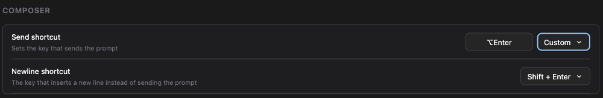
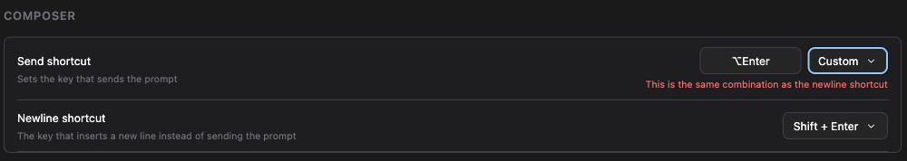

# Choose what sends and what breaks the line

> Language: **English** · [한국어](./ko.md)

## What was wrong

You are typing a prompt in a JetBrains IDE. It is turning into a list, so you
press Shift+Enter to start the next line.

A second copy of the chat opens beside the one you were typing in. Your line
break never happens.

That is how it was reported in
[#463](https://github.com/Swttch/swttch/issues/463), from Rider. Ctrl+Enter did
much the same thing, and Ctrl+J did nothing at all. The reporter's workaround
was to write multi-line text in another editor and paste the finished block in.

The cause was not in the chat. Shift+Enter and Ctrl+Enter are both bound in the
IDE's own factory keymap, in `keymaps/$default.xml`, which every JetBrains
product ships:

| Key | IDE action | What it does |
| --- | --- | --- |
| Shift+Enter | `OpenInRightSplit` | Opens the selected file in a right-hand split |
| Ctrl+Enter | `ViewSource` | Opens the source of the selected item |

The selected file, while you are typing in the chat, is the chat's own editor
tab. So the IDE opened the chat again, in a split, and the keystroke never
reached the composer at all.

The second thing wrong was smaller and older. The setting that decided all of
this was a single on/off switch called **Use Cmd+Enter To Send**, which named
its own mechanism rather than the question you were asking, and left the other
half of the question unanswered: if the modifier sends now, what does plain
Enter do?

## What you see now

Settings → General has a **Composer** section, with one row for each half of
the question.

### Send shortcut

| Option | What sends the prompt |
| --- | --- |
| **Enter** | A plain Enter. This is the default. |
| **⌘ + Enter** (**Ctrl + Enter** on Windows and Linux) | Either modifier plus Enter. Both work on both platforms; only the label follows the keyboard in front of you. |
| **Custom** | A combination you press yourself. |

### Newline shortcut

| Option | What breaks the line |
| --- | --- |
| **Shift + Enter** | Shift plus Enter. This is the default. |
| **Enter** | A plain Enter. Pick this when the send key is a modifier combination. |
| **Custom** | A combination you press yourself. |

## Setting a combination of your own

Choose **Custom** and a button appears to the left of the dropdown, reading
**Not set**. Click it, and it changes to **Press a key…**. Press the
combination you want, and it is stored immediately.

Escape leaves the button as it was, for when you opened it by accident.

Most combinations need Ctrl, Alt or Cmd held as well, because a bare letter or
a Shift+letter is a character you are trying to type, and binding one would
make that character unusable in the composer. Press one and the button says so:

> Hold Ctrl, Alt or Cmd as well.

Keys that type no character at all are exempt, so **Shift+Enter is accepted**,
and so are Tab, the arrow keys, and the function keys. That exemption exists
for this screen specifically: the newline default *is* Shift+Enter, and a
setting that could not express its own default would be a strange setting.

## The two keys cannot be the same

If a change would leave both rows on the same combination, the change is
refused and the row says why:

Nothing is written when that happens, so the dropdown keeps showing the value
that is actually in effect. Saving the collision instead would leave you with a
composer that had silently lost one of the two actions, while the screen
claimed otherwise.

## A message sent while Claude is working

The third row in the section is about a different moment: you have already sent
something, Claude is working on it, and you type again.

| Option | What your message does |
| --- | --- |
| **Queue** | Waits until the current turn finishes, then goes. This is the default, and it is what the app has always done. |
| **Steer** | Ends the current turn now and gets answered instead. |

Steering is not a separate channel. It is the same interrupt the Stop button
sends, and it is what a terminal user does by typing and pressing Escape: your
message is already in the CLI's queue, so ending the turn makes the CLI pick it
up and start a new one on it. The work done so far is still in the conversation,
so Claude answers you knowing everything it had just found out.

### Doing the opposite for one message

You do not have to change the setting to make one message go the other way.
There is a key for it, and it follows whatever your send shortcut is:

| Your send shortcut | The one-off key |
| --- | --- |
| Enter | ⌘+Enter (Ctrl+Enter on Windows and Linux) |
| ⌘+Enter | ⇧⌘+Enter |
| A custom combination without Ctrl/Cmd | Ctrl/Cmd plus that combination |
| A custom combination with Ctrl/Cmd but no Shift | Shift plus that combination |

A send shortcut that already carries both has nothing left to add, so it has no
one-off key. The row says nothing about one in that case rather than naming a
key that would not work.

The same is true when your newline shortcut happens to sit on the combination
the table above would produce. The key you chose keeps it — a key you never
chose does not get to take a setting you filled in.

## Enter always breaks the line

Whatever the two rows say, an Enter that is not the send key inserts a line
break.

So if you set the send key to ⌘+Enter and leave the newline key on Shift+Enter,
plain Enter still breaks the line. It is bound to nothing, and an Enter bound to
nothing is the one outcome nobody wants from an Enter key.

There is a practical reason underneath the tidy one. Inside the IDE's embedded
browser, an Enter the code ignores is swallowed as an input-method commit and no
line break appears at all — the same failure behind
[#215](https://github.com/Swttch/swttch/issues/215).

## Where your old setting went

If you had **Use Cmd+Enter To Send** switched on, nothing changed for you. The
old key is still read: with it on, the Composer section opens showing
**⌘ + Enter** for sending and **Enter** for the line break, which is exactly
what that switch used to do.

The old key is only consulted while you have never touched the new rows. The
moment you choose something, your choice decides and the old key is ignored.

## Limits

**These keys are not in Settings → Keymap.** The reporter asked for that
specifically, and it is not something we can offer. The IDE's keymap lists IDE
actions, and a line break inside the chat is not one — it happens inside the
embedded browser, below the level the IDE's action system can see. The Composer
section is where these two keys are rebound.

**Plain Enter is still the IDE's.** We ask the IDE to stand back from Enter only
when a modifier is held. A plain Enter already reaches the composer, and
claiming it outright would take Enter away from every IDE list and dialog that
the chat merely happens to be focused in front of.

**Every modifier plus Enter now goes to the chat.** Shift, Ctrl, Alt and Cmd are
all released, not just the two in the report, because the send and newline keys
are yours to set — a rule that named only Shift and Ctrl would break again the
first time someone chose Alt+Enter, and give no hint why. The trade is that
while the chat has focus, the IDE's own Shift+Enter and Ctrl+Enter actions are
out of reach. Click into an editor and they work as always.

**Custom with nothing recorded sends on nothing.** A row set to Custom before
you have pressed a combination binds no key rather than falling back to a
built-in one, because a fallback would leave the row reading "Custom" while some
combination you never chose did the sending. Enter still breaks the line, as
above.

**On a touch keyboard, Enter always breaks the line.** A phone or tablet
keyboard has no modifiers to reach for, so Enter has to type a line there
whatever the send key is set to. Use the send button.

**While an input method is composing, neither key fires.** Enter is how an IME
commits a candidate, and that keystroke belongs to the composition. Press Enter
again once the candidate is committed.

**Steering ends the turn; it does not pause it.** There is no way to hand Claude
a note while it keeps working — the CLI has no such channel, and inventing one
would mean relying on something undocumented that could stop working without
notice. What Steer does is what you could do by hand, faster: end the turn and
ask again with everything already learned still in the conversation.
