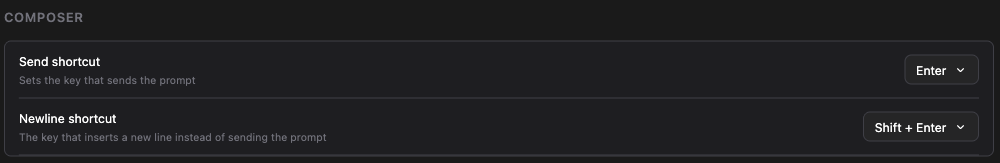

# 보내는 키와 줄 바꾸는 키를 직접 고릅니다

> 언어: [English](./en.md) · **한국어**

## 무엇이 잘못되어 있었나

JetBrains IDE에서 프롬프트를 쓰고 있습니다. 목록을 만들려고 Shift+Enter를 누릅니다.

쓰고 있던 채팅 옆에 채팅이 하나 더 열립니다. 줄은 바뀌지 않습니다.

[#463](https://github.com/Swttch/swttch/issues/463)에 Rider에서 제보된 내용입니다. Ctrl+Enter도 거의 같은 일을 했고, Ctrl+J는 아무 일도 하지 않았습니다. 제보자는 여러 줄짜리 글을 다른 편집기에서 쓴 다음 완성된 덩어리를 붙여넣는 방법으로 버티고 있었습니다.

원인은 채팅에 있지 않았습니다. Shift+Enter와 Ctrl+Enter는 모든 JetBrains 제품이 함께 싣는 출고 키맵 `keymaps/$default.xml`에 이미 잡혀 있습니다.

| 키 | IDE 액션 | 하는 일 |
| --- | --- | --- |
| Shift+Enter | `OpenInRightSplit` | 선택된 파일을 오른쪽 분할 영역에 엽니다 |
| Ctrl+Enter | `ViewSource` | 선택된 항목의 소스를 엽니다 |

채팅에 글을 쓰는 동안 선택된 파일은 채팅 자신의 에디터 탭입니다. 그래서 IDE는 채팅을 분할 영역에 한 번 더 열었고, 그 키 입력은 입력창까지 아예 오지 못했습니다.

두 번째 문제는 더 작고 더 오래된 것입니다. 이 모든 것을 결정하던 설정은 **Cmd+Enter로 전송**이라는 켜고 끄는 스위치 하나였습니다. 그 이름은 사용자가 묻는 질문이 아니라 구현 수단을 가리켰고, 질문의 나머지 절반을 답하지 않은 채로 남겨두었습니다. 수식키가 보내게 되었다면 그냥 Enter는 이제 무엇을 하는가 하는 질문입니다.

## 지금 보이는 화면

설정 → 일반에 **입력창** 섹션이 생겼고, 질문의 절반씩을 한 행이 맡습니다.

### 보내기 단축키

| 선택지 | 무엇이 프롬프트를 보내나 |
| --- | --- |
| **Enter** | 그냥 Enter입니다. 기본값입니다. |
| **⌘ + Enter** (Windows와 Linux에서는 **Ctrl + Enter**) | 두 수식키 중 아무것이나 Enter와 함께 누르면 됩니다. 양쪽 다 어느 운영체제에서나 동작하고, 라벨만 눈앞의 키보드를 따라갑니다. |
| **사용자 설정** | 직접 눌러서 지정한 조합입니다. |

### 개행 단축키

| 선택지 | 무엇이 줄을 바꾸나 |
| --- | --- |
| **Shift + Enter** | Shift와 Enter입니다. 기본값입니다. |
| **Enter** | 그냥 Enter입니다. 보내기를 수식키 조합으로 옮겼을 때 고르면 됩니다. |
| **사용자 설정** | 직접 눌러서 지정한 조합입니다. |

## 직접 조합 지정하기

**사용자 설정**을 고르면 드롭다운 왼쪽에 **지정 안 됨**이라고 쓰인 버튼이 나타납니다. 버튼을 누르면 **키를 누르세요…**로 바뀝니다. 원하는 조합을 누르면 그 자리에서 저장됩니다.

실수로 눌렀다면 Escape로 원래대로 둘 수 있습니다.

대부분의 조합은 Ctrl과 Alt와 Cmd 중 하나를 함께 눌러야 합니다. 맨 글자나 Shift+글자는 사용자가 입력하려는 문자이고, 그것을 단축키로 묶으면 입력창에서 그 문자를 쓸 수 없게 되기 때문입니다. 그런 조합을 누르면 버튼이 이렇게 알려줍니다.

> Ctrl·Alt·Cmd 중 하나를 함께 눌러야 합니다.

문자를 만들어내지 않는 키는 예외라서 **Shift+Enter가 받아들여집니다.** Tab과 화살표 키와 펑션 키도 마찬가지입니다. 이 예외는 이 화면을 위해 만들어졌습니다. 개행의 기본값이 바로 Shift+Enter인데, 자기 기본값을 표현하지 못하는 설정은 이상한 설정이기 때문입니다.

## 두 키는 같을 수 없습니다

어떤 변경이 두 행을 같은 조합에 올려놓게 되면, 그 변경은 거부되고 해당 행이 이유를 말합니다.

그때 아무것도 저장되지 않으므로, 드롭다운은 실제로 적용 중인 값을 계속 보여줍니다. 충돌을 그대로 저장했다면 입력창은 두 동작 중 하나를 조용히 잃은 채로 남고, 화면은 그렇지 않다고 말하게 됩니다.

## Enter는 언제나 줄을 바꿉니다

두 행이 무엇으로 되어 있든, 보내기 키가 아닌 Enter는 줄을 바꿉니다.

그래서 보내기를 ⌘+Enter로 두고 개행을 Shift+Enter로 남겨두어도, 그냥 Enter는 여전히 줄을 바꿉니다. 그냥 Enter는 아무 데도 묶여 있지 않은데, 아무 데도 묶이지 않은 Enter가 아무 일도 하지 않는 것은 Enter 키에 대해 아무도 원하지 않는 결과입니다.

깔끔한 이유 아래에 실무적인 이유가 하나 더 있습니다. IDE에 내장된 브라우저 안에서는, 코드가 무시한 Enter가 입력기의 확정 입력으로 삼켜져서 줄바꿈이 아예 나타나지 않습니다. [#215](https://github.com/Swttch/swttch/issues/215)의 원인과 같은 현상입니다.

## 쓰던 설정은 어떻게 되었나

**Cmd+Enter로 전송**을 켜두고 쓰셨다면 달라진 것이 없습니다. 예전 키를 계속 읽습니다. 그 값이 켜져 있으면 입력창 섹션은 보내기 **⌘ + Enter**, 개행 **Enter**로 열리고, 그것이 예전 스위치가 하던 일 그대로입니다.

예전 키는 새 두 행을 한 번도 건드리지 않은 동안에만 참고됩니다. 무언가를 고르는 순간부터는 고른 값이 결정하고 예전 키는 무시됩니다.

## 한계

**이 두 키는 설정 → Keymap에 나타나지 않습니다.** 제보자가 이 점을 콕 집어 요청했지만 드릴 수 없는 것입니다. IDE의 키맵은 IDE 액션의 목록인데, 채팅 안의 줄바꿈은 IDE 액션이 아닙니다. 줄바꿈은 내장된 브라우저 안에서 일어나고, 그곳은 IDE의 액션 시스템이 볼 수 있는 층보다 아래입니다. 이 두 키를 다시 지정하는 자리는 입력창 섹션입니다.

**그냥 Enter는 여전히 IDE의 것입니다.** 수식키가 함께 눌렸을 때만 IDE에게 Enter에서 물러나 달라고 요청합니다. 그냥 Enter는 이미 입력창까지 잘 도착하고 있고, 그것까지 가져오면 채팅이 앞에 떠 있다는 이유만으로 IDE의 모든 목록과 대화상자에서 Enter를 빼앗게 됩니다.

**수식키가 붙은 Enter는 전부 채팅으로 옵니다.** 제보에 나온 두 개만이 아니라 Shift와 Ctrl과 Alt와 Cmd를 전부 풀었습니다. 보내기와 개행 키는 사용자가 정하는 것이라, Shift와 Ctrl만 이름 붙인 규칙은 누군가 Alt+Enter를 고르는 순간 다시 깨지고 그 이유도 알려주지 못하기 때문입니다. 대가는 채팅에 포커스가 있는 동안 IDE 자신의 Shift+Enter와 Ctrl+Enter 액션에 손이 닿지 않는다는 점입니다. 에디터를 클릭해 들어가면 예전처럼 동작합니다.

**아무것도 지정하지 않은 사용자 설정은 아무 키로도 보내지 않습니다.** 조합을 누르기 전의 사용자 설정 행은 내장된 조합으로 대신하지 않고 아무 키도 묶지 않습니다. 대신했다면 행에는 "사용자 설정"이라고 쓰여 있는데 사용자가 고른 적 없는 조합이 전송을 하게 됩니다. 이때도 Enter는 위에서 말한 대로 줄을 바꿉니다.

**터치 키보드에서는 Enter가 언제나 줄을 바꿉니다.** 휴대폰이나 태블릿 키보드에는 함께 누를 수식키가 없으므로, 보내기 키를 무엇으로 두었든 그곳에서는 Enter가 줄을 바꿔야 합니다. 보내기 버튼을 쓰시면 됩니다.

**입력기가 조합 중일 때는 두 키 모두 동작하지 않습니다.** Enter는 입력기가 후보를 확정하는 방법이고, 그 키 입력은 조합의 것입니다. 후보가 확정된 뒤에 Enter를 한 번 더 누르시면 됩니다.
