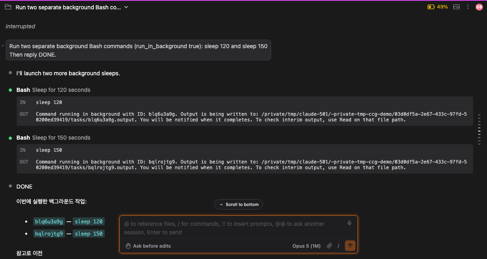
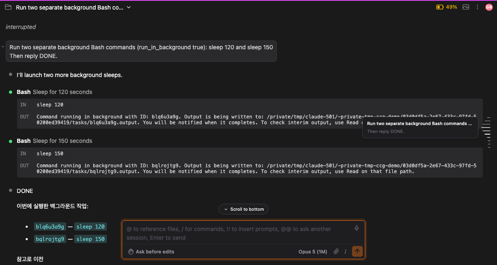

> [English](./en.md)

# 전송 목차 — 내가 보낸 프롬프트를 훑는 눈금자

긴 세션에는 프롬프트가 수십 개 있고, 하나하나 뒤에 도구 호출과 diff와 명령 출력으로 가득 찬 답변이 따라옵니다. 무언가를 물어봤던 자리를 찾으려면 한참 스크롤해야 하고, 그러다 보던 자리를 놓치기 쉽습니다.

**전송 목차**는 채팅 오른쪽 가장자리에 서 있는 가느다란 눈금 띠입니다. 세션에서 보낸 프롬프트 하나당 눈금 하나가 서고, 세션 전체를 담습니다. 눈금에 마우스를 올리면 그 프롬프트를 읽을 수 있고, 클릭하면 그리로 이동합니다.

[#427](https://github.com/Swttch/swttch/issues/427)에서 요청받았습니다.

## 눈금이 알려주는 것

레일은 두 가지 질문에 동시에 답하되, 각각 다른 수단을 씁니다. 그래서 둘이 섞이지 않습니다.

| 수단 | 답하는 질문 |
|---|---|
| **길이** | 내 포인터가 어디에 있나 |
| **밝기** | 내가 어디를 읽고 있나 |

**길이는 포인터를 따라갑니다.** 눈금에 마우스를 올리면 그 자리를 정점으로 파형이 솟습니다. 커서 아래 눈금이 가장 길어지고, 위아래 네 줄에 걸쳐 원래 길이로 가라앉습니다. 하나만 강조하는 대신 형태가 만들어지므로, 옆 눈금과 비교하지 않아도 포인터 위치가 한눈에 읽힙니다.

**밝기는 읽고 있는 위치를 따라갑니다.** 지금 화면을 채우고 있는 답변의 프롬프트가 흰색으로 그려지고, 바로 위아래는 그보다 어둡고, 나머지는 더 어둡습니다. 채팅을 스크롤하면 밝은 눈금이 함께 움직입니다.

두 가지를 모두 길이에 맡기면 동작하지 않기 때문에 나눈 것입니다. 그렇게 하면 긴 눈금이 "여기 마우스가 있다"와 "여기를 읽고 있다" 중 어느 쪽인지 알 수 없고, 두 위치가 겹치는 순간 구분할 방법이 사라집니다.

## 가지 않고 프롬프트 읽기

아무 눈금에나 마우스를 올리면 본문 쪽으로 카드가 열리고, 그 프롬프트의 앞 네 줄이 보입니다.

한 줄이 아니라 네 줄인 이유가 있습니다. 작업 중인 세션의 프롬프트는 같은 말로 시작하는 경우가 많아서("고쳐줘", "이번엔"), 한 줄만 잘라 보여주면 여러 항목이 똑같아 보입니다.

**카드에는 마우스를 올릴 수 있습니다.** 카드 위로 옮겨가 글자를 선택해 복사할 수 있습니다. 카드 안을 클릭해도 본문은 움직이지 않습니다. 눈금을 클릭했을 때만 이동합니다.

## 프롬프트로 이동하기

**눈금을 클릭하면** 채팅이 그 프롬프트로 스크롤합니다. 화면 위쪽에 자리를 잡되, 바로 앞 답변이 조금 보이는 위치에 내려앉습니다.

**키보드**는 레일에 포커스가 있을 때 동작합니다.

| 키 | 하는 일 |
|---|---|
| `Alt+F` | 레일을 띄우고 키보드를 그리로 옮깁니다. 다시 누르면 빠져나옵니다. |
| `Shift+K` / `↑` | 포인터를 이전 프롬프트로 옮깁니다 |
| `Shift+J` / `↓` | 포인터를 다음 프롬프트로 옮깁니다 |
| `Esc` | 레일에서 빠져나옵니다 |

이동 키를 누르고 있으면 **포인터가 레일을 걸어 올라가거나 내려갑니다.** 지나가는 프롬프트의 카드가 차례로 보이고, 채팅은 움직이지 않습니다. **키를 떼는 순간** 포인터가 멈춘 자리로 한 번만 스크롤합니다.

이렇게 나눈 데에는 이유가 있습니다. 키를 누를 때마다 스크롤하면, 누르고 있는 동안 앞선 스크롤이 끝나기 전에 다음 스크롤이 시작되어 본문이 프롬프트 하나씩 덜컥거리며 움직입니다. 먼저 걸어가 놓고 한 번에 가는 편이 읽기에도 빠르고 도착도 빠릅니다.

따로 확정하는 단계는 없고, 레일에서 `Enter`는 아무 일도 하지 않습니다. 누를 수 있게 될 때쯤이면 이미 도착해 있기 때문입니다.

## 화면에 있는 것이 아니라 세션 전체

채팅은 페이지 단위로 불러오기 때문에, 긴 세션이라면 어느 순간에도 본문에는 일부만 들어 있습니다. 레일은 그렇지 않습니다.

세션을 여는 순간 **모든 프롬프트가 눈금을 갖습니다.** 채팅이 아직 불러오지 않은 옛날 프롬프트도 포함됩니다. **그중 하나를 클릭해도 똑같이 동작합니다.** 채팅이 그 프롬프트까지 거슬러 불러온 뒤 그리로 스크롤합니다. 불러오는 동안 레일이 먼저 목적지를 표시하므로, 클릭이 씹힌 것처럼 보이지 않습니다.

불러온 프롬프트와 아직 불러오지 않은 프롬프트는 **똑같이 그려집니다.** 일부러 그렇게 했습니다. 어디까지 가져왔는지는 채팅이 내부적으로 불러오는 방식일 뿐 대화의 성질이 아니고, 흐린 눈금은 덜 중요하거나 지워진 메시지처럼 읽히기 때문입니다.

## 페이지 중간에서 시작하는 답변 위의 프롬프트

채팅의 한 페이지가 답변 중간에서 시작하면, 화면 위에 고정되는 자리가 비어 있었습니다. 그 답변이 딸린 프롬프트를 불러오지 않아서 보여줄 것이 없었기 때문입니다.

전송 목차는 그 프롬프트를 알고 있으므로 이제 그 자리에 그립니다. 나타나는 것은 목차가 가진 사본이고 400자에서 잘려 있습니다. 이전 메시지를 더 불러오면 잘리지 않은 진짜 메시지로 바뀝니다.

## 한계

- **미리보기는 400자입니다.** 그보다 길면 말줄임표로 잘립니다. 전문은 언제나 채팅 본문에 있으니, 눈금을 눌러 가서 읽으시면 됩니다.
- **프롬프트에 붙여넣은 이미지는 카드에 나오지 않습니다.** 카드는 글자만 담습니다. 세션의 첨부물은 [에셋](../059-assets/ko.md) 화면이 다룹니다.
- **턴이 도는 중에 입력한 메시지**는 채팅이 CLI의 큐 기록에서 복원하는 것이라 이동할 고유 식별자가 없습니다. 채팅이 그 범위까지 불러오면 눈금은 생깁니다.
- **아직 아무것도 보내지 않은 세션에는 레일이 뜨지 않습니다.** 목차로 만들 것이 없기 때문입니다.

## 스크롤바

함께 나갑니다. 앱 전체의 스크롤바 폭이 절반으로 줄고, 레일 배경은 완전히 투명해지고, 어두운 테마에서는 핸들이 배경보다 밝은 대신 어두워집니다. 어두운 본문 가장자리에 밝은 막대가 서 있으면 시선이 대화에서 떨어지는데, 이제 그 가장자리를 레일이 함께 쓰기 때문입니다.
