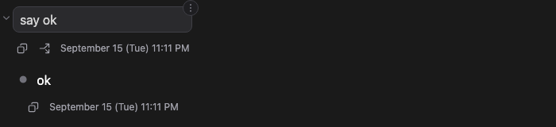
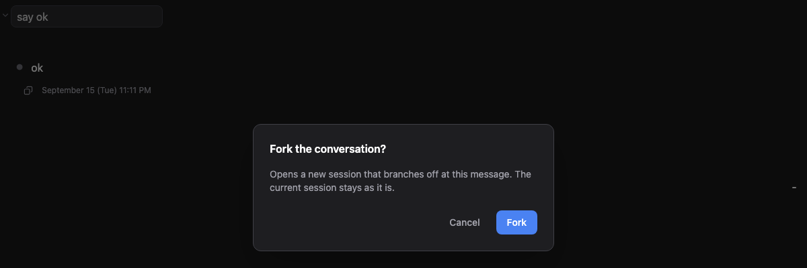
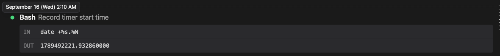

# 메시지 푸터: 복사, 포크, 그리고 보낸 시각

> 언어: [English](./en.md) · **한국어**

## 대화를 거슬러 올라가도 "언제"는 알 수 없었습니다

긴 세션은 하루치, 때로는 며칠치 작업의 기록입니다. 위로 스크롤하면 모든 프롬프트와 응답이 남아 있지만, 그 일이 언제 있었는지는 어디에도 나오지 않았습니다. "그거 점심 전이었나 후였나?", "이걸 어제 시켰나 오늘 아침에 시켰나?" 채팅 화면은 답하지 못했습니다. 반면 채팅이 읽어 오는 세션 파일은 답할 수 있었습니다. CLI가 기록하는 항목마다 시각을 찍어 두기 때문입니다.

[#498](https://github.com/Swttch/swttch/issues/498)의 요청이 바로 이것이었습니다. 메시지를 보낸 시각을 보여 주어, 대화 기록을 거슬러 올라가며 각 메시지가 정확히 언제 오갔는지 확인할 수 있게 해 달라는 요청입니다.

그 답으로 메시지마다 아래에 작은 줄 하나, **메시지 푸터**를 붙였습니다. 메시지 푸터에는 시각과 함께, 메시지를 두고 가장 자주 하는 두 가지 동작인 복사와 포크가 들어 있습니다.

## 메시지 푸터가 나오는 곳

| 위치 | 복사 | 포크 | 시각 |
| --- | --- | --- | --- |
| 내가 보낸 메시지 아래 | ✓ | ✓ | ✓ |
| Claude 응답의 글 덩어리 아래 | ✓ | | ✓ |
| 도구 카드(`Bash`, `Read`, 파일 편집 등) | | | 동그라미 표시에서 확인, 아래 참고 |

**메시지에 마우스를 올리면 나타납니다.** 마우스를 메시지 위에 올리면 메시지 푸터가 나타나고, 마우스를 치우면 사라집니다. 그래서 긴 대화가 버튼으로 뒤덮이지 않습니다.

**채팅의 맨 마지막 메시지는 메시지 푸터가 항상 보입니다.** 마지막 메시지가 내가 보낸 프롬프트이든 Claude의 응답이든, 마우스를 올리지 않아도 복사 버튼과 시각이 보입니다. 그래서 가장 최근 대화는 언제나 클릭 한 번이면 복사할 수 있습니다.

## 시각

시각은 세션 파일에서 가져옵니다. CLI가 해당 항목을 기록한 순간의 시각입니다. 시각은 사용 중인 컴퓨터의 시간대로 보이며, 얼마나 지난 메시지인지에 따라 두 가지 형식으로 적힙니다.

| 지난 시간 | 표시 형식 |
| --- | --- |
| 7일 미만 | `(목요일) 오후 12:13` |
| 7일 이상 | `6월 27일 (월) 오후 5:08` |

일주일 안에서는 요일만으로 어느 메시지인지 가릴 수 있습니다. 일주일이 넘으면 같은 요일이 다시 돌아오므로 날짜를 앞에 붙입니다.

표시 언어는 **설정 → 일반 → 인터페이스 언어**를 따르며, 인터페이스가 번역된 모든 언어에서 같은 모양으로 나옵니다. 예를 들어 영어로 설정하면 위의 두 시각은 `(Thursday) 12:13 PM`과 `June 27 (Mon) 5:08 PM`으로 보입니다.

**연도는 표시하지 않습니다.** 그래서 작년 6월 27일 메시지와 올해 6월 27일 메시지가 같은 문구로 보입니다. 1년 넘게 이어지는 세션은 드물고, 나머지 대부분의 경우에는 짧은 줄이 더 읽기 편하기 때문입니다.

## 복사

복사 버튼을 누르면 메시지의 글이 클립보드에 담기고, 짧은 알림으로 복사했다고 알려 줍니다. 클릭하는 도중 창이 포커스를 잃는 경우처럼 클립보드가 복사를 거부하면, 복사하지 못했다는 알림이 뜹니다. 그래서 메시지를 복사했다고 믿고 엉뚱한 내용을 붙여 넣는 일이 생기지 않습니다.

- **내가 보낸 메시지 아래**의 복사 버튼은 내가 입력한 글을 복사합니다.
- **Claude 응답 아래**의 복사 버튼은 해당 글 덩어리를 마크다운 원문으로 복사합니다. 채팅 화면이 서식을 입혀 보여 주는 바로 그 글입니다. 도구를 몇 번 실행한 응답은 글이 여러 덩어리로 나뉘는데, 덩어리마다 자기 메시지 푸터가 있고 자기 글만 복사합니다.

## 포크

내가 보낸 메시지 아래의 포크 버튼은 **해당 메시지에서 갈라진 새 세션**을 엽니다. 새 세션에는 해당 메시지 이전의 대화가 모두 들어 있고, 해당 메시지는 입력창에 담긴 채로 기다립니다. 원래 있던 세션은 그대로 남습니다.

포크는 다른 세션으로 이동시키기 때문에, 먼저 확인을 받습니다.

**포크**를 누르면 진행합니다. **취소**를 누르거나, Esc 키를 누르거나, 확인 창 바깥을 클릭하면 아무 일도 일어나지 않습니다.

포크 버튼은 내가 보낸 메시지 오른쪽 위 모서리의 ⋮ 메뉴에 있는 **여기서 대화 포크**와 같은 동작입니다. 메뉴 항목은 확인을 묻지 않습니다. 메뉴를 여는 것 자체가 이미 의도를 가진 동작이기 때문입니다. 반면 메시지 푸터의 포크 버튼은 복사 버튼과 바로 붙어 있어 실수로 누르기 쉽습니다.

포크 버튼은 다음 두 경우에 보이지 않습니다.

- **방금 보낸 메시지 아래.** CLI가 해당 메시지를 세션 파일에 기록하기 전에는 갈라져 나올 지점이 없습니다. 기록이 끝나면 포크 버튼이 나타납니다.
- **Claude 응답 아래.** 포크는 내가 보낸 메시지 바로 앞에서 갈라지면서 해당 메시지를 새 세션으로 가져갑니다. 응답에는 가져갈 프롬프트가 없고, 응답 *다음*에서 갈라지는 기능은 아직 앱이 지원하지 않습니다.

## 도구 카드의 동그라미 표시

도구 카드에는 메시지 푸터가 없습니다. 대신 카드 왼쪽의 작은 동그라미 표시에 마우스를 올리면, 툴팁으로 시각이 위와 같은 형식으로 나타납니다. Claude 응답의 글 덩어리 왼쪽에 있는 동그라미 표시에서도 똑같이 동작합니다.

## 메시지가 맨 위에 붙어 있는 동안

긴 응답을 스크롤해 내려가면, 내가 보낸 메시지가 채팅 맨 위에 붙어 작게 접힙니다. 이렇게 접혀 있는 동안에는 마우스를 올려도 메시지 푸터가 나오지 않습니다. 맨 위에 붙은 메시지는 그 아래 응답이 무엇에 대한 것인지 알려 주는 이정표이지, 지금 읽고 있는 대상이 아니기 때문입니다.

맨 위에 붙은 메시지를 클릭하면 전체 높이로 펼쳐지고, 메시지 푸터도 함께 나타납니다. 이때는 마우스를 올리지 않아도 보입니다. 다시 클릭해 접으면 메시지 푸터도 다시 사라집니다.

## 알아 두면 좋은 점

- **아직 도착하는 중인 응답 아래에는 아무것도 나오지 않습니다.** 그때 복사하면 응답이 반만 복사되고, 시각도 아직 기록된 시각이 아닙니다. 응답이 끝나면 메시지 푸터가 나타납니다.
- **"채팅의 맨 마지막"은 내가 보낸 메시지와 Claude 응답만 따집니다.** CLI는 응답이 끝난 뒤에도 세션 파일에 화면에 거의 아무것도 그리지 않는 정리용 기록을 남깁니다. 그런 기록은 건너뛰므로, 지금 보고 있는 응답의 메시지 푸터가 사라지지 않습니다.
- **응답의 마지막이 도구 카드라면**, 채팅은 도구 카드에서 끝난 것입니다. 그 위의 글은 마우스를 올렸을 때만 메시지 푸터가 나옵니다.
- **설정 → 모양 → 채팅 → 도구 호출 숨기기를 켠 상태에서는**, 숨겨진 도구 카드로 끝나는 응답도 도구 카드에서 끝난 것으로 칩니다. 그래서 화면에 마지막으로 보이는 글은 마우스를 올렸을 때만 메시지 푸터가 나옵니다.
- **에이전트 대화 기록 창 안에서는**(백그라운드 작업 패널에서 여는 창), 메시지 푸터가 항상 마우스를 올려야 나옵니다. 그 창에는 "채팅의 맨 마지막"이 없기 때문입니다.
- **메시지 푸터는 표시만 합니다.** 세션 파일에는 아무것도 추가되거나 바뀌지 않습니다.
