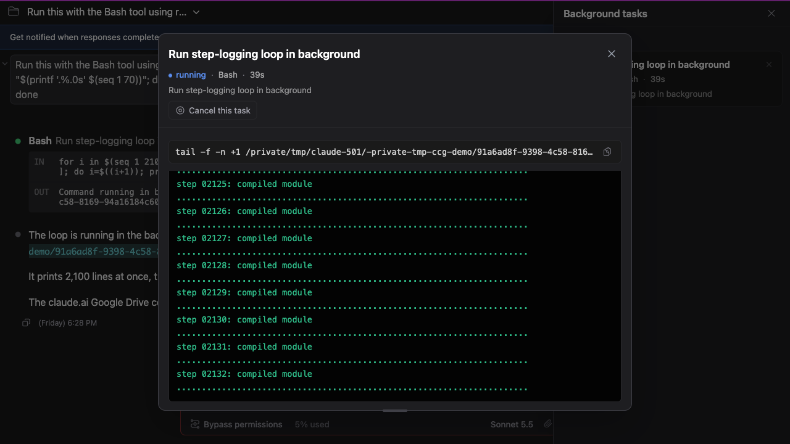
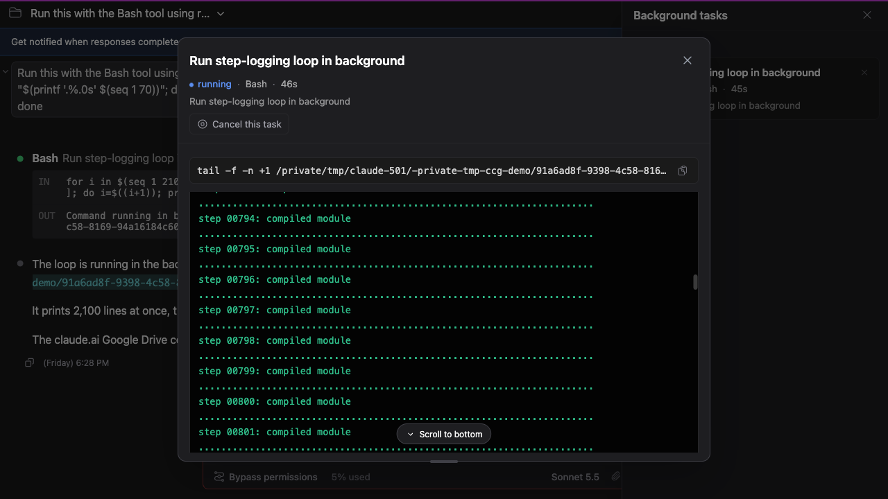

# Background task details scroll like the chat

> Language: **English** · [한국어](./ko.md)
>
> Related: [#511](https://github.com/Swttch/swttch/issues/511) · builds on [The view stays where you put it while you read](../023-auto_scroll_stays_put/en.md)

## The report

A user wrote:

> If you go to a background task, open a running agent/workflow, and then move the scroll bar position, whenever the next tool call happens you're sent to the top, the bottom or somewhere random, it shouldn't move at all.

They scrolled up inside a running agent's detail window to read something, and the window moved by itself the next time the agent called a tool.

## What was actually happening

The **Background tasks** panel opens a detail window for every task: a workflow agent, a background agent, or a plain background command. Each of those three windows kept its own small copy of the "follow the newest output" logic. The main chat had since grown a much more careful version, and the three copies never caught up.

For a **workflow agent** this was the cause of the report. The window reloads the agent's transcript every time the agent's numbers change (tokens, tool calls, elapsed time). While a reload was in flight the window swapped the transcript for a loading spinner and then drew a brand-new scrolling area. A brand-new scrolling area starts at the top, so a reader who had scrolled up was thrown back to the start on every tool call.

The other differences were quieter:

- The detail windows decided whether to follow by looking only at the position at that moment (24 pixels from the bottom), so a long block of output arriving at once made them give up following. The main chat decides by what you did: only scrolling up stops it.
- The "Scroll to bottom" button only appeared after new output arrived, not when you scrolled up. It was also worded "Jump to bottom" and jumped instead of gliding.
- The distance from the bottom that counts as "still following" ignored your **auto-scroll resume distance** setting and was fixed at 24 pixels.
- Following was only re-checked when new data arrived, not when a block simply grew taller (a code block finishing its layout, for example).
- Sending a message to an agent from the window did not bring the window back to the bottom.
- Picking another agent in a workflow carried the previous agent's scroll state over.
- A plain background command's log is cut from the front once it passes 200,000 characters. As it was cut, the line you were reading slid upward one line at a time.

## What changed

The three detail windows now use the same auto-scroll as the main chat. It is one shared piece of code, not three copies, so they can no longer drift apart.

- **Your scroll position is yours.** Scroll up and the window stays put while the agent keeps working. The loading spinner and the redraw are gone for a transcript that is already on screen.
- **Following follows what you did.** Near the bottom, the window follows new output and glides to it while the task is running. Scroll up past your auto-scroll resume distance and it stops; scroll back within that distance and it picks up again.
- **The "Scroll to bottom" button** appears the moment you scroll away from the bottom, and it is the same button, with the same wording, as in the main chat. It glides to the bottom and turns following back on.
- **Sending a message to an agent** takes the window to the bottom right away, even though the message only shows up in the transcript a few seconds later, once the agent has picked it up.
- **Each agent keeps its own state** in a workflow's agent list.
- **A command log holds your place** when its beginning is cut off, so the line you are reading stays where it is. If the window cannot work out how much was cut (a log made of identical lines, for example), it leaves the position alone rather than guess.
- **A failed refresh is said out loud.** If reloading an agent's transcript fails while you are reading it, the last transcript that loaded stays on screen and a line below it says "Couldn't refresh this transcript. Showing the last version that loaded." It disappears when a reload succeeds.

## What did not change

- The detail windows do **not** remember where you were when you close and reopen them. Every opening starts at the newest output. A remembered position goes stale here: a running task keeps adding output while the window is closed, so it would reopen part-way up and not following. The main chat keeps remembering your position per session, as before.
- The main chat behaves exactly as before. Its auto-scroll was moved into the shared code without changing how it works.
- The auto-scroll resume distance setting (Settings → Appearance → Scrolling) now applies to the detail windows too. Its range and default (80 pixels) are unchanged.

## If something looks off

- **The window does not follow a running task.** Check whether you scrolled up: the "Scroll to bottom" button is showing exactly when following is off. Press it, or scroll back near the bottom.
- **The transcript looks stale.** Look for the "Couldn't refresh this transcript" line under it. It means the last reload failed and the window is showing the previous one.
