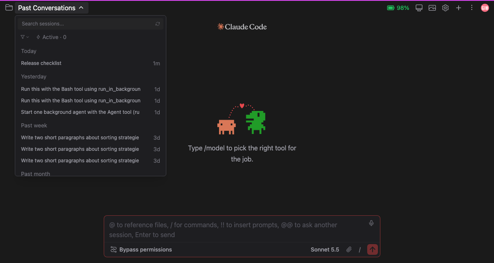
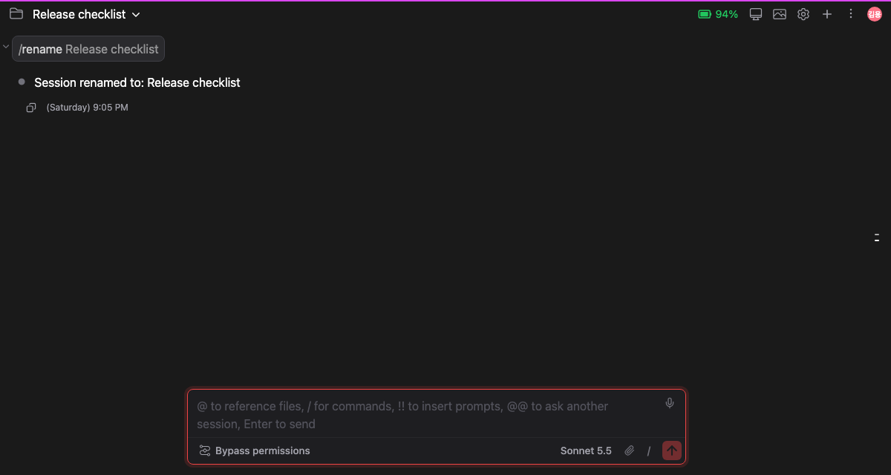
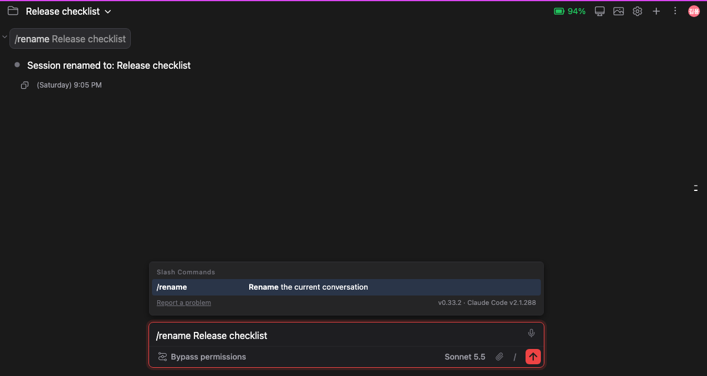

# /rename으로 정한 세션 이름

> 언어: [English](./en.md) · **한국어**

`/rename`으로 이름을 바꾼 세션은 이제 채팅이 세션을 보여 주는 모든 자리에서 그 이름으로 나옵니다. 그리고 `/rename `을 치면 지금 제목을 미리 보여 주기 때문에 처음부터 다시 치지 않고 고쳐 쓸 수 있습니다([#512](https://github.com/Swttch/swttch/issues/512)).

바뀐 것은 세 가지입니다.

1. **세션 목록과 상단바**가 첫 프롬프트가 아니라 사용자가 정한 이름을 보여 줍니다.
2. 이름 변경이 끝나면 목록이 **저절로 새로고침**되고, 새로고침한 채팅에도 입력한 명령과 받은 응답이 그대로 남습니다.
3. `/rename ` 뒤에 세션의 **현재 제목이 미리보기**로 뜨고, **Tab**을 누르면 진짜 글자가 됩니다.

## 세션 목록과 상단바에 이름이 나옵니다

채팅에서 `/rename Release checklist`를 실행하면, 그 세션은 이후 세션 드롭다운과 상단바에서 처음 보낸 메시지 대신 **Release checklist**로 나옵니다.

CLI에서 정한 이름도 마찬가지입니다. 터미널에서 `/rename`으로 바꾼 세션은 여기서도 그 이름으로 보입니다.

### 어떤 이름이 이기는가

세션 이름은 두 곳에서 바꿀 수 있습니다. `/rename`과 세션 드롭다운입니다. 둘 중 **이 앱에서 나중에 정한 이름**이 보입니다.

- 드롭다운에서 이름을 바꾼 뒤에 **이 채팅에서** 다른 이름으로 `/rename`을 실행하면 `/rename`으로 정한 이름이 보입니다.
- `/rename` 뒤에 드롭다운에서 이름을 바꾸면 드롭다운에서 정한 이름이 보입니다.

## 목록이 저절로 새로고침됩니다

검색란 옆의 새로고침 아이콘을 누를 필요가 없습니다. CLI가 **"Session renamed to: …"** 라고 응답하는 순간 목록을 다시 불러와서 상단바와 드롭다운에 새 이름이 나옵니다.

## 새로고침한 채팅에도 명령과 응답이 남습니다

페이지를 새로고침하거나 세션을 다시 열어도 채팅에는 그때 있었던 일이 그대로 보입니다.

- **인자가 붙은** 명령 `/rename Release checklist`(예전에는 인자가 사라져서 `/rename`만 남았습니다).
- 응답 **"Session renamed to: Release checklist"**.

Claude에게 묻지 않고 결과만 출력하는 다른 슬래시 명령(예: 비용 요약)의 출력도 이제 새로고침 뒤에 남습니다.

## "/rename " 뒤에 현재 제목 미리보기

`/rename`과 공백 한 칸을 치면, 커서 뒤에 세션의 현재 제목이 흐린 이탤릭으로 나타나고 그 뒤에 짧은 안내가 붙습니다.

**Tab**을 누르면 미리보기가 고칠 수 있는 평범한 글자가 됩니다.

- **미리보기일 뿐입니다.** 확정하기 전에는 아무것도 보내지거나 복사되지 않습니다. `/rename ` 바로 뒤에 Enter를 눌러도 제목이 전송되지 않습니다.
- **Cmd+Z / Ctrl+Z 한 번**으로 확정한 제목을 되돌립니다.
- **입력창이 정확히 `/rename `(공백 한 칸)일 때만** 나옵니다. 직접 한 글자라도 치거나 공백을 하나 더 치면 미리보기가 사라집니다.
- **제목이 있는 세션이어야** 합니다. 아직 메시지를 보내지 않은 새 채팅에는 미리 보여 줄 제목이 없습니다.
- **한글 자판 상태에서도** 나옵니다. `/ㄱㄷㅜㅁㅡㄷ `은 한글 자판으로 친 `/rename `이고, 같은 미리보기가 나옵니다. [한글 자판 상태로 친 슬래시 명령](../079-korean_layout_command_search/ko.md)을 참고하세요.
- **줄이 너무 좁으면** 안내 "(Tab to accept)"가 잘린 조각으로 남지 않고 통째로 빠집니다. Tab은 그대로 동작합니다.
- 안내 문구는 12개 인터페이스 언어로 번역되어 있습니다. 제목은 번역하지 않고 그대로 보여 줍니다.

## 하지 않는 것

- 드롭다운에서 정한 이름은 CLI가 아니라 이 앱이 저장합니다. 드롭다운에서 이름을 바꾼 뒤 터미널에서(이 채팅 뒤의 CLI와는 다른 프로세스에서) 다시 이름을 바꾸면, 이 채팅에서 `/rename`을 실행하거나 드롭다운에서 다시 이름을 바꾸기 전까지는 드롭다운에서 정한 이름이 계속 보입니다. 드롭다운에서 이름을 바꾼 적이 없는 세션은 영향이 없고 터미널에서 정한 이름이 보입니다.
- 세션이 이미 가진 이름과 똑같은 이름으로 `/rename`을 실행하면 눈에 보이는 변화가 없습니다.
