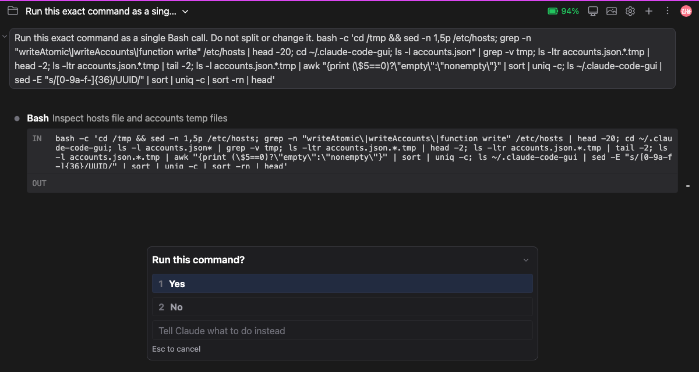
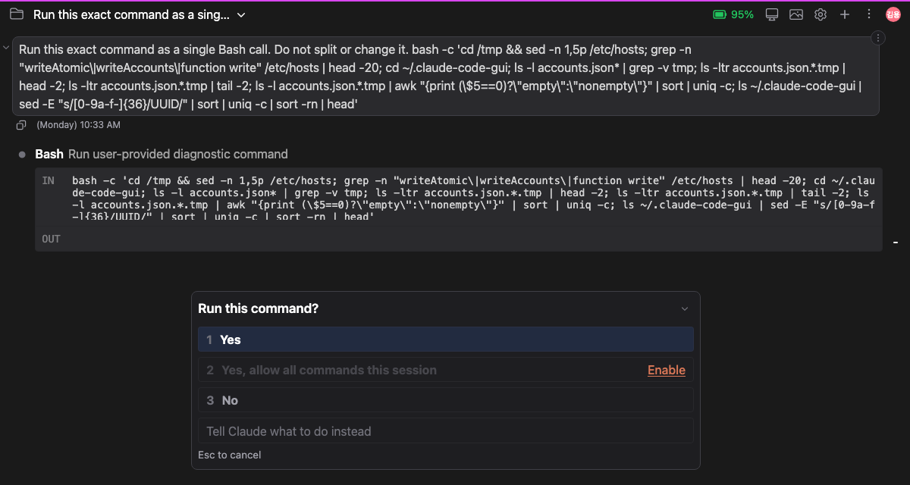
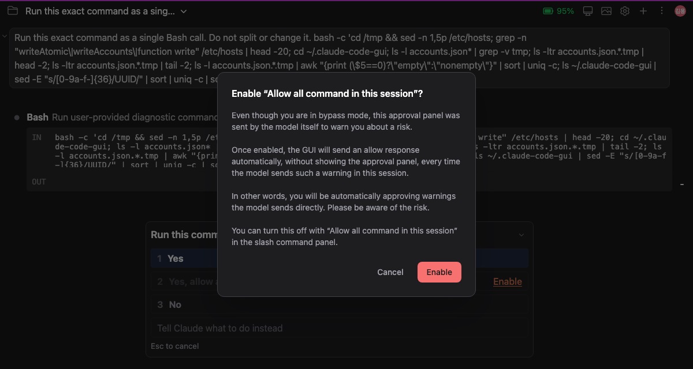
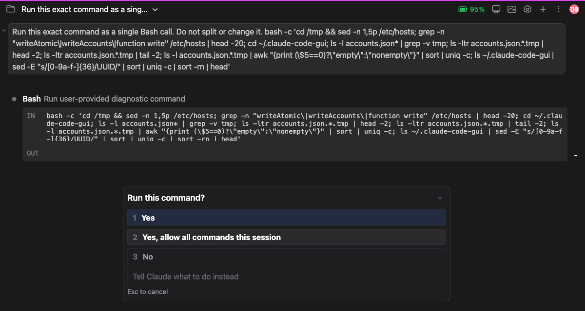
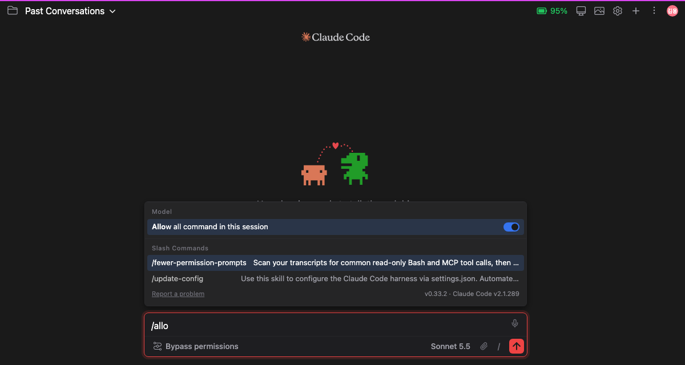

# Allow all command in this session

> Language: **English** · [한국어](./ko.md)

Some approval panels cannot be silenced with "Yes, allow all commands this session". You pick it, the command runs, and the very next command asks again. This feature explains why that happens, stops the panel from offering a choice that cannot work, and gives you a switch for the case where you do want those panels answered for you.

## Why the panel keeps coming back

Claude Code decides whether to ask you before it runs a command. In **Bypass permissions** mode it normally asks about nothing. There is one exception: when Claude Code **cannot work out what a command does**, it asks anyway, as a safety check. A long `bash -c '...'` command with quotes nested inside quotes is a typical case, because Claude Code cannot read what is inside it with confidence.

These safety questions have a rule of their own: **Claude Code never remembers an answer to them.** "Yes, allow all commands this session" normally tells Claude Code to stop asking. For a safety question, Claude Code ignores that instruction and asks again the next time a command it cannot read comes along. In one turn that can mean several panels in a row, each one just as if you had never chosen the second option.

That was the confusing part: the second option was on screen, it looked like it would work, and it did not.

## What the panel shows now

When Claude Code says it will not remember the answer, the panel no longer pretends it will.

**Outside Bypass permissions mode** (for example Plan mode, Ask before edits or Edit automatically), the second option is left out. The panel has two answers, **Yes** and **No**, and **No** takes the number 2. Pressing **2** on the keyboard answers **No**.

**In Bypass permissions mode**, the second option stays in its place but is greyed out, and a link in the same colour as Claude's logo sits at the right end of the row: **Enable**. The numbers do not change, so **No** is still 3.

Bypass mode keeps the option because you have already told the app you do not want to be asked. Enabling is a reasonable next step for you, but it is your call, so it is behind a warning.

Clicking the greyed-out row itself does nothing. Only the **Enable** link is live. Pressing **2** on the keyboard does nothing either, while the row is greyed out.

## Enabling it

Click **Enable**. A warning opens and tells you three things:

- Even though you are in bypass mode, this approval panel was sent by the model itself to warn you about a risk.
- Once enabled, the GUI will answer with "allow" by itself, without showing the approval panel, every time the model sends such a warning in this session.
- In other words, you will be automatically approving warnings the model sends directly, and you should be aware of the risk.

The last line tells you where to turn it off again: the **Allow all command in this session** switch in the slash command panel.

Choose **Enable** to turn it on, or **Cancel** (or press Esc) to leave things as they are. While the warning is open, the approval panel underneath does not react to the keyboard, so pressing Enter or a number cannot answer the panel by accident.

When you confirm, the second option lights up straight away. Choosing it approves this command, like the same option always did.

From then on, in this session, every safety question of this kind is answered with "allow" without a panel appearing. You will see the command run and its output, with no question in between.

## The switch in the slash command panel

Type `/` in the chat box to open the slash command panel. At the bottom of the **Model** section there is a switch, **Allow all command in this session**.

- Turning it **on** shows the same warning as the **Enable** link. It does not turn on until you confirm.
- Turning it **off** needs no confirmation. The panel simply comes back for the next safety question.
- The **Enable** link and the switch are the same setting. Enabling from one shows up in the other.
- It follows the usual panel keys: Enter on the row toggles it.
- You can type a few letters to find it, for example `/allow`.

### Turning it on before you have sent a message

You can turn the switch on in an empty conversation, before the first message. A conversation only becomes a session when its first message is sent, so the choice is held for the conversation you are about to start and handed to the session that first message creates.

If instead you open an **existing** session from the session list while the empty screen's switch is on, that session does **not** inherit it. The choice was about a new conversation, so the existing session starts with the switch off, and so does the next new conversation.

## What it covers, and what it does not

- **Only the safety questions that Claude Code will not remember.** Every other approval panel appears as before, including panels where "Yes, allow all commands this session" works. If you pick that option on an ordinary panel, Claude Code does remember it, as always.
- **This session only.** The setting is kept in memory for the open conversation. A new conversation, a reload of the panel, or restarting the IDE starts with it off.
- **Each session has its own.** Turning it on in one conversation does not change another conversation, even one open in another tab.
- **The command you are asked about is not checked by this app.** Turning it on means such commands run without you looking at them. Use it for sessions where you trust what Claude is doing.
- **Older Claude Code versions.** The hiding and the Enable link depend on Claude Code telling the app that it will not remember the answer. If your version does not say so, the panel looks exactly as it did before this feature, with the second option always available.

## Frequently asked questions

**I chose "Yes, allow all commands this session" and the panel came back. Is that a bug?**
For ordinary approvals, yes, it would be. For the safety questions described above, it was expected, and this feature is what addresses it. If you are in bypass mode, you can now enable the switch. In other modes, the second option is no longer shown for those panels, because it could not have worked.

**Why does the panel still appear in bypass mode?**
Bypass mode removes the questions Claude Code can answer on its own. A command it cannot read is not one of them. The panel is Claude Code asking, not this app.

**Can I make the greyed-out option work without enabling it?**
No. The option is greyed out precisely because Claude Code would ignore it. The only way to stop the panel is the switch, which makes this app answer for you.

**How do I turn it off?**
Open the slash command panel with `/`, find **Allow all command in this session**, and switch it off. Starting a new conversation also turns it off.

**I turned it on before sending my first message, then opened an old session, and it is off. Why?**
The choice belonged to the new conversation. An existing session you open from the list never inherits it. Turn it on again inside that session if you want it there.

**Does this change my permission mode?**
No. Your mode stays what it was. This switch only affects how those specific safety questions are answered.
