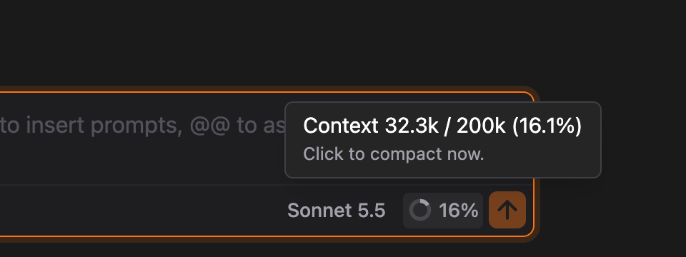
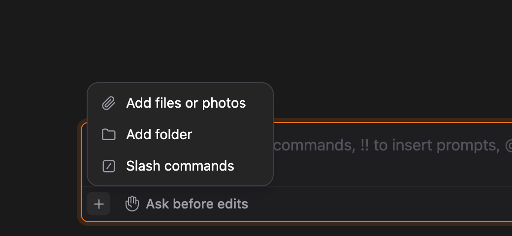

# Context badge and the + menu

> Languages: **English** · [한국어](./ko.md)
>
> Related: [#328](https://github.com/Swttch/swttch/issues/328), [#490](https://github.com/Swttch/swttch/issues/490)

## What's new

Two things in the bar under the message box changed.

- The **context badge** now says how much of the context window is used and how big the window is, without rounding the percentage up.
- The attach button and the slash button became **one + button**. Hover it and a small menu opens.

## The context badge

The badge sits to the right of the model name, just before the send button. It shows a **ring that fills clockwise** as the context fills up, and the **percentage** next to it. The percentage is **cut off, never rounded**: 15.9% shows as **15%**, so the badge never claims more room is used than really is.

Hover the badge for the details:

- **First line** — `Context 32.3k / 200k (16.1%)`: tokens used, the size of the window, and the percentage with **one decimal**, also cut off.
- **Second line** — how much is left before **auto-compact** kicks in.
- **Third line** — `Click to compact now.` It appears once the context is at least **10%** full. Clicking the badge then runs **/compact** for you. The badge is not clickable while Claude is replying.

### What the badge shows in each state

| Situation | Badge | Tooltip |
|-----------|-------|---------|
| The window size is known | Ring and a whole percentage | Used / total with one decimal, the room left before auto-compact, and the click-to-compact hint from 10% |
| A new chat with nothing used yet | Empty ring and **0%** | `Context … · The total size shows after the next reply` |
| A chat with history whose window size is not known yet | Ring and the **used token count** (for example **32.3k**) in place of a percentage | The same sentence about the next reply |

The badge never guesses a window size. The CLI tells the GUI the size when a reply ends, so a badge that guessed 200k would be wrong for a 1M-token model. Showing the token count until the size is known keeps the number honest.

### Opening an earlier chat

When you open a chat you already had, the percentage would normally have to wait for your next reply. Instead the GUI asks the CLI for the current usage in the background with `/context`. That is a local command: **no model is called, no tokens are spent, and nothing is added to the chat history.** The badge fills in a few seconds after the chat opens.

### On a narrow panel

- Narrower than **640 px**: the number is dropped and only the ring stays. The tooltip still has everything.
- Narrower than **440 px**: the badge is hidden.

## The + menu

The bottom-left of the message box has a single **+** button where the attach and slash buttons used to be. **Hover it** (or focus it with the keyboard, or click it) and a menu opens above it:

| Item | What it does |
|------|--------------|
| **Add files or photos** | Opens the system file picker. Everything you pick is attached **by path**, photos included, and Claude reads it from there. |
| **Add folder** | Opens the folder picker and attaches the folder by path. |
| **Slash commands** | Opens the slash command panel, the same as typing `/`. |

Photos you **paste or drop** into the message box still become inline image attachments, exactly as before. The command palette's **Attach file...** item also still opens the file picker directly.

## Limits

- The window size comes from the CLI. If the CLI cannot report it, the badge keeps showing the used token count rather than a percentage.
- Opening an earlier chat takes the CLI a few seconds (about 5 to 8 in testing), so the percentage appears after that short wait, not the instant the chat opens.
