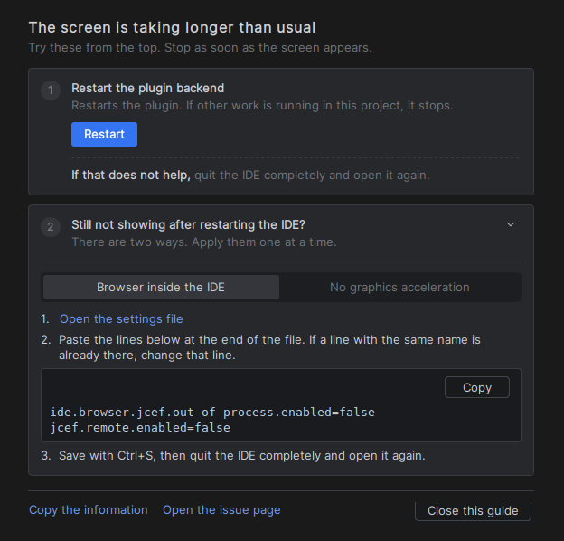
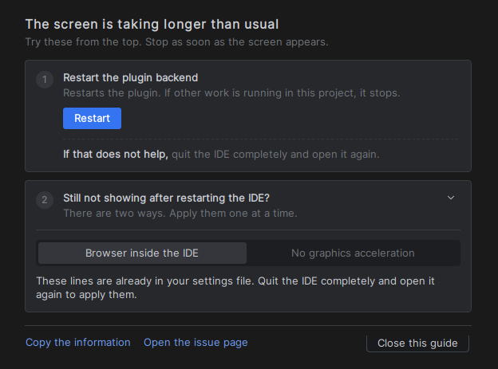
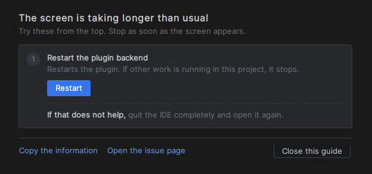
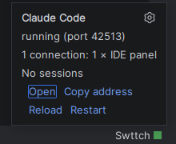

# 멈춘 화면 안내, 그리고 상태바의 새로고침과 재시작

> 언어: [English](./en.md) · **한국어**
>
> 관련: [#526](https://github.com/Swttch/swttch/issues/526), [#473](https://github.com/Swttch/swttch/issues/473), [#528](https://github.com/Swttch/swttch/pull/528), [#529](https://github.com/Swttch/swttch/pull/529)

## 새로워진 점

Claude Code 화면이 뜨지 않을 때를 위해 세 가지가 바뀌었습니다.

- 화면을 불러오기 시작한 지 **30초**가 지나도록 다 불러오지 못하거나, 브라우저가 화면을 아예 불러오지 못했다고 알리면, "화면을 불러오는 중..." 자리에 **안내 화면**이 나타납니다. **재시작** 버튼이 있고, IDE를 완전히 종료한 뒤 다시 실행해 보라고 안내하며, 그리지 못하는 내장 브라우저를 고치는 **IDE 설정**을 따라 할 수 있게 안내합니다.
- **상태바**의 점 앞에 **Swttch**라는 이름이 붙고, 그 점이나 이름을 누르면 열리는 카드에 **Reload**와 **Restart**가 생겼습니다.
- 백엔드가 다른 포트로 다시 뜨면, 화면이 옛 주소에 머무르지 않고 **스스로 다시 불러옵니다.**

불러오는 중 문구의 **"(SSH)"**는 이제 화면을 실제로 Remote Development 클라이언트가 그릴 때만 붙습니다. 이전에는 로컬 IDE에서도 붙었습니다([#526](https://github.com/Swttch/swttch/issues/526)).

## 안내 화면

안내 화면은 화면을 불러오던 그 탭에 나타납니다. 카드 두 장과 하단 줄로 되어 있고, 위에서부터 시도해 볼 순서대로 놓여 있습니다. 화면이 뜨면 거기서 멈추셔도 됩니다.

안내 문구는 **플러그인 설정에서 고른 인터페이스 언어**(**설정 → 일반 → 인터페이스 언어**)로 나오며, 플러그인이 지원하는 12개 언어로 준비되어 있습니다. 단어는 중간에서 끊기지 않습니다. 페이지는 띄어쓰기에서 줄을 바꾸고, 한 줄보다 넓은 단어나 일본어처럼 띄어쓰기가 없는 글만 글자 단위로 끊습니다.

### 플러그인 백엔드 재시작

**재시작**은 화면 뒤에서 일하는 Swttch 부분을 처음부터 다시 켠 뒤, 화면을 다시 불러옵니다. 같은 프로젝트의 Claude Code 탭은 모두 새 백엔드에서 다시 불러옵니다.

**같은 프로젝트의 다른 탭에서 진행 중인 작업이 중단될 수 있습니다.** 이 페이지에서 무언가를 끊을 수 있는 단계는 재시작뿐이어서, 카드가 제목 바로 아래에 그렇게 적어 둡니다.

버튼 아래에는 **그래도 안 되면 IDE를 완전히 종료한 뒤 다시 실행해 보세요.**라고 적혀 있습니다. 이 방법은 IDE의 내장 브라우저도 처음부터 다시 시작시키는데, 재시작은 그렇게 하지 못합니다.

재시작한 뒤에는 안내 화면이 다시 나타나기까지 30초가 아니라 **60초**를 기다립니다. 느린 컴퓨터가 같은 자리를 맴돌지 않게 하려는 것입니다.

### IDE 재부팅 후에도 안 보이시나요?

이 카드는 **처음부터 펼쳐져** 있습니다. 제목을 누르면 접힙니다.

어떤 컴퓨터는 IDE가 기본으로 잡아 둔 방식으로는 내장 브라우저로 그리지 못합니다. IDE 2025.1부터 내장 브라우저가 기본으로 별도 프로세스에서 돌고, 그 브라우저로 화면을 그리는 플러그인들이 일부 컴퓨터에서 패널이 비어 보인다고 보고합니다. 도움이 되는 설정은 두 가지이며, 카드의 **탭** 둘이 그것입니다. 탭은 **아직 할 일이 남아 있을 때만** 보입니다.

| 탭 | 바꾸는 것 |
|----|-----------|
| **IDE 안에서 브라우저 실행** | 내장 브라우저가 다시 IDE 자신의 프로세스 안에서 돕니다. |
| **그래픽 가속 끄기** | 내장 브라우저가 그래픽 칩 대신 프로세서로 그립니다. |

먼저 첫 번째 탭을 해 보세요. 첫 번째를 하고 재시작한 뒤에도 화면이 안 뜰 때만 두 번째를 해 보세요. 옵션이 하나만 남으면 탭 대신 그 옵션의 이름이 한 줄로 나옵니다.

탭마다 세 단계와 붙여 넣을 줄이 함께 나옵니다.

1. **설정 파일 열기**를 클릭합니다. **Help → Edit Custom Properties...**가 여는 것과 같은 파일이 열립니다. 파일이 아직 없으면 IDE가 만듭니다.
2. 줄 위쪽의 **복사** 버튼으로 복사한 뒤 파일 맨 끝에 붙여 넣습니다. 같은 이름으로 시작하는 줄이 이미 있으면 한 줄을 더 추가하지 말고 그 줄을 고칩니다.
3. 파일을 저장한 뒤 IDE를 완전히 종료하고 다시 실행합니다. 이 단계에는 쓰는 운영체제에 맞는 저장 키가 적힙니다. macOS는 Cmd+S, Windows와 Linux는 Ctrl+S입니다.

옵션마다 **IDE가 읽는 것으로 알려진 이름을 전부** 적어 둡니다. IDE는 모르는 이름을 무시하므로, 어느 IDE 버전이 어느 이름을 읽는지에 기대지 않습니다.

네이티브 **Wayland**의 Linux에서는 첫 번째 탭이 안내 하나로 시작합니다. 그 옵션을 쓰면 Claude Code 화면이 IDE 안이 아니라 IDE 옆 **별도 창**으로 열린다는 안내입니다.

#### 이미 끝낸 것은 다시 안내하지 않습니다

안내 화면은 IDE의 상태를 보고 옵션마다 무엇을 보여 줄지 정합니다.

| 상태 | 보이는 것 | 화면 |
|------|-----------|------|
| **설정 안 됨** | 세 단계와 붙여 넣을 줄 | 위의 첫 번째 화면 |
| **파일에는 썼지만 IDE를 아직 재시작하지 않음** | "이 줄들은 이미 설정 파일에 들어 있어요. IDE를 완전히 종료하고 다시 실행하면 적용돼요." 한 문장뿐 |  |
| **이미 적용 중** | 아무것도 없음. 그 옵션은 빠지고, 두 옵션이 모두 적용 중이면 카드 전체가 사라집니다. |  |

첫 번째 옵션은 파일 속 이름이 아니라 **IDE가 실제로 하는 일**(내장 브라우저가 지금 정말 IDE 안에서 도는지)로 판단합니다. 두 번째는 눈으로 확인할 수 있는 결과가 없어서 설정값으로 판단합니다.

### 하단 줄

**정보 복사**는 짧은 글을 클립보드에 넣습니다. 플러그인과 IDE 버전, 운영체제, 화면 도구 모음, 브라우저가 별도 프로세스로 도는지, 설정들, 백엔드가 돌고 있는지, 화면이 얼마나 기다렸는지가 들어 있습니다. **코드도, 대화도, 폴더 이름도, 경로도 들어 있지 않습니다.** 링크 위에 마우스를 올리면 이 문장을 읽을 수 있습니다.

**이슈 페이지 열기**는 [이슈 페이지](https://github.com/Swttch/swttch/issues/new)를 브라우저로 엽니다. 거기에 복사한 글을 붙여 넣어 주세요.

**안내 닫기**는 화면이 실제로는 잘 보이는데 안내가 그 위를 덮고 있을 때 안내를 치웁니다. 화면을 다 불러오는 순간에는 안내가 **저절로** 사라집니다.

### 좁은 창

모든 너비는 도구 창의 너비에서 계산하고, 너비가 바뀌면 다시 계산합니다. 페이지는 오른쪽 가장자리에서 잘리지 않고 접힙니다. 420px 아래에서는 카드의 여백과 번호 배지가 작아지고, 300px 아래에서는 배지가 빠지며, 탭이 위아래로 쌓이고, 하단 줄의 버튼이 각자 한 줄을 차지합니다.

### 브라우저가 페이지를 아예 불러오지 못할 때

브라우저가 화면을 불러오지 못했다고 알리면(예를 들어 백엔드가 답하지 않아 "This site can't be reached"가 뜨는 경우) 안내 화면이 **즉시** 나타나 **그대로 남습니다.** 전에는 그 오류 페이지를 다 불러온 것으로 셌기 때문에 안내가 사라지고 브라우저 자신의 오류 페이지만 남았습니다. 멈춘 백엔드가 정확히 그 페이지를 만드는 Remote Development에서 발견했습니다.

## 상태바의 새로고침과 재시작

상태바의 점 앞에 **Swttch**라는 이름이 붙어, 이 위젯이 누구의 것인지 보여 줍니다. 이름이나 점을 누르면 전과 같은 카드가 열리고, 링크가 두 개 늘었습니다.

| 링크 | 하는 일 |
|------|---------|
| **Reload** | 이 프로젝트에서 열려 있는 Claude Code 화면들을 백엔드의 **현재** 포트로 다시 불러옵니다. 백엔드는 건드리지 않고 아무것도 멈추지 않습니다. 프로젝트의 화면이 하나도 열려 있지 않으면 누를 수 없습니다. |
| **Restart** | 이 프로젝트의 백엔드를 재시작하고 그 화면들을 다시 불러옵니다. 같은 프로젝트의 다른 탭에서 진행 중인 작업이 중단될 수 있습니다. 백엔드가 꺼져 있을 때도 쓸 수 있으며, 그때는 백엔드를 켭니다. |

화면이 비어 있어도 카드는 열 수 있어서, 두 링크를 카드에 두었습니다.

**Reload는 주소를 새로 만듭니다.** 브라우저의 자체 새로고침은 옛 주소를 그대로 다시 요청하는데, 포트가 바뀐 경우에는 그것이 도움이 되지 않는 유일한 방법이기 때문입니다.

**재시작해도 IDE의 빨간 오류 배지가 뜨지 않습니다.** 백엔드를 끌 때 출력 통로가 플러그인의 읽기 작업 밑에서 닫히는데, 이것이 재시작마다 오류로 기록되었습니다. 이제는 그 상황 그대로 종료로 기록하고, 종료가 아닌데 읽기 오류가 나면 지금도 오류로 기록합니다.

## 백엔드가 다른 포트로 옮겨 갔을 때

화면은 자신이 불러온 주소를 계속 요청합니다. 백엔드가 새 포트로 다시 뜨면, 화면은 아무도 없는 곳에 말을 거는 채로 남습니다. 이제 플러그인이 백엔드의 포트를 2초마다 확인하고, 두 번 연속으로 달라져 있으면(재시작이 아직 자리 잡는 중인 경우를 두 번 불러오지 않으려는 것입니다) 새 포트로 화면을 다시 불러옵니다. 아무것도 하지 않으셔도 됩니다. 실행 중인 백엔드의 포트를 옮기는 시험용 빌드로 측정했고, 화면이 새 포트에서 다시 불러와졌습니다.

IDE에서 하는 보통의 재시작은 백엔드에게 이전에 쓰던 포트를 다시 달라고 요청하므로, 주소가 대개 그대로여서 다시 불러올 일이 없습니다. 이 기능은 그렇지 않았던 경우를 덮습니다.

## 하지 않는 것

- **이 컴퓨터에서 내장 브라우저가 그리지 못하는 문제를 고칠 수는 없습니다.** 두 설정은 알려진 우회 방법이지 치료가 아닙니다. 도움이 되지 않으면 정보를 복사해서 보내 주세요.
- **화면을 다 불러온 뒤 한 번도 그리지 못하는 브라우저는 잡지 못합니다.** 안내 화면은 30초가 지나도록 화면을 **다 불러오지 못했거나** 불러오는 데 실패했을 때 나타납니다. 그 경우는 [Linux에서 채팅 탭이 완전히 비어 열림](../../troubleshooting/ko/linux-jcef-blank-panel.md)을 보세요.
- **첫 번째 옵션은 IDE 전체에 영향을 줍니다.** 이 플러그인만이 아니라 내장 브라우저를 쓰는 모든 기능에서 별도 프로세스를 끕니다.
- **첫 번째 옵션은 IDE 2025.2.3의 Windows에서는 안내하지 않습니다.** 거기서 별도 프로세스를 끄면 페이지가 일반 글자로만 그려지기 때문입니다.
- **두 번째 옵션은 무거운 페이지를 느리게 할 수 있습니다.** 그래픽 칩 대신 프로세서가 그리기 때문입니다.
- **Remote Development**(호스트는 PhpStorm 2026.2.3, macOS의 JetBrains Client)에서는 안내 화면이 클라이언트에 나타났고, 안내의 **재시작** 버튼이 백엔드를 재시작해 화면을 다시 불러왔습니다. **다음 둘은 거기서 측정하지 못했습니다.** **설정 파일 열기** 버튼이 어느 쪽 IDE에서 파일을 여는지, 그리고 그 설정이 클라이언트에서 도는 브라우저를 바꾸는지입니다. 상태바 카드는 클라이언트에 **아예 보이지 않아서** 카드의 Reload와 Restart는 거기서 쓸 수 없고, 안내 화면의 재시작은 쓸 수 있습니다.
- **로컬 IDE에서 확인했습니다**(Linux, Arm의 IntelliJ IDEA 2026.2.3). 브라우저가 별도 프로세스로 도는 경우와 IDE 안에서 도는 경우를 모두 확인했습니다.
- **잘 뜬 화면 위를 덮은 안내**(화면은 멀쩡한데 다 불러왔다는 신호를 못 보낸 경우)는 위의 버튼으로 닫을 수 있습니다.

## 함께 보기

- [Linux에서 채팅 탭이 완전히 비어 열림](../../troubleshooting/ko/linux-jcef-blank-panel.md)
- [Remote Development 포트 포워딩](../073-remote_dev_port_forwarding/ko.md)
