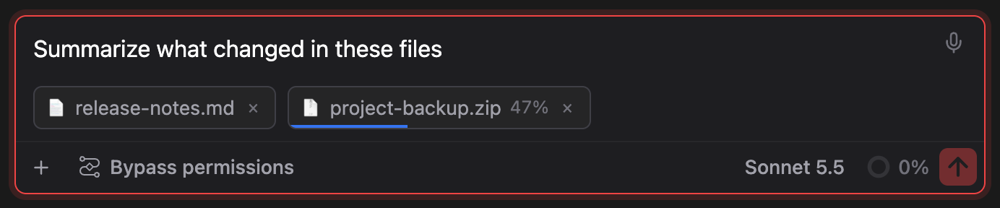
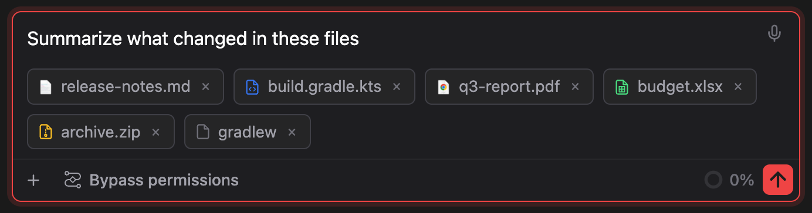
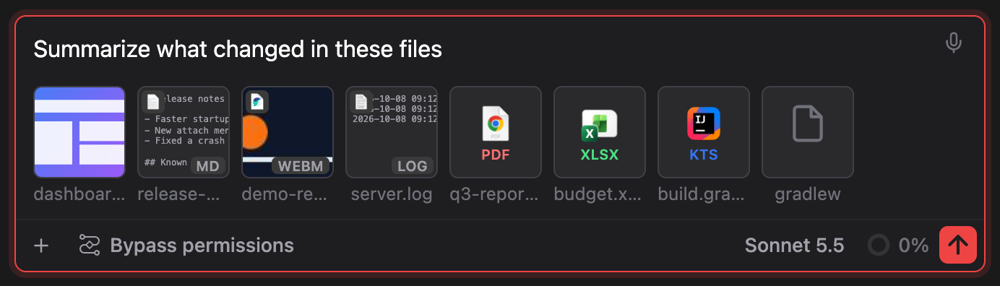
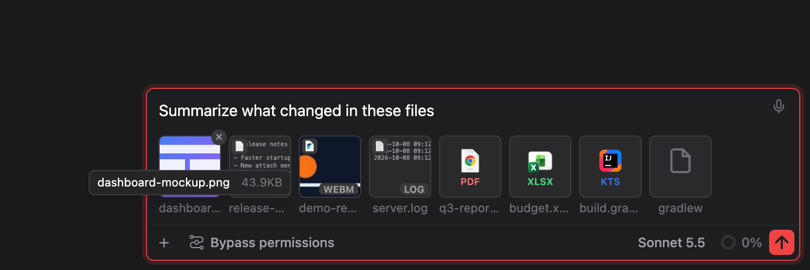
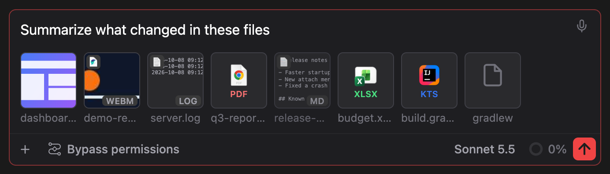

# Attaching any file: drop, paste, pick, preview and reorder

> Languages: **English** · [한국어](./ko.md)
>
> Related: [Context badge and the + menu](../083-context_badge_and_add_menu/en.md)

## What's new

Attachments used to be easy to lose track of: only pictures could be dropped or pasted in a browser, a file picked from the **+** menu that took more than 30 seconds to choose vanished without a word, and every attachment looked the same. This release changes all of that.

- **Any file, any type** can be attached by dropping, pasting or picking it, in a browser as well as in the IDE.
- **Folders** can be dropped into a browser too.
- While a file is travelling to the app, its chip shows **how much has gone**.
- Each chip has the **icon of its file type**, and cards show a **preview** of text, pictures and videos.
- Hover a name and a tooltip shows the **whole name, the size and the path**. You can select and copy it.
- **Drag a chip** to put the attachments in a different order.

## Three ways to attach

| Way | In a browser | In a JetBrains IDE |
|-----|--------------|--------------------|
| **+ menu → Add files or photos / Add folder** | The system picker opens. There is **no time limit**: choose whenever you like. | Same. |
| **Drag from the file manager** | Any file and any folder. | Any file and any folder. The IDE hands over the real path. |
| **Paste** (copy a file in the file manager, press paste) | Any file. | Pictures only. For other files the IDE keeps the paste. |

Pictures of the kinds **png, jpeg, gif and webp** that you drop or paste, up to **10 MB**, are still attached **inline**, as before: Claude receives the picture itself. A picture over 10 MB shows "File too large", and every other kind (svg, heic, bmp and so on) becomes an ordinary file chip.

### Why a browser makes a copy

A browser never tells a web page where a dropped file lives on disk, so the app cannot attach "the file at that path". Instead the file is sent to the app in pieces and **saved as a copy** here:

```
~/.claude-code-gui/uploads/<random id>/<file name>
```

A dropped folder keeps its shape: `…/<random id>/<folder>/<subfolder>/<file>`. If you set `CCG_HOME`, the copies go to `$CCG_HOME/uploads` instead.

The chip points at the copy, so Claude reads the copy. That has some consequences:

- Your **original is never touched**, and changes you make to it afterwards do **not** reach the copy. Drop it again if it changed.
- There is **no size limit**, but a big file takes a while to send.
- **Copies older than 7 days are deleted** the next time an upload starts (a folder's age is the time of its last change). Removing a chip does not delete its copy right away; the clean-up does.
- In a JetBrains IDE nothing is copied: the IDE already knows the real path.

## While a file is travelling

A file that is still being sent has a chip of its own, with a **bar along its bottom edge** and the **percentage** beside the name:



- A folder is counted as **one transfer**, by the total size of everything in it.
- The **×** on a travelling chip **stops the upload** and removes the chip. Nothing is reported as an error, since you chose it.
- The **send button is dimmed and Enter does nothing** until every upload has finished, because a file that has no path yet would be left out of the message.
- If an upload fails, a short line under the chips says which file it was.

## What a chip looks like

### Compact chips

With no picture in the row, attachments are **compact chips**. Each has the **icon of its file type**, so a row of mixed files can be told apart at a glance:



### Cards

As soon as a **picture** joins the row, the row is as tall as its thumbnail, and a thin pill beside it looks lost. So every other attachment, folders and travelling uploads included, takes the **same square shape**:



Each card shows the file's **icon, or a preview** of it:

| What the file is | What the card shows |
|------------------|---------------------|
| Text, in the list below | The **first 12 lines** (40 characters each) as a tiny page |
| A picture the browser can draw: svg, bmp, ico, avif, and png, jpeg, gif, webp when attached by path | The picture. Up to **2 MB**. |
| A video: mov, mp4, m4v, webm | A **frame from the start**. Up to **32 MB**, and only if the browser can play that video. |
| Anything else, or anything over those sizes | The file type's icon |

Text previews are shown only for names on this list: `txt md markdown mdx log json jsonc csv tsv patch diff xml html htm css scss yml yaml toml ini conf env properties sql js mjs cjs jsx ts tsx py rb go rs java kt swift c h cc cpp hpp cs php sh bash zsh`. A name on the list whose content is not text still gets its icon. **Files such as `build.gradle.kts`, `gradlew` (no extension) and `.bat` are plain text but stay icons on purpose**, the way the Finder shows an icon for types it has no preview for: at 64 pixels their first lines are noise, not information.

A card that shows a preview carries the file's small icon at its **top left** and the **extension** at its bottom right.

The label under a card is cut short, like a thumbnail's. Hover it for the whole name.

### Which icon

The icon follows the file's **extension**:

- **Drawn icons**, the same everywhere: a page with a symbol on it (a play triangle for video, a note for audio, `</>` for code, a grid for spreadsheets, a zipper for archives, a mountain for pictures, lines for documents and text), in a colour per kind. Files of no known kind get a plain page.
- **The system's own icon** is used instead when the operating system can give it, so a chip looks the way the file does everywhere else on your machine:

| System | Where the icon comes from |
|--------|---------------------------|
| macOS | The Finder's icon for the type (`NSWorkspace`) |
| Windows | Explorer's icon for the type (`SHGetFileInfo`, 32 pixels) |
| Linux | The shared MIME database names the type, the type names the icon, and your **icon theme** holds the picture. A machine without a MIME database or a theme keeps the drawn icon. |

The first time an extension is seen it can take **a second or so** to arrive (about 0.5 to 1.6 s on macOS and 0.4 to 1 s on Windows in testing); until then the drawn icon shows. It is then remembered while the app runs. The icon depends on **which app your system opens that type with**, so the same `.kts` can be an IntelliJ icon on one machine and a plain page on another.

## The tooltip

Rest the pointer on a chip's name and a tooltip shows the **whole name**, with the **size at the right end** of the same line and the **path** underneath:



- The size is written the way the Finder writes it: thousands, three significant digits, no space (**25KB**, **12.7MB**, **1.46GB**).
- A **folder shows no size**, since that would mean reading everything inside it.
- A picture attached inline has **no path**, so its tooltip is just the name and the size.
- You can **select the text and copy it**. Press and drag across it; the tooltip stays open while the button is down, even if the pointer wanders off it, and closes when you let go away from it.

## Putting attachments in order

**Drag any chip or card** to another place in the row and let go. The others move aside, and the new order stays:



- A press on the **×** never starts a drag, and a click that barely moves is still a click, so removing a chip and opening a picture work as before.
- A chip that is **still travelling** cannot be moved; it is not an attachment yet.
- With only one attachment there is nothing to move, so no drag is offered.

### What the order does to the message

Claude gets the **paths of files and folders listed in the order you set**, and the **pictures in the order you set**. A picture and a file cannot be ordered against each other: pictures go after your text and paths go before it, whatever their places in the row.

## Limits

- A browser copy is a **snapshot**. Edit the original and you have to attach it again.
- Dropping an **empty folder** into a browser fails: there is nothing to copy, and the line under the chips names it. Empty subfolders inside a folder are not kept.
- A **huge folder** (think `node_modules`) is sent file by file and takes as long as that takes. Cancel it with the **×** on its chip.
- Pasting a **folder** works only where the browser hands the folder over; if it does not, the line under the chips names it.
- A video the browser cannot play, a picture over 2 MB and a video over 32 MB keep their icon. The file is still attached, only the preview is missing.
- On Linux the system icon exists only if the machine has the shared MIME database and an icon theme. Some desktops know `.ts` as a Qt translation file, and its icon is the plain-text one.
- On Windows the system icon is 32 pixels, so on a high-resolution screen it can look a little soft.
- The kind of a file is judged by its **name**, never by opening it. A PDF renamed `.txt` gets a text icon and, because its content is not text, no preview.

## Questions

**I picked a file from the + menu and nothing appeared.** Before this release the picker gave up after 30 seconds. It no longer does. If nothing appears now, the backend lost its connection while the picker was open; the picker's answer cannot arrive after that, so attach it again.

**The icon changed a second after I attached the file.** That is the system's own icon arriving; until then the drawn icon stands in.

**Why is there no preview for my `.kts` / `.gradle` file?** See the text-preview list above. These are shown as icons on purpose.

**My send button is dimmed.** A file is still travelling. Wait for it, or press the **×** on its chip.

**Where did my dropped files go?** `~/.claude-code-gui/uploads/`, in a folder per drop. They are cleared 7 days later, when the next upload starts.
