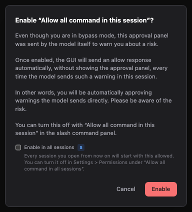
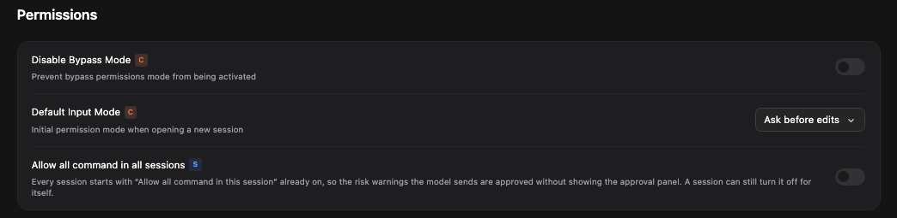
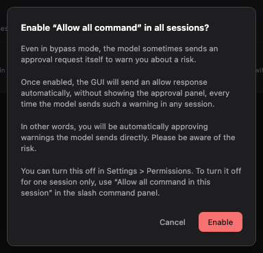
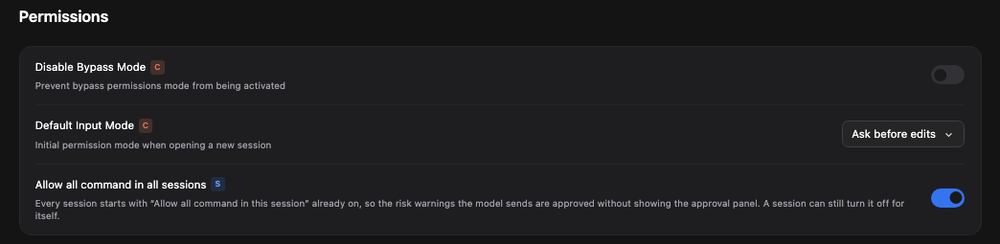
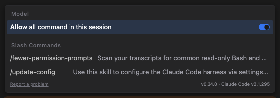
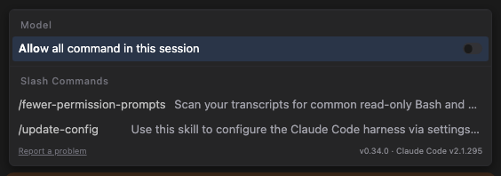
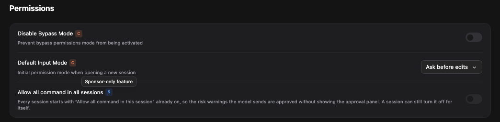
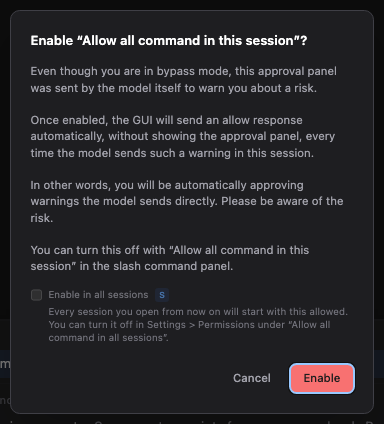

# Allow all command in all sessions

> Language: **English** · [한국어](./ko.md)

[Allow all command in this session](../081-allow_all_commands_in_session/en.md) quiets the approval panels that Claude Code raises as risk warnings, even in bypass mode. It has one limit: it lasts for one conversation. Open a new one and the panels are back, and you switch it on again.

This feature takes that last step away. You can keep it on for **every session**, so a new conversation already starts the way you want it, and any single session can still turn it off for itself.

> **Keeping it on beyond one session is a sponsor feature.** The controls are on screen for everyone, so you can see exactly how it works. Turning it on for one session stays free, as it always was. Claude Code with GUI stays free, and sponsoring is what keeps this independent, JetBrains-first project moving. It also opens this feature, and every other sponsor feature, for you.

## What changes

| | Before | Now |
|---|---|---|
| A new conversation | Starts with the switch off. | Starts as your default says. |
| Turning it on | In each session, through the warning. | Once, for every session. |
| A session that should keep asking | Nothing to do, it started off. | Turn that session's own switch off. |

Everything else about the feature stays as described in [Allow all command in this session](../081-allow_all_commands_in_session/en.md): the warning you see, the safety questions it covers and the ones it does not.

## Turning it on from the warning

You meet the warning in the middle of your work. Either you press **Enable** on a greyed-out approval option in bypass mode, or you switch on **Allow all command in this session** in the slash command panel. Under the text of the warning there is now a small box, **Enable in all sessions**, with the blue **S** badge that marks a sponsor feature. A line under it says what ticking it does.

The box starts where your setting stands. If you have not turned the default on, it starts empty.

What happens when you press **Enable** depends on the box:

- **Ticked.** This session turns it on, and so does every session from now on.
- **Empty, and the default was off.** Only this session turns it on. The default stays off.
- **Empty, and the default was on.** This session turns it on, and the default is switched **off**. The box starts ticked when the default is on, so clearing it is how you take it back for everyone else.
- **Cancel, or Esc.** Nothing changes. Neither the session nor the default.

Because the box starts at the current setting, pressing **Enable** without touching it never changes the default.

## Turning it on from Settings

The same default has a switch of its own in **Settings → Permissions**. The page is one card now, with the three permission rows together, and the new row is **Allow all command in all sessions**. It carries the blue **S** badge.

Turning the switch on opens a warning worded for every session. It is the same warning in substance, and it names Settings → Permissions as the place to turn it off.

There is no box here, because turning the switch on already means every session. Choose **Enable** to turn it on, or **Cancel** to leave it off.

Turning the switch off needs no confirmation. It only brings the approval panel back.

## Each session still decides for itself

Open the slash command panel with `/` and look for **Allow all command in this session**. With the default on, a new conversation shows that switch already on.

Turn it off there, and **only this session** asks again.

- Turning a session's switch off needs no confirmation. Turning it back on shows the warning, with the box.
- A session that has made its own choice keeps it. A session that has not follows the default, so changing the default reaches the open sessions that have not chosen, straight away.
- A conversation that has not sent its first message follows the same rule. Switch it off before the first message and the session that message creates starts off.
- The session switch and the default are two layers of one setting. The switch in the slash command panel never changes the default.

## If you are not a sponsor

Both controls stay on screen. They are not hidden, and they are not a dead end.

In **Settings → Permissions** the switch is dimmed and off. Hovering the badge says "Sponsor-only feature". Pressing the switch opens **Settings → Sponsor**, in the overlay or in a new tab, following your **Open Settings as** choice.

In the warning, the box is dimmed and cannot be ticked. Pressing the box, or its text, **closes the warning** and opens **Settings → Sponsor**. The warning closes first because it holds the keyboard focus, and it would sit on top of the page you are being sent to.

Turning it on for one session stays free. If you press **Enable** without touching the box, the session turns it on as usual.

If the app has not yet heard from the sponsor check, nothing is dimmed. A sponsor never sees the lock flash up while the status loads.

## When a sponsorship ends

The setting you made is kept. While you are not a sponsor it stops applying, and the safety panels come back in every session that was following the default. A session you switched on yourself stays on, because that switch is free. When your sponsorship returns, so does the setting, as you left it.

## Where the choice is kept

The default is saved in your user settings, in `~/.claude-code-gui/settings.js` under `allowAllCommandsByDefault`. It is off until you turn it on.

It is a **user setting only**. On the **Project Settings (Local)** tab the row is greyed out, and a tooltip says "Only available as a global setting".

This is on purpose. A project's settings file lives inside the repository (`.claude-code-gui/settings.json`), so a repository you clone could ship it switched on and silence the warnings for whoever opens it. For that reason, a value written in a project file is ignored. A project that carries the key at all reads as off, which gives a project a way to opt out and no way to opt you in.

## What it covers, and what it does not

- **The same safety questions as before.** These are the questions that Claude Code never remembers an answer to. Every other approval panel appears as always. See [Allow all command in this session](../081-allow_all_commands_in_session/en.md#what-it-covers-and-what-it-does-not).
- **It does not check the commands.** Keeping it on means such commands run without you looking at them. Use it where you trust what Claude is doing.
- **It does not change your permission mode.** Your mode stays what it was.
- **Older Claude Code versions.** It depends on Claude Code telling the app that it will not remember an answer. If your version does not say so, the panel is unchanged.
- **One window can lag a moment.** A request that arrives in the first moments after the panel opens, before the app has read your sponsorship, can still show a panel.

## Frequently asked questions

**I turned it on in Settings and a session still shows the panel. Why?**
Five reasons are possible. That session turned its own switch off, a project file carries the key, your sponsorship has ended, the safety question arrived before the app had read your sponsorship, or the panel is an ordinary approval and not one of the safety questions. Open the slash command panel in that session to see its switch.

**How do I turn it off for every session?**
Turn the switch off in **Settings → Permissions**, or clear the box in the warning and press **Enable**. The first needs no confirmation.

**How do I turn it off for one session only?**
Turn off **Allow all command in this session** in that session's slash command panel. The default and the other sessions are not touched.

**I am a sponsor and the controls are dimmed. Why?**
They are dimmed only when the app reads that you are not a sponsor on this device. Open **Settings → Sponsor** to see the state of this device.

**Why did pressing the box close the warning?**
The warning holds the keyboard focus, so it cannot stay open on top of the page you are sent to. Press **Enable** without touching the box if you only wanted this session.

**Can a project turn it on for me?**
No. A project file cannot switch it on. It can only say that this project should not be switched on.

**Does it change my permission mode or let Claude do more?**
No. It changes who answers one kind of question: those safety questions, which Claude Code asks even in bypass mode.

## Related

- [Allow all command in this session](../081-allow_all_commands_in_session/en.md): the per-session switch and the safety questions it answers.
- [Auto-resume on usage-limit reset](../019-auto_resume_on_limit/en.md): another sponsor feature.
- [#534](https://github.com/Swttch/swttch/pull/534): the change that added it.
