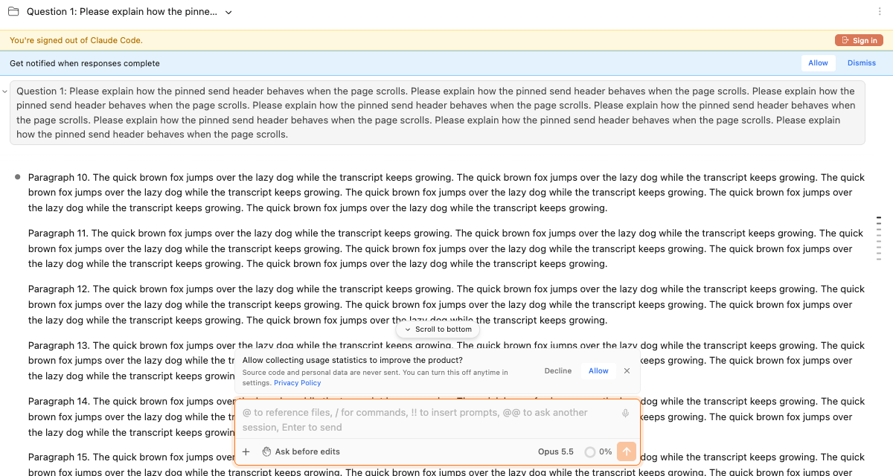
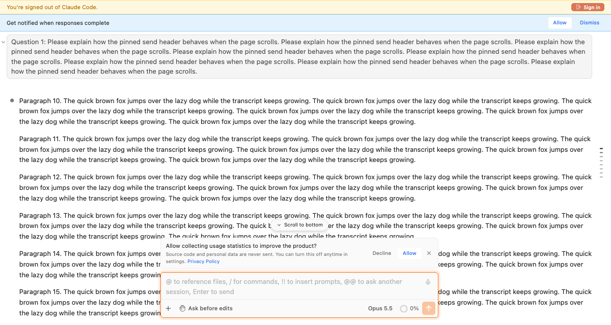

# `top_bar_display=F`로 상단바 숨기기

> 언어: [English](./en.md) · **한국어**

## 새로워진 점

브라우저에서 Claude Code 화면을 여는 주소에 **`top_bar_display=F`**를 붙이면 **상단바**를 아예 그리지 않습니다. 채팅이 창의 맨 위에서 시작하므로, 전보다 40픽셀 높이 올라옵니다.

명령줄의 옵션처럼 쓰는 방식입니다. 원하는 모양을 주소가 알려 주므로 설정을 바꿀 필요가 없습니다.

상단바를 숨겨도 숨겨지는 것은 상단바뿐입니다. 탭이 세션의 상태를 알려 주는 일은 상단바가 있을 때와 똑같이 계속됩니다([계속 동작하는 것](#계속-동작하는-것) 참고).

## 사용 방법

**브라우저**(`ccg` 명령으로 여는 Standalone 모드)에서 쓰는 기능입니다. IDE의 도구 창 주소는 IDE가 직접 만들기 때문에, IDE 안에는 파라미터를 적을 자리가 없습니다.

브라우저 주소창의 주소 끝에 파라미터를 붙입니다.

- 주소에 이미 `?`가 있으면 맨 끝에 `&top_bar_display=F`를 붙입니다.
- `?`가 없으면 `?top_bar_display=F`를 붙입니다.

예를 들면 다음과 같습니다.

```
http://localhost:<포트>/sessions/new?workingDir=%2FUsers%2Fyou%2Fproject&top_bar_display=F
```

그다음 Enter를 누릅니다.

### 전과 후

상단바가 있으면 창의 첫 줄에 폴더 아이콘, 세션 제목, ⋮ 메뉴가 있습니다.



`top_bar_display=F`를 붙이면 그 줄이 없어집니다. 배너가 화면의 맨 위 가장자리에 붙고, 대화가 배너 바로 아래에서 시작합니다.



## 값

| 주소의 값 | 상단바 |
|-----------|--------|
| `F`, `f`, `false`, `FALSE`, `0` | 숨김 |
| 그 밖의 모든 값: `T`, `true`, `1`, 빈 값, 오타 | 보임 |
| 주소에 파라미터가 없음 | 보임 |

오타로는 상단바가 숨겨지지 않습니다. 상단바가 그대로 보이면 이름이 정확히 `top_bar_display`로, 소문자에 밑줄(`_`)로 적혔는지 확인해 주십시오.

## 상단바와 함께 사라지는 것

상단바를 숨기면 그 줄에 있던 것은 모두 화면에 없습니다.

- 워킹 디렉토리 드롭다운과 세션 드롭다운(세션 제목)
- ⋮ 메뉴와 그 옆에 꺼내 둔 모든 아이콘: 사용량, 예약된 메시지, 백그라운드 작업, 원격 터널, 설정, 에셋, 새 탭 열기
- 계정 전환기

그 줄 아래의 것들은 자리와 동작이 그대로입니다. 대화, 배너, 입력창, 오른쪽 가장자리의 보낸 메시지 인덱스, 긴 답변 위에 고정되는 보낸 메시지가 해당합니다.

위에서 내려오는 알림(토스트)도 맨 위에서 40픽셀 아래가 아니라 맨 위 가장자리에 나타납니다.

## 계속 동작하는 것

아래 일들은 전에는 상단바가 화면에 있는 덕분에 이뤄졌습니다. 이제는 페이지가 직접 하므로 상단바를 숨겨도 계속됩니다.

- **탭 제목**이 세션 제목을 따라갑니다.
- 응답이 흐르는 동안 **탭 아이콘**이 돌고, 안 읽음과 "답을 기다리는 중" 표시가 뜹니다.
- 턴이 끝날 때의 **알림음**과 **데스크톱 알림**이 나옵니다.
- 세션 목록의 표시(실행 중, 답을 기다리는 중, 안 읽음)가 이 화면과 같은 상태를 유지합니다.
- 세션을 보고 있으면 읽음으로 처리됩니다.

## 알아 둘 점

- **파라미터는 페이지를 열 때 한 번만 읽습니다.** 다른 세션으로 옮기는 것처럼 앱 안에서 이동하면 주소가 바뀌면서 파라미터가 빠집니다. 그 페이지가 열려 있는 동안에는 상단바가 계속 숨겨져 있습니다. 그 뒤에 페이지를 **새로고침**하면 주소에 파라미터가 없으므로 상단바가 돌아옵니다. 새 탭이나 새로고침 뒤에도 숨기고 싶으면 파라미터를 다시 붙여 주십시오.
- **설정 항목은 없습니다.** 스위치는 주소뿐입니다.
- **상단바를 숨긴 동안 슬래시 패널의 "Resume conversation"을 고르면 눈에 보이는 일이 일어나지 않습니다.** 입력해 둔 `/resume` 글자는 지워지지만, 열 대상이 없습니다. 그 목록이 상단바에 속해 있기 때문입니다.
- 이 기능은 IDE 안에서 Swttch가 보이는 모양을 바꾸지 않습니다.

## 같이 올라가지 않는 곳이 있다면

상단바의 높이는 이제 한 곳에만 적혀 있고, 대화 영역, 배너, 토스트, 고정된 보낸 메시지, 보낸 메시지 인덱스가 모두 그 값을 따라갑니다. 상단바와 함께 올라가지 않는 부분을 보시면 제보해 주십시오.
