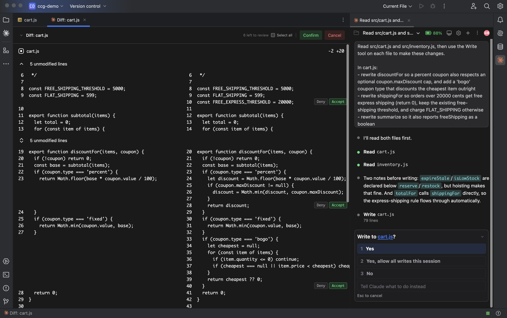
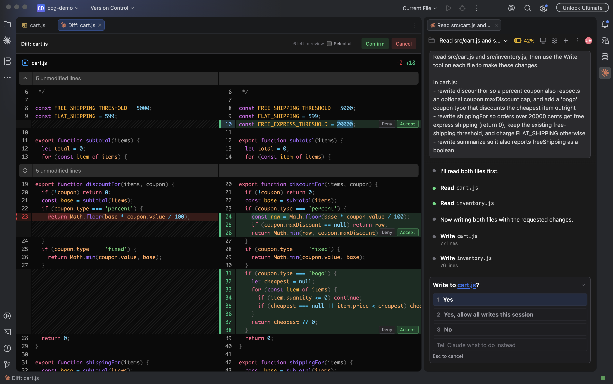

# L'écran de revue n'a pas de couleur

🌐 [English](../en/diff-colors-old-ide.md) | [한국어](../ko/diff-colors-old-ide.md) | [日本語](../ja/diff-colors-old-ide.md) | [中文](../zh/diff-colors-old-ide.md) | [Español](../es/diff-colors-old-ide.md) | [Deutsch](../de/diff-colors-old-ide.md) | **Français**

_Dernière mise à jour : 2026-08-24_

Quand Claude propose une modification de fichier, nous vous montrons le changement — mais **sur les IDE 2025.2 et antérieurs, cet écran s'affiche sans couleur.** Nous n'avons pas encore pu contourner le problème ; mettre l'IDE à jour le règle immédiatement.

## Symptômes

Toute la revue est dessinée dans une seule couleur.

- Mots-clés, chaînes et nombres ne se distinguent pas : tout est blanc (ou noir)
- **Les lignes ajoutées et supprimées n'ont pas de couleur de fond.** Aucune couleur n'indique quelles lignes ont changé
- Les numéros de ligne et les séparateurs ont ce même ton plat

Voici à quoi cela devrait ressembler.

Le texte et les numéros de ligne sont corrects, et accepter ou refuser fonctionne comme d'habitude. **C'est seulement plus difficile à lire, rien n'est cassé.**

## Cause

Cet écran est dessiné sur **JCEF**, le moteur de navigateur basé sur Chromium intégré à votre IDE. Il choisit ses couleurs avec une fonctionnalité CSS appelée `light-dark()` : une seule ligne contient la couleur du thème clair et celle du thème sombre, et le navigateur prend celle qui correspond.

Cette fonctionnalité nécessite **Chromium 123 ou plus récent**. Voici ce que contient l'IDE :

| Version de l'IDE | Chromium | Couleur |
|---|---|---|
| 2024.2 – 2025.2 | **122** | absente |
| **2025.3 et plus récent** | **137** | correcte |

Une seule version fait la différence. Sur 122, les déclarations de couleur sont entièrement rejetées et il ne reste rien à appliquer.

Chromium 122 est une build de mars 2024. Si vous utilisez le même IDE depuis un moment, le moteur de navigateur à l'intérieur est tout aussi ancien.

## Que faire

**Mettez votre IDE à jour vers 2025.3 ou plus récent.** La dernière version si vous le pouvez.

- **Help → Check for Updates**
- Avec Toolbox : mettez à jour depuis Toolbox

Redémarrez l'IDE et la couleur revient. Aucun réglage du plugin n'est à modifier.

Votre version se trouve dans **Help → About**.

### Si la mise à jour est impossible

Vous pouvez aussi examiner le changement dans l'**outil de diff de l'IDE**. Celui-ci est dessiné par l'IDE, il n'est donc pas concerné.

Allez dans **Paramètres → Affichage des diffs → Examiner les modifications dans** et choisissez **Outil de diff de l'IDE**.

À noter : les décisions bloc par bloc et la modification directe de la proposition n'y sont pas disponibles — nous ne les proposons que dans notre propre écran.

## Liens associés

### PR de ce dépôt

- [#342 — Make the proposed side of a review diff editable](https://github.com/Swttch/swttch/pull/342)

### Références externes

- [MDN : `light-dark()`](https://developer.mozilla.org/en-US/docs/Web/CSS/color_value/light-dark) — prise en charge par les navigateurs
- [JetBrains Runtime](https://github.com/JetBrains/JetBrainsRuntime) — le runtime livré avec l'IDE ; JCEF s'y trouve
